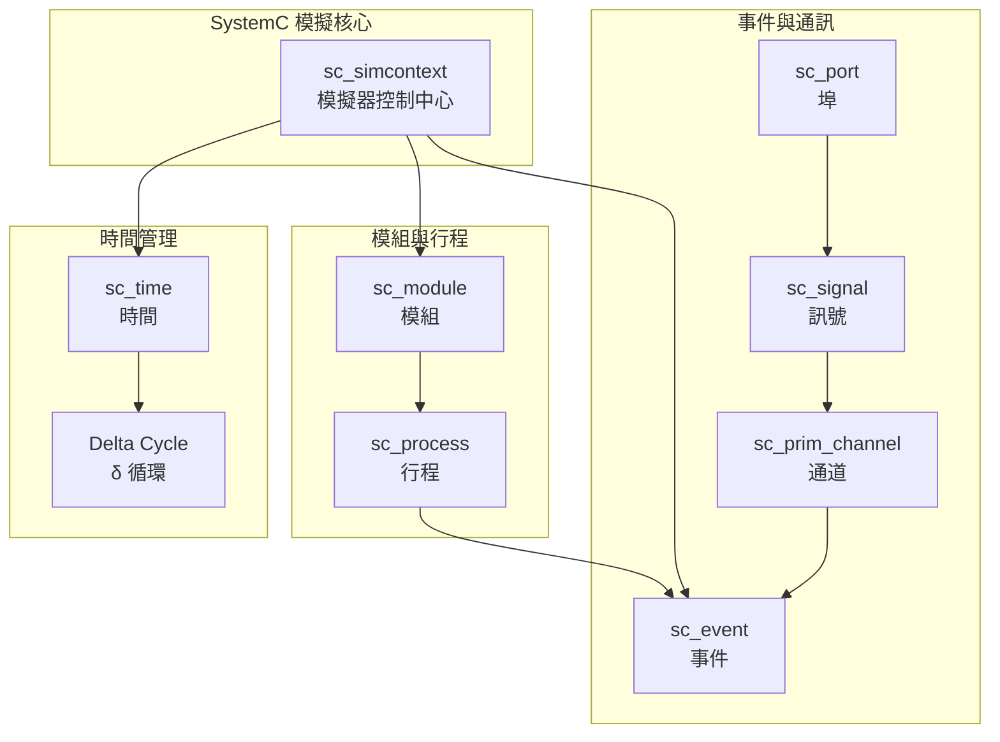

# SystemC Phase 1: Top-Down 架構總覽

> **建立時間**: 2026-02-08
> **版本**: SystemC 3.0.2
> **目標**: 用簡單易懂的方式解釋 SystemC 整體架構

---

## SystemC 核心架構圖



---

## 1. 什麼是 SystemC？一句話說明

**SystemC = 用 C++ 寫的「硬體模擬器」**

想像你是一位硬體設計師，想測試一個晶片設計，但還不想花大錢去製作真正的晶片。SystemC 讓你用軟體模擬硬體的行為，在電腦上就能測試你的設計。

### 1.1 為什麼不用普通 C++？

| 普通 C++ | SystemC |
|---------|---------|
| 程式一行一行依序執行 | 硬體是「平行」運作的（很多電路同時工作） |
| 沒有時間概念 | 需要模擬「時間流逝」（時脈週期） |
| 沒有訊號概念 | 需要模擬「電線上的訊號變化」 |

---

## 2. 四大核心概念

### 2.1 Module（模組）

**白話說明**: 就像樂高積木的「一塊積木」，代表一個硬體元件

**對應硬體**: Verilog 的 `module`

```cpp
// 這是一個「加法器模組」
SC_MODULE(Adder) {
    sc_in<int> a;      // 輸入埠
    sc_in<int> b;      // 輸入埠
    sc_out<int> sum;   // 輸出埠
    
    void do_add() {    // 這是行為（Process）
        sum = a + b;
    }
    
    SC_CTOR(Adder) {
        SC_METHOD(do_add);     // 註冊行為
        sensitive << a << b;   // 當 a 或 b 變化時執行
    }
};
```

**類別對照**:
| SystemC | 對應類別 | 說明 |
|---------|---------|------|
| `sc_module` | `sc_module.h` | 所有模組的基底類別 |
| `sc_object` | `sc_object.h` | 所有 SystemC 物件的基底 |

---

### 2.2 Process（行程/行為）

**白話說明**: 模組「要做什麼事情」的定義，像是硬體電路的功能描述

**對應硬體**: Verilog 的 `always @` 區塊

**三種類型**:

| 類型 | 名稱 | 白話說明 | 使用時機 |
|-----|------|---------|---------|
| **SC_METHOD** | 方法行程 | 「組合邏輯」，立即完成 | 純粹的計算，沒有記憶狀態 |
| **SC_THREAD** | 執行緒行程 | 「可以暫停、可以等」 | 需要等待時間或事件 |
| **SC_CTHREAD** | 時脈執行緒 | 「只在時脈邊緣執行」 | 同步電路設計 |

```cpp
// SC_METHOD 範例：組合邏輯
void comb_logic() {
    output = input1 & input2;
}

// SC_THREAD 範例：可以等待
void thread_example() {
    while(true) {
        wait(10, SC_NS);  // 等待 10 奈秒
        wait(event_a);    // 等待事件 a
    }
}
```

**類別對照**:
| SystemC | 檔案 | 說明 |
|---------|------|------|
| `sc_process_b` | `sc_process.h` | 所有 process 的基底類別 |
| `sc_method_process` | `sc_method_process.h` | SC_METHOD 實作 |
| `sc_thread_process` | `sc_thread_process.h` | SC_THREAD 實作 |
| `sc_cthread_process` | `sc_cthread_process.h` | SC_CTHREAD 實作 |

---

### 2.3 Event（事件）

**白話說明**: 「鈴響了，該做事了」的通知機制

**對應硬體**: 訊號變化（signal change）、時脈邊緣（clock edge）

```cpp
sc_event data_ready;  // 宣告一個事件

// 在某個地方通知事件
data_ready.notify();  // 「鈴響！」

// 在某個 process 等待事件
wait(data_ready);     // 「聽到鈴響才繼續」
```

**三種通知方式**:

| 通知方式 | 寫法 | 白話說明 |
|---------|------|---------|
| **立即通知** | `e.notify()` | 「現在馬上」 |
| **Delta 通知** | `e.notify(SC_ZERO_TIME)` | 「這個時間點稍後」 |
| **時間通知** | `e.notify(10, SC_NS)` | 「10 奈秒後」 |

**類別對照**:
| SystemC | 檔案 | 說明 |
|---------|------|------|
| `sc_event` | `sc_event.h` | 核心事件類別 |

---

### 2.4 Channel（通道）

**白話說明**: 模組之間「傳遞訊號的電線」

**對應硬體**: Verilog 的 `wire` 或 `reg`

```cpp
sc_signal<int> data_bus;      // 32 位元資料匯流排
sc_signal<bool> clock;        // 時脈訊號

// 寫入訊號
data_bus = 42;        // 實際上是「請求」寫入
                      // 真正的寫入在 delta cycle 結束時

// 讀取訊號
int val = data_bus.read();
```

**重要概念：Request-Update 機制**

```
時間點 T
┌─────────────────────────────────────────┐
│ 1. Evaluation Phase（評估階段）           │
│    - Process 執行                         │
│    - 寫入訊號：m_new_val = value          │
│    - 呼叫 request_update()                │
├─────────────────────────────────────────┤
│ 2. Update Phase（更新階段）               │
│    - 真正更新訊號值：m_cur_val = m_new_val│
│    - 觸發 value_changed_event             │
├─────────────────────────────────────────┤
│ 3. Delta Cycle（Delta 循環）              │
│    - 處理所有 delta 通知的事件            │
│    - 回到步驟 1 如果有新的 process 要執行│
└─────────────────────────────────────────┘
```

**類別對照**:
| SystemC | 檔案 | 說明 |
|---------|------|------|
| `sc_signal<T>` | `sc_signal.h` | 訊號模板類別 |
| `sc_prim_channel` | `sc_prim_channel.h` | 基本通道基底 |

---

## 3. Delta Cycle 機制（超重要！）

### 3.1 什麼是 Delta Cycle？

**白話說明**: 在同一個時間點內，處理「連鎖反應」的機制

**為什麼需要？**

想像這個電路：
```
A (AND gate) → B (NOT gate) → C
```

當 A 的輸入變化 → A 的輸出變化 → B 的輸入變化 → B 的輸出變化 → C 收到訊號

在「真實硬體」中，這些變化是「同時發生」的。在「模擬器」中，我們用 Delta Cycle 來模擬這種「同時發生」。

### 3.2 Delta Cycle 執行流程

```
時間 = 10ns
┌─────────────────────────────────────────────────────────┐
│ Delta Cycle 0                                           │
├─────────────────────────────────────────────────────────┤
│ 1. Evaluate: Process A 執行，寫入 signal X = 1          │
│ 2. Update: signal X 更新為 1，觸發 event X_changed         │
│ 3. Check: 有 Process 要執行？是的，Process B 在等 X       │
├─────────────────────────────────────────────────────────┤
│ Delta Cycle 1                                           │
├─────────────────────────────────────────────────────────┤
│ 1. Evaluate: Process B 執行，寫入 signal Y = 0          │
│ 2. Update: signal Y 更新為 0，觸發 event Y_changed        │
│ 3. Check: 有 Process 要執行？是的，Process C 在等 Y       │
├─────────────────────────────────────────────────────────┤
│ Delta Cycle 2                                           │
├─────────────────────────────────────────────────────────┤
│ 1. Evaluate: Process C 執行                             │
│ 2. Update: 沒有訊號變化                                 │
│ 3. Check: 有 Process 要執行？沒有 → 時間前進             │
└─────────────────────────────────────────────────────────┘
```

**RTL 知識補充**: Delta Cycle 對應硬體模擬中的「零延遲傳播」（zero-delay propagation），用來模擬組合邏輯在同一時間點內的連鎖反應。

---

## 4. 核心類別總結

### 4.1 Kernel 核心（最重要的 5 個類別）

| 類別 | 檔案 | 職責 |
|-----|------|------|
| `sc_simcontext` | `sc_simcontext.h` | 模擬控制中心 |
| `sc_module` | `sc_module.h` | 硬體模組基底 |
| `sc_process_b` | `sc_process.h` | Process 基底 |
| `sc_event` | `sc_event.h` | 事件機制 |
| `sc_time` | `sc_time.h` | 時間表示 |

### 4.2 Communication 通訊（最重要的 5 個類別）

| 類別 | 檔案 | 職責 |
|-----|------|------|
| `sc_signal<T>` | `sc_signal.h` | 訊號線 |
| `sc_interface` | `sc_interface.h` | 介面定義 |
| `sc_port` | `sc_port.h` | 埠連接 |
| `sc_prim_channel` | `sc_prim_channel.h` | 基本通道 |
| `sc_clock` | `sc_clock.h` | 時脈產生 |

---

## 5. 下一步：Phase 2

Phase 2 將深入分析 Kernel 模組：
1. `sc_simcontext` - 模擬上下文
2. `sc_process` - Process 機制
3. `sc_event` - 事件機制
4. `sc_module` - 模組機制
