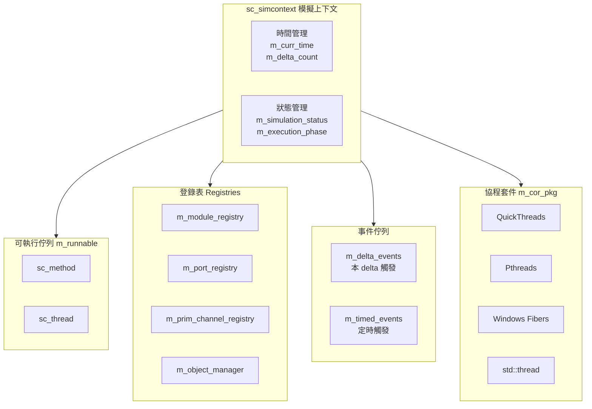

# SystemC Simulation Context (sc_simcontext) 模擬上下文

> **建立日期**: 2026-02-08  
> **對應 Phase**: Phase 2.1 (Simulation Context)

---

## 概述 (Overview)

`sc_simcontext` 類別是 **SystemC 模擬器的核心大腦**，負責管理整個模擬的生命週期。可以把它想像成硬體模擬的「作業系統」。

**白話說明**: 
- 就像電腦需要 OS 來管理程式執行，SystemC 需要 `sc_simcontext` 來管理所有模組和信號的運作
- 它控制「時間如何前進」、「哪些 process 要執行」、「信號何時更新」

---

## Class Hierarchy / 類別層級

```
sc_simcontext (standalone class, not in inheritance hierarchy)
    └── Manages all other SystemC objects
```

Unlike most SystemC classes, `sc_simcontext` is NOT derived from `sc_object`. It sits above the object hierarchy and owns everything.

## Key Responsibilities

### 1. Simulation Lifecycle Management

| Phase | Method | Description |
|-------|--------|-------------|
| Elaboration | `elaborate()` | Module hierarchy construction, port binding |
| Pre-simulation | `prepare_to_simulate()` | Create coroutines, initialize processes |
| Execution | `simulate()` / `crunch()` | Run delta cycles |
| Termination | `end()` | Cleanup, callbacks |

### 2. The Delta Cycle (The "Heartbeat")

The `crunch()` method implements the classic **delta cycle** execution model:

```cpp
while (true) {
    // 1. EVALUATE PHASE: Execute all runnable processes
    for each method in runnable queue:
        execute method
    for each thread in runnable queue:
        yield to thread coroutine
    
    // 2. UPDATE PHASE: Update signal values
    perform_update() on primitive channels
    
    // 3. NOTIFICATION PHASE: Process delta events
    trigger all delta events
    
    // Check for more work or exit
    if (no more runnable processes && no pending events)
        break;
}
```

This is the **fundamental RTL simulation model**: evaluate, update, notify - repeat.

### 3. Member Variables (The "State Machine")

```cpp
// Core simulation state
sc_status m_simulation_status;     // SC_ELABORATION, SC_RUNNING, etc.
sc_stage m_stage;                   // Current simulation stage
execution_phases m_execution_phase; // phase_evaluate, phase_update, etc.

// Time management
sc_time m_curr_time;                // Current simulation time
sc_dt::uint64 m_delta_count;        // Number of delta cycles

// Process management
sc_runnable* m_runnable;            // Queue of processes to execute
sc_process_table* m_process_table; // All existing processes
sc_curr_proc_info m_curr_proc_info; // Currently running process

// Event management
std::vector<sc_event*> m_delta_events;    // Events to trigger this delta
sc_ppq<sc_event_timed*>* m_timed_events;  // Time-ordered future events

// Registries (managers for different object types)
sc_module_registry* m_module_registry;
sc_port_registry* m_port_registry;
sc_export_registry* m_export_registry;
sc_prim_channel_registry* m_prim_channel_registry;

// Coroutine support
sc_cor_pkg* m_cor_pkg;    // Platform-specific coroutine implementation
sc_cor* m_cor;              // Main coroutine context
```

## Key Methods

### Simulation Control

```cpp
// Start simulation for specified duration
void sc_start(const sc_time& duration);

// Stop simulation (can be called from anywhere)
void sc_stop();

// Get current simulation time
const sc_time& sc_time_stamp();
```

### Process Creation Factory

```cpp
// These are called by SC_METHOD, SC_THREAD, SC_CTHREAD macros
sc_process_handle create_method_process(...);
sc_process_handle create_thread_process(...);
sc_process_handle create_cthread_process(...);
```

### Process Scheduling

```cpp
// Add process to runnable queue
void push_runnable_method(sc_method_handle);
void push_runnable_thread(sc_thread_handle);

// Get next process to execute
sc_method_handle pop_runnable_method();
sc_thread_handle pop_runnable_thread();

// Remove process from queue
void remove_runnable_method(sc_method_handle);
void remove_runnable_thread(sc_thread_handle);
```

## Design Patterns Used

### 1. Singleton (with a twist)

```cpp
// Global pointer to current simulation context
extern sc_simcontext* sc_curr_simcontext;

// Access function (creates default if none exists)
inline sc_simcontext* sc_get_curr_simcontext() {
    if (sc_curr_simcontext == 0) {
        sc_default_global_context = new sc_simcontext;
        sc_curr_simcontext = sc_default_global_context;
    }
    return sc_curr_simcontext;
}
```

**Note**: While SystemC uses a global pointer, it technically supports multiple contexts (for advanced use cases). Most code uses the global.

### 2. Registry Pattern

Multiple specialized registries handle different object types:
- `sc_module_registry` - manages modules
- `sc_port_registry` - manages ports
- `sc_prim_channel_registry` - manages primitive channels
- `sc_object_manager` - manages the overall object hierarchy

### 3. State Machine

The simulation moves through well-defined states:

```
SC_ELABORATION 
    ↓
SC_BEFORE_END_OF_ELABORATION (callbacks)
    ↓
SC_END_OF_ELABORATION
    ↓
SC_START_OF_SIMULATION (callbacks)
    ↓
SC_RUNNING ←→ SC_PAUSED
    ↓
SC_STOPPED / SC_END_OF_SIMULATION
```

### 4. Phase Callbacks

The simulator calls user-defined callbacks at each phase transition:

```cpp
// In your module:
void before_end_of_elaboration() override;
void end_of_elaboration() override;
void start_of_simulation() override;
void end_of_simulation() override;
```

## RTL/Hardware Knowledge

### Delta Cycle Semantics

The delta cycle is the **fundamental timing abstraction** in RTL simulation:

1. **Delta delay = zero simulation time, but causal ordering**
2. Signals update AFTER all processes execute (non-blocking assignment semantics)
3. Multiple delta cycles can occur at the same simulation time
4. This models **delta-delayed signal propagation** in real hardware

Example:
```cpp
SC_METHOD(combinational_logic);
sensitive << a << b;  // Executes when a or b changes

void combinational_logic() {
    c = a + b;  // c gets new value after this delta cycle
    // c is NOT immediately visible to other processes in this delta!
}
```

### Time Wheel

Timed events (using `wait(10, SC_NS)`) are stored in a priority queue (`sc_ppq`) ordered by notification time. The simulator jumps between time points, executing all events at each time before advancing.

### Immediate vs Delta vs Timed Notifications

```cpp
// Immediate (within evaluation phase only)
e.notify();  

// Delta-delayed (next delta cycle, same time)
e.notify(SC_ZERO_TIME);

// Timed (at specific future time)
e.notify(10, SC_NS);
```

## Important Notes for Software Developers

1. **No Preemption Within a Delta**: All methods run to completion. Threads yield cooperatively via `wait()`.

2. **Deterministic Execution**: The execution order of processes within a delta is deterministic (based on creation order and sensitivity), though you shouldn't rely on it.

3. **Reference Counting**: The simulator uses reference counting on processes (`reference_increment()`, `reference_decrement()`) to manage lifecycle.

4. **Exception Safety**: The simulator catches exceptions in processes and converts them to `sc_report` errors via `sc_handle_exception()`.

5. **Thread Safety**: The simulator is **NOT** thread-safe by default. Only the main thread should call simulation functions.

---

## Architecture Diagram / 架構圖



---

## 軟體開發者重點筆記 (Software Developer Notes)

| 重點 | 說明 |
|:-----|:-----|
| **無搶佔** | Delta 內所有 method 執行到完畢，thread 透過 `wait()` 主動讓出 |
| **確定性執行** | Process 執行順序確定（但不應依賴） |
| **參考計數** | Process 使用參考計數管理生命週期 |
| **例外安全** | 例外被捕獲並轉換為 `sc_report` 錯誤 |
| **非執行緒安全** | 只有主執行緒可呼叫模擬函式 |

