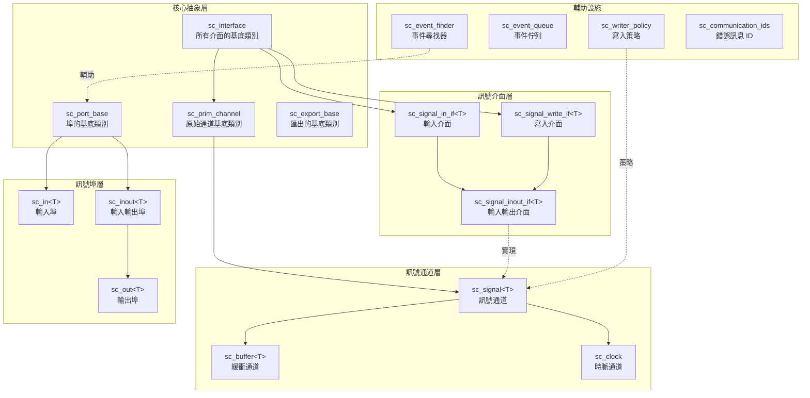
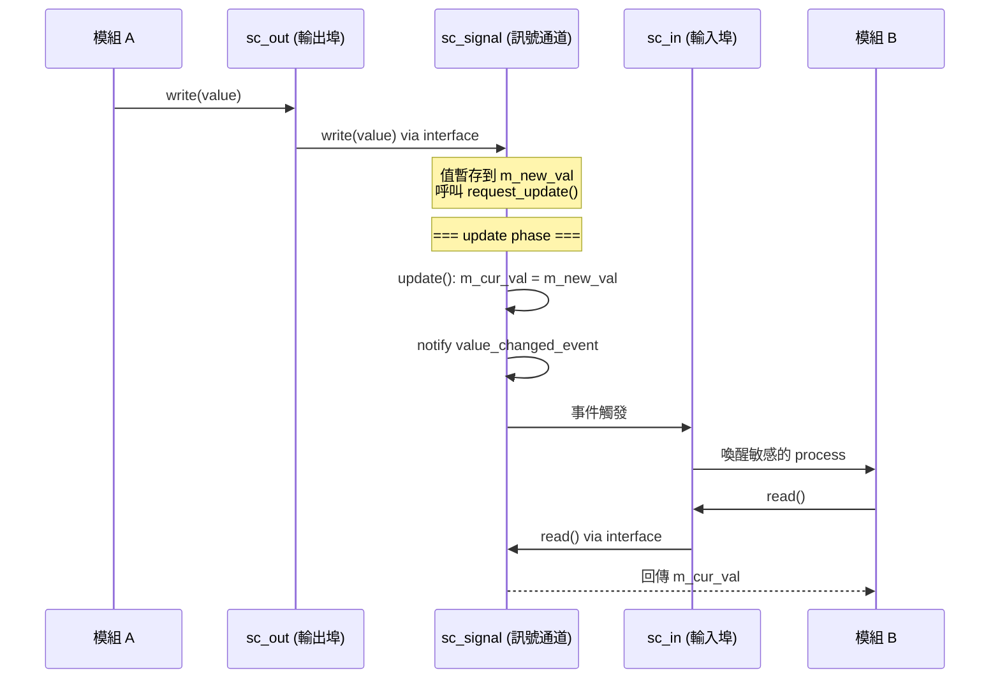
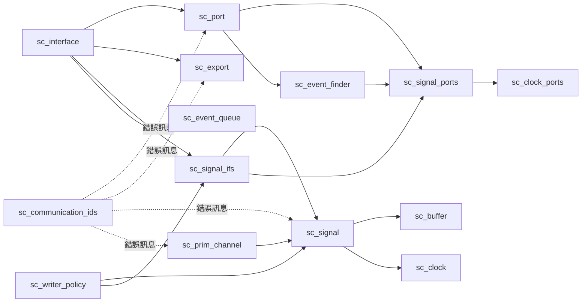

# communication -- SystemC 通訊子系統

SystemC 的 `communication` 子系統定義了模組之間溝通的所有基礎設施。它實現了 **介面 (Interface)**、**通道 (Channel)**、**埠 (Port)** 和 **匯出 (Export)** 四大核心概念，讓硬體模組能夠互相傳遞資料和事件。

## 概述

想像一座城市的郵政系統：
- **介面 (Interface)** 就像「寄信」和「收信」的規則 -- 定義了能做什麼操作
- **通道 (Channel)** 就像實際的郵筒和信箱 -- 實現了資料的儲存和傳遞
- **埠 (Port)** 就像每棟建築物門口的信箱口 -- 模組透過它來存取外部的通道
- **匯出 (Export)** 就像「服務窗口」 -- 讓模組把內部的介面暴露給外部使用

這套架構遵循「介面與實現分離」的設計原則：模組只依賴介面定義，不依賴具體的通道實現，從而實現鬆耦合 (loose coupling)。

## 架構關係圖

## 資料流示意圖

## 檔案列表

| 檔案 | 說明 |
|------|------|
| [sc_interface.md](sc_interface.md) | 所有介面類別的抽象基底類別 |
| [sc_port.md](sc_port.md) | 埠的基底類別，模組存取外部通道的入口 |
| [sc_export.md](sc_export.md) | 匯出的基底類別，讓模組暴露內部介面 |
| [sc_prim_channel.md](sc_prim_channel.md) | 原始通道的抽象基底類別 |
| [sc_signal.md](sc_signal.md) | 泛型訊號通道 `sc_signal<T>` |
| [sc_signal_ifs.md](sc_signal_ifs.md) | 訊號相關的介面定義 |
| [sc_signal_ports.md](sc_signal_ports.md) | 訊號專用的埠類別 (`sc_in`, `sc_inout`, `sc_out`) |
| [sc_writer_policy.md](sc_writer_policy.md) | 訊號寫入策略，控制多重寫入者行為 |
| [sc_buffer.md](sc_buffer.md) | 緩衝通道，每次寫入都觸發事件 |
| [sc_clock.md](sc_clock.md) | 時脈通道，產生週期性的布林訊號 |
| [sc_clock_ports.md](sc_clock_ports.md) | 時脈專用埠的型別別名 |
| [sc_event_finder.md](sc_event_finder.md) | 事件尋找器，在綁定完成前延遲解析事件 |
| [sc_event_queue.md](sc_event_queue.md) | 事件佇列，支援多個待處理通知 |
| [sc_communication_ids.md](sc_communication_ids.md) | 通訊子系統的錯誤/警告訊息 ID |

## 依賴關係圖

## 設計理念

### 為什麼要分離介面、通道和埠？

在真正的硬體設計中，模組之間的連線（wire）和通訊協定（protocol）是分開的概念。SystemC 沿用了這個思想：

1. **介面 (Interface)** 定義「能做什麼」（例如：讀取、寫入）
2. **通道 (Channel)** 定義「怎麼做」（例如：用兩個暫存器實現 delta cycle 更新）
3. **埠 (Port)** 定義「從哪裡存取」（連接模組與通道的橋樑）
4. **匯出 (Export)** 定義「提供什麼服務」（讓子模組的介面對外可見）

這種分離讓同一個介面可以有不同的通道實現，也讓模組可以在不知道具體通道類型的情況下進行通訊。

## 相關目錄

- `sysc/kernel/` - 核心模擬引擎（事件、排程器）
- `sysc/datatypes/` - 資料型別（`sc_logic`, `sc_bv` 等）
- `sysc/tracing/` - 波形追蹤
