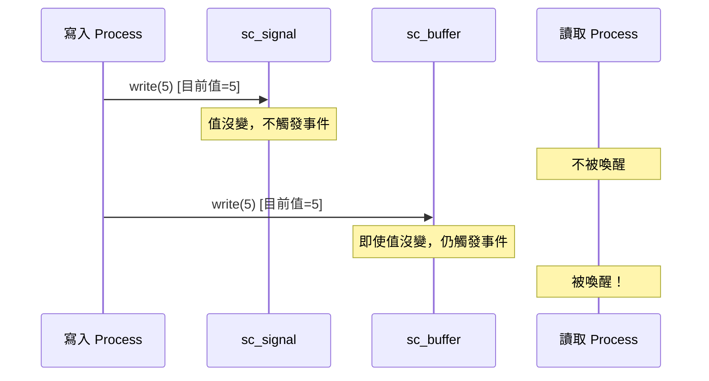

# sc_buffer -- 緩衝通道，每次寫入都觸發事件

## 概述

`sc_buffer<T>` 是 `sc_signal<T>` 的子類別，唯一的差別在於：**每次呼叫 `write()` 都會觸發 `value_changed_event()`**，即使寫入的值與當前值相同。這對於需要偵測「寫入動作」而非「值改變」的場景非常有用。

**原始檔案：** `sc_buffer.h`（僅標頭檔）

## 日常比喻

比較 `sc_signal` 和 `sc_buffer`：

- **sc_signal** 就像「門鈴」-- 只有在門口**有新客人**時才會響（值改變時觸發事件）
- **sc_buffer** 就像「按鈴記錄器」-- **每次有人按鈴都會記錄**，即使按鈴的人還站在門口（每次寫入都觸發事件）

## 行為差異



## 類別定義

```cpp
template< typename T, sc_writer_policy POL = SC_DEFAULT_WRITER_POLICY >
class sc_buffer : public sc_signal<T, POL>
{
public:
    typedef sc_buffer<T,POL> this_type;
    typedef sc_signal<T,POL> base_type;

    // constructors
    sc_buffer();
    explicit sc_buffer( const char* name_ );
    sc_buffer( const char* name_, const T& initial_value_ );

    virtual void write( const T& );
    virtual const char* kind() const { return "sc_buffer"; }

protected:
    virtual void update();
};
```

## 關鍵方法差異

### `write()` - 永遠請求更新

```cpp
template< typename T, sc_writer_policy POL >
void sc_buffer<T,POL>::write( const T& value_ )
{
    if( !base_type::policy_type::check_write(this, true) )
        return;

    this->m_new_val = value_;
    this->request_update();  // 永遠呼叫，不檢查值是否改變
}
```

注意第二個參數傳入 `true`（表示 `value_changed`），確保寫入策略檢查認為值有變化。

### `update()` - 永遠執行更新

```cpp
template< typename T, sc_writer_policy POL >
void sc_buffer<T,POL>::update()
{
    base_type::policy_type::update();
    base_type::do_update();  // 永遠執行，不檢查值是否改變
}
```

與 `sc_signal` 的 `update()` 不同，`sc_buffer` 跳過了「值是否改變」的判斷，直接呼叫 `do_update()` 來更新值並觸發事件。

## sc_signal vs sc_buffer 比較

| 特性 | sc_signal | sc_buffer |
|------|-----------|-----------|
| write(same_value) | 不觸發事件 | 觸發事件 |
| write(different_value) | 觸發事件 | 觸發事件 |
| request_update 條件 | 值改變時 | 每次寫入 |
| update 條件 | 值改變時 | 每次 |
| 用途 | 模擬線路 (wire) | 模擬暫存器/FIFO 入口 |

## 使用場景

1. **計數器觸發**：每次寫入同一個值也需要觸發下游 process
2. **FIFO 入口**：即使連續寫入相同的資料，每次寫入都是一個有效的操作
3. **事件產生器**：用寫入動作本身作為事件來源
4. **硬體暫存器模擬**：暫存器每個時脈週期都會「載入」值，不管值是否改變

## 設計重點

### 效能考量

`sc_buffer` 比 `sc_signal` 有更多的更新開銷，因為每次寫入都會進入 update phase。如果不需要偵測「相同值的寫入」，應該使用 `sc_signal`。

### 與 RTL 的對應

- `sc_signal` 更像 Verilog 中的 `wire` -- 只有值改變才產生事件
- `sc_buffer` 更像 Verilog 中帶有 `always @(*)` 觸發的 `reg` -- 每次賦值都是一個事件

## 相關檔案

- `sc_signal.h` - 基底類別
- `sc_writer_policy.h` - 寫入策略定義
- `sc_prim_channel.h` - `request_update()` 方法的來源
