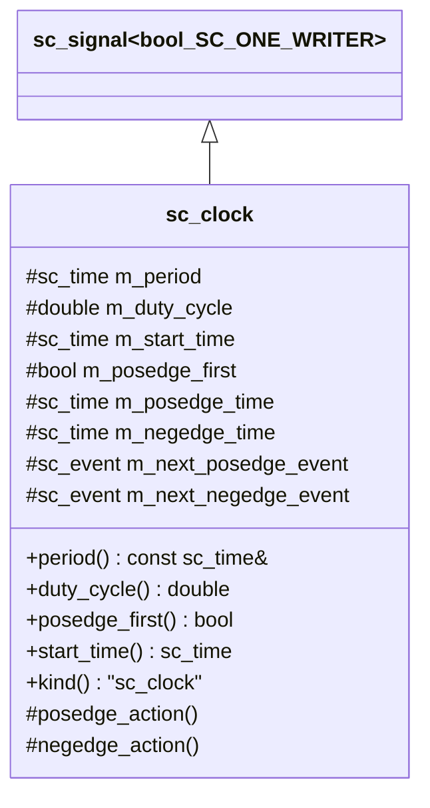
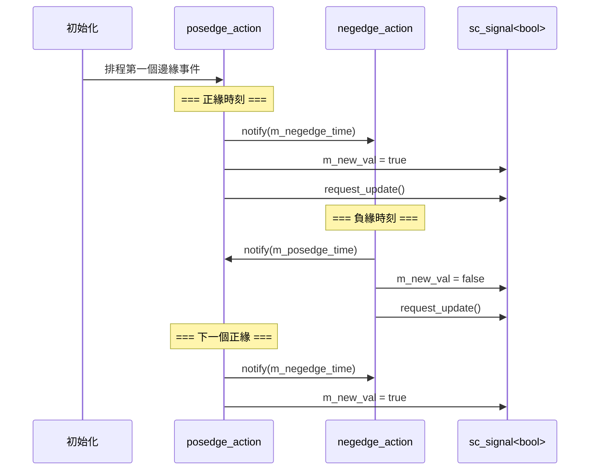

# sc_clock -- 時脈通道

## 概述

`sc_clock` 是 SystemC 中的時脈產生器，繼承自 `sc_signal<bool, SC_ONE_WRITER>`。它自動產生週期性的布林訊號，在 `true` 和 `false` 之間交替，模擬硬體時脈。

**原始檔案：** `sc_clock.h`, `sc_clock.cpp`

## 日常比喻

`sc_clock` 就像一個自動的「交通號誌燈」：
- 它會按固定週期在「綠燈 (true)」和「紅燈 (false)」之間切換
- **週期 (period)** 是一次完整紅綠燈循環的時間
- **工作週期 (duty cycle)** 是綠燈佔整個週期的比例（預設 0.5 = 50%）
- **起始時間 (start time)** 是第一次燈亮的時間
- **正緣優先 (posedge first)** 決定第一次是先亮綠燈還是紅燈

```mermaid
gantt
    title sc_clock timing diagram (period=10, duty=0.5, posedge_first=true)
    dateFormat X
    axisFormat %s

    section clock
    HIGH (true)  : 0, 5
    LOW (false)  : 5, 10
    HIGH (true)  : 10, 15
    LOW (false)  : 15, 20
```



## 類別定義



## 建構子

`sc_clock` 提供多種建構方式：

```cpp
// 最完整的版本
sc_clock( const char* name_,
          const sc_time& period_,          // 週期
          double duty_cycle_ = 0.5,        // 工作週期（0~1）
          const sc_time& start_time_ = SC_ZERO_TIME,  // 起始時間
          bool posedge_first_ = true );    // 先正緣？

// 使用數值+單位
sc_clock( const char* name_,
          double period_v_,
          sc_time_unit period_tu_,
          double duty_cycle_ = 0.5 );

// 向後相容（使用預設時間單位）
sc_clock( const char* name_,
          double period_,
          double duty_cycle_ = 0.5,
          double start_time_ = 0.0,
          bool posedge_first_ = true );
```

## 時脈產生機制



核心是兩個交替觸發的動作方法：

```cpp
void sc_clock::posedge_action()
{
    m_next_negedge_event.notify_internal( m_negedge_time );  // schedule next negedge
    m_new_val = true;
    request_update();
}

void sc_clock::negedge_action()
{
    m_next_posedge_event.notify_internal( m_posedge_time );  // schedule next posedge
    m_new_val = false;
    request_update();
}
```

## 時間計算

```
period = 10ns, duty_cycle = 0.6

|<---------- period (10ns) ---------->|
|<-- high (6ns) -->|<-- low (4ns) --->|
    posedge_time        negedge_time
     = 4ns                = 6ns

m_posedge_time = period - negedge_time
m_negedge_time = period * duty_cycle
```

## 寫入保護

```cpp
virtual void sc_clock::write( const bool& ) {
    // reports error: SC_ID_ATTEMPT_TO_WRITE_TO_CLOCK_
}
```

`sc_clock` 覆寫了 `write()` 方法使其報錯。時脈訊號是自動產生的，不允許外部寫入。

## 埠綁定保護

```cpp
virtual void sc_clock::register_port( sc_port_base& port_, const char* if_type ) {
    // checks if port is sc_inout or sc_out, and reports error
    // SC_ID_ATTEMPT_TO_BIND_CLOCK_TO_OUTPUT_
}
```

時脈通道不允許綁定到 `sc_inout` 或 `sc_out` 埠，因為時脈只能被讀取，不能被外部模組寫入。

## 設計重點

### `is_clock()` 標記

```cpp
bool is_clock() const { return true; }
```

`sc_signal<bool>` 有一個虛擬方法 `is_clock()`，預設回傳 `false`。`sc_clock` 覆寫它回傳 `true`，讓系統能區分一般的 bool 訊號和時脈訊號。

### 與 RTL 的對應

| SystemC | Verilog |
|---------|---------|
| `sc_clock clk("clk", 10, SC_NS)` | `always #5 clk = ~clk;` |
| `period()` | 完整週期 |
| `duty_cycle()` | 高電位佔比 |
| `posedge_event()` | `@(posedge clk)` |
| `negedge_event()` | `@(negedge clk)` |

### 為什麼使用 `notify_internal()` 而非 `notify()`？

`notify_internal()` 是 `notify_delayed()` 的非棄用版本，效能更好。由於時脈是系統核心元件，每個時脈週期都要排程兩個事件，使用更輕量的方法很重要。

## 相關檔案

- `sc_signal.h` - 基底類別 `sc_signal<bool>`
- `sc_clock_ports.h` - 時脈埠的型別別名
- `sc_signal_ports.h` - `sc_in<bool>` 用來連接時脈
- `sc_communication_ids.h` - 時脈相關錯誤訊息
