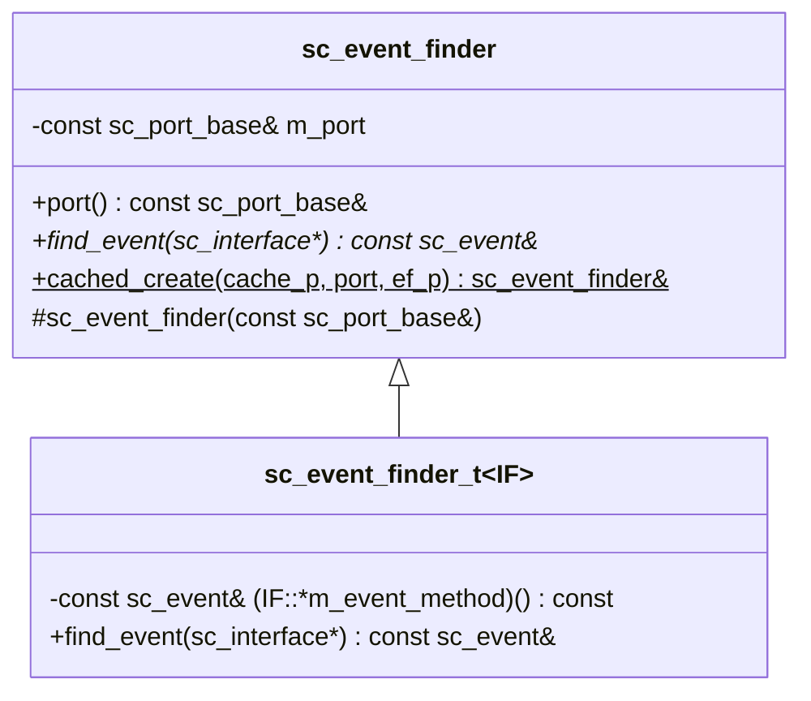
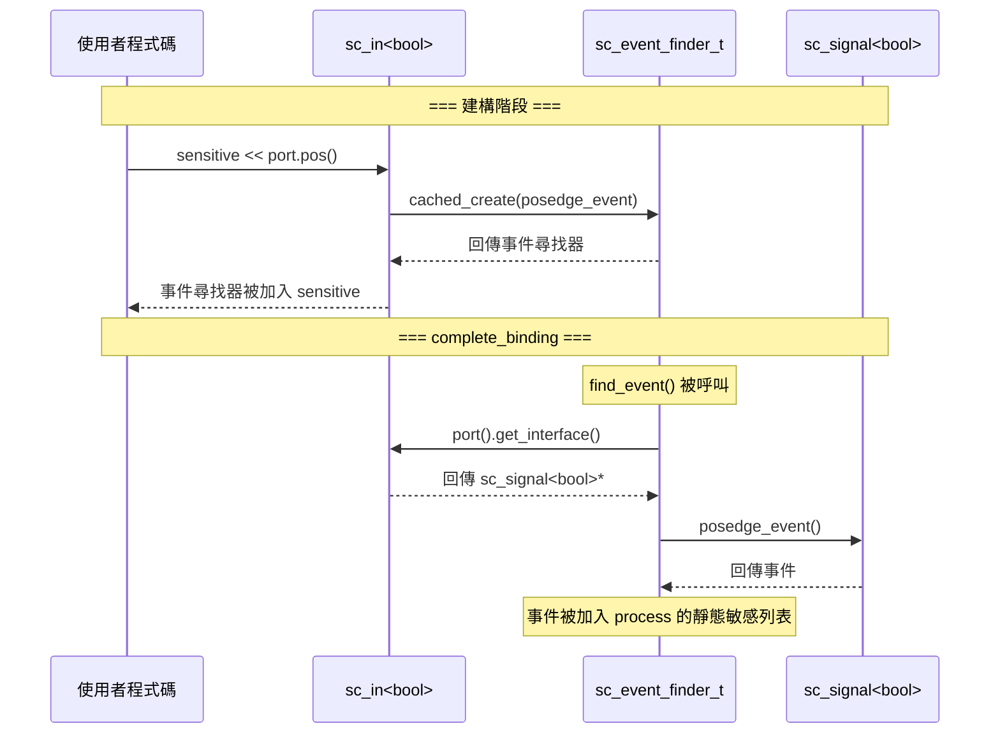

# sc_event_finder -- 事件尋找器

## 概述

`sc_event_finder` 解決了一個時序問題：在 elaboration 階段設定 `sensitive` 敏感列表時，埠可能還沒有綁定到通道，所以無法直接取得事件。事件尋找器充當一個「延遲代理」，記錄「要從介面的哪個方法取得事件」，等到綁定完成後再實際解析。

**原始檔案：** `sc_event_finder.h`, `sc_event_finder.cpp`

## 日常比喻

想像你在訂閱一份報紙，但報紙還沒開始送：
- **直接取事件** = 你跑到信箱去拿報紙，但報紙還沒送到（綁定尚未完成）
- **事件尋找器** = 你留下一張便條「請把報紙放進我的信箱」，等郵差來了自然會送到

事件尋找器就是那張「便條」-- 它記錄了「從哪裡」以及「要找什麼事件」，等一切就緒後才實際取得事件。

## 類別階層



## 關鍵方法

### `find_event()` - 尋找事件

```cpp
template <class IF>
const sc_event&
sc_event_finder_t<IF>::find_event( sc_interface* if_p ) const
{
    const IF* iface = ( if_p ) ? dynamic_cast<const IF*>( if_p ) :
                                 dynamic_cast<const IF*>( port().get_interface() );
    if( iface == 0 ) {
        report_error( SC_ID_FIND_EVENT_, "port is not bound" );
        return sc_event::none();
    }
    return (const_cast<IF*>( iface )->*m_event_method) ();
}
```

1. 如果提供了介面指標 `if_p`，使用它
2. 否則從關聯的埠取得介面
3. 透過函式指標 `m_event_method` 呼叫介面的事件方法

### `cached_create()` - 快取建立

```cpp
template<typename IF>
static sc_event_finder&
sc_event_finder::cached_create( sc_event_finder*& cache_p
                              , const sc_port_base& port_
                              , const sc_event& (IF::*ef_p)() const )
{
    if( !cache_p ) {
        cache_p = new sc_event_finder_t<IF>( port_, ef_p );
    }
    sc_assert( &port_ == &cache_p->port() );
    return *cache_p;
}
```

這是一個延遲建立 + 快取的靜態工廠方法。每個埠的每種事件類型只會建立一個事件尋找器實例。

## 使用流程



## 在信號埠中的使用

`sc_in<bool>` 透過事件尋找器來實現 `pos()` 和 `neg()` 方法：

```cpp
// in sc_in<bool>
sc_event_finder& pos() const {
    return sc_event_finder::cached_create(
        m_pos_finder_p, *this,
        &in_if_type::posedge_event );
}

sc_event_finder& neg() const {
    return sc_event_finder::cached_create(
        m_neg_finder_p, *this,
        &in_if_type::negedge_event );
}
```

## 設計重點

### 為什麼需要事件尋找器？

在 `SC_CTOR` 中設定 `sensitive << clk.pos()` 時，時間線是：
1. 模組建構子執行 → `sensitive` 需要事件
2. 但此時 `clk` 可能還沒綁定到 `sc_clock`
3. 所以無法直接呼叫 `clk->posedge_event()`

事件尋找器記錄了「到時候要呼叫 `posedge_event()`」，等 `complete_binding()` 時才實際取得事件。

### 快取策略

每個埠對每種事件只建立一個事件尋找器。例如 `sc_in<bool>` 最多有三個：
- `m_change_finder_p` - 值改變事件
- `m_pos_finder_p` - 正緣事件
- `m_neg_finder_p` - 負緣事件

這避免了重複分配記憶體。

### 成員函式指標

`sc_event_finder_t<IF>` 儲存的是一個「指向介面成員函式的指標」：

```cpp
const sc_event& (IF::*m_event_method) () const;
```

這是 C++ 的成員函式指標語法，允許在執行時動態呼叫指定的事件存取方法。

## 相關檔案

- `sc_port.h` - 事件尋找器與埠協作完成綁定
- `sc_signal_ports.h` - `sc_in<bool>` 使用事件尋找器
- `sc_signal_ifs.h` - 事件方法（如 `posedge_event()`）的介面定義
