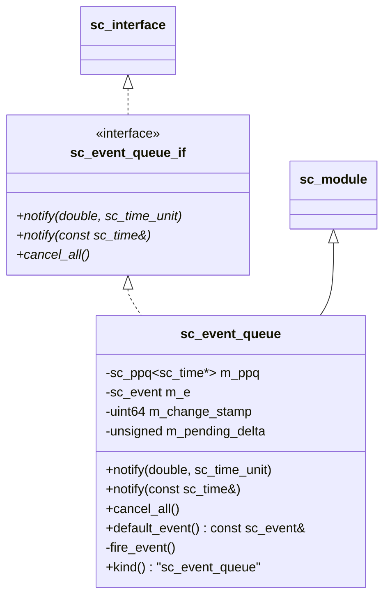
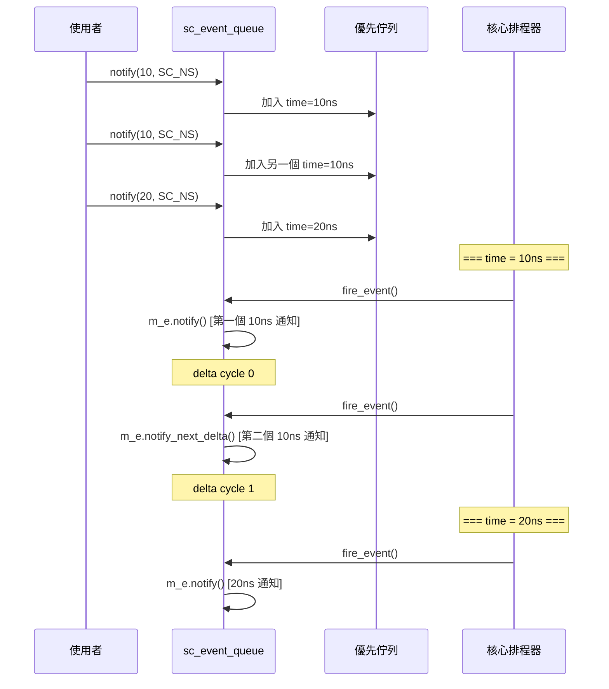

# sc_event_queue -- 事件佇列

## 概述

`sc_event_queue` 是一個可以同時持有多個待處理通知的佇列。與一般的 `sc_event`（後來的 `notify()` 會覆蓋先前的）不同，`sc_event_queue` 保證**每次 `notify()` 呼叫都會產生一個對應的觸發**。

**原始檔案：** `sc_event_queue.h`, `sc_event_queue.cpp`

## 日常比喻

比較 `sc_event` 和 `sc_event_queue`：

- **sc_event** 就像「一個鬧鐘」-- 你連續設了三個鬧鐘，但每次設定都會覆蓋前一個，最後只會響一次
- **sc_event_queue** 就像「鬧鐘排程表」-- 你設了三個鬧鐘時間，三個時間到了都會分別響

如果多個通知排在同一個時間點，事件佇列會在不同的 delta cycle 分別觸發，確保每個通知都被 process 看到。

## 類別結構



## 關鍵方法

### `notify()` - 排程通知

```cpp
virtual void notify(const sc_time& when);

inline void notify(double when, sc_time_unit base)
{
    notify( sc_time(when, base) );
}
```

將一個新的通知加入佇列。通知會在 `when` 時間後觸發。

### `cancel_all()` - 取消所有待處理通知

清空佇列中所有尚未觸發的通知。

### `default_event()` - 取得觸發事件

```cpp
const sc_event& default_event() const
{
    return m_e;
}
```

回傳佇列的內部事件。process 透過 `sensitive << event_queue.default_event()` 來監聽佇列的觸發。

## 內部機制



### 同時間的多個通知

當多個通知排在同一個模擬時間點時，事件佇列使用 delta cycle 來區分它們：
- 第一個通知立即觸發
- 後續的通知在下一個 delta cycle 觸發
- 這確保每個 `notify()` 都能被敏感的 process 偵測到

## 作為階層式通道

`sc_event_queue` 繼承自 `sc_module`（而非 `sc_prim_channel`），因為它使用內部的 process（`fire_event`）來實現觸發邏輯。這讓它成為一個「階層式通道」而非「原始通道」。

## 埠型別

```cpp
typedef sc_port<sc_event_queue_if, 1, SC_ONE_OR_MORE_BOUND> sc_event_queue_port;
```

提供了便利的埠型別別名，讓模組可以透過埠連接到事件佇列。

## 使用場景

1. **中斷控制器**：多個中斷源可能同時發生，每個都需要被處理
2. **DMA 控制器**：多個傳輸請求排程在不同時間
3. **網路模擬**：多個封包到達事件的排程
4. **測試平台**：按時間排程的激勵信號

## 設計重點

### sc_event vs sc_event_queue

| 特性 | sc_event | sc_event_queue |
|------|----------|----------------|
| 多次 notify 同一時間 | 只保留一次 | 每次都保留 |
| cancel | 取消最近一次 | 取消全部 |
| 繼承自 | 獨立類別 | sc_module |
| 效能 | 更快 | 有佇列開銷 |

### 為什麼要用優先佇列？

通知可能以任意順序加入，但必須按時間順序觸發。優先佇列（`sc_ppq`）自動維護時間排序。

## 相關檔案

- `sc_interface.h` - `sc_event_queue_if` 繼承自 `sc_interface`
- `sc_port.h` - `sc_event_queue_port` 使用 `sc_port`
- `sc_event.h` - 內部使用 `sc_event` 來觸發
