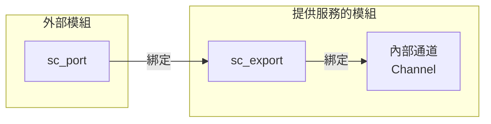
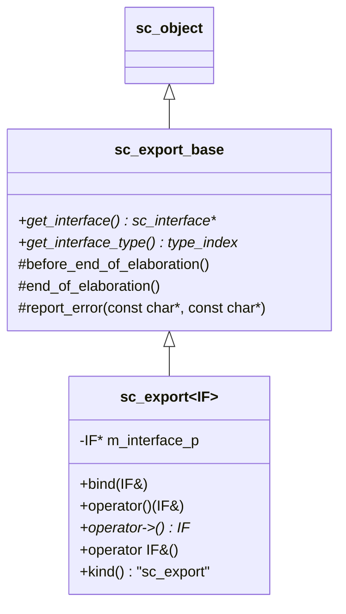
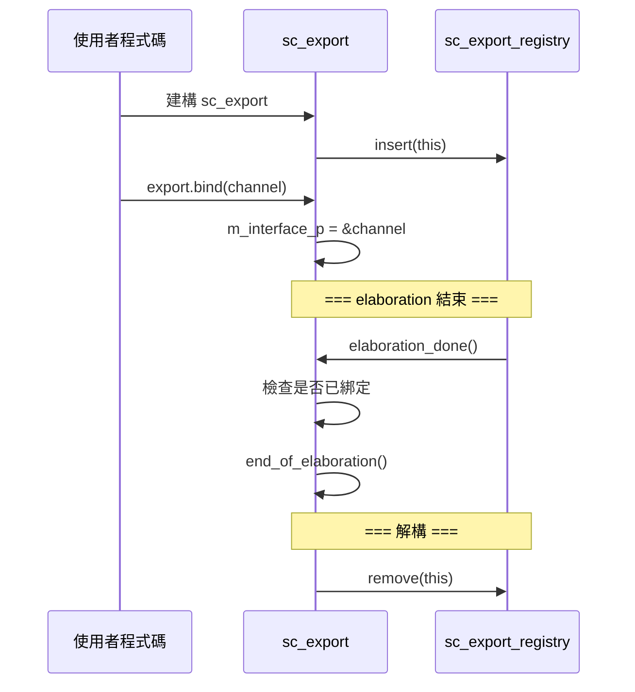

# sc_export -- 匯出的基底類別，讓模組暴露內部介面

## 概述

`sc_export` 讓模組可以將內部的介面（通常由內部通道提供）暴露給外部使用。這與 `sc_port` 方向相反：埠是「向外尋找介面」，匯出是「向外提供介面」。

**原始檔案：** `sc_export.h`, `sc_export.cpp`

## 日常比喻

想像一棟建築物：
- **sc_port** 就像「從辦公室伸出的插頭」，需要找到外面的電源
- **sc_export** 就像「建築物外牆上的服務窗口」，讓外面的人可以使用裡面的服務

例如一個「銀行模組」內部有「帳戶存取通道」，透過 `sc_export` 就能讓外部的「ATM 模組」透過埠連接到這個服務窗口。



## 類別階層



## 關鍵方法說明

### `bind()` - 綁定介面

```cpp
virtual void bind( IF& interface_ )
{
    if ( m_interface_p )
    {
        SC_REPORT_ERROR(SC_ID_SC_EXPORT_ALREADY_BOUND_, name());
        return;
    }
    m_interface_p = &interface_;
}
```

一個 `sc_export` 只能綁定一次。與 `sc_port` 不同的是，`sc_export` 綁定的是一個**本地的介面實現**（通常是內部通道），而不是外部的通道。

### `operator->()` - 存取介面

```cpp
IF* operator -> () {
    if ( m_interface_p == 0 )
    {
        SC_REPORT_ERROR(SC_ID_SC_EXPORT_HAS_NO_INTERFACE_, name());
    }
    return m_interface_p;
}
```

與 `sc_port` 類似，透過 `->` 可以直接呼叫介面方法。

### `operator IF&()` - 隱式轉型

`sc_export` 可以隱式轉換為其介面型別的參考。這讓 `sc_port` 可以直接綁定到 `sc_export`，因為 `sc_export` 看起來就像一個介面。

## 生命週期



## 使用範例概念

```cpp
// Producer module with an export
SC_MODULE(Producer) {
    sc_export<sc_signal_inout_if<int>> data_export;
    sc_signal<int> internal_signal;

    SC_CTOR(Producer) {
        data_export.bind(internal_signal); // expose internal signal
    }
};

// Consumer module with a port
SC_MODULE(Consumer) {
    sc_port<sc_signal_in_if<int>> data_port;
    // ...
};

// Top-level binding
Producer prod("prod");
Consumer cons("cons");
cons.data_port.bind(prod.data_export); // port binds to export
```

## sc_export_registry

內部管理類別，由 `sc_simcontext` 持有，負責追蹤所有 `sc_export` 實例並在適當時機觸發回呼。在 elaboration 結束時會檢查所有 `sc_export` 是否都已綁定到介面。

## 設計重點

### Port vs Export

| 特性 | sc_port | sc_export |
|------|---------|-----------|
| 方向 | 向外尋找介面 | 向外提供介面 |
| 綁定目標 | 外部通道或父埠 | 內部通道 |
| 可多重綁定 | 是（依 N 值） | 否（只能綁定一次） |
| 階層穿透 | 可連接到父埠 | 可讓外部埠直接綁定 |

### 與 RTL 的關聯

在 RTL 中，模組的輸入/輸出是透過 port list 定義的。`sc_export` 更像是 SystemC 在交易層級建模 (TLM) 中引入的概念，讓複雜的模組可以暴露多種服務介面，而不僅僅是訊號級的連接。

## 相關檔案

- `sc_interface.h` - `sc_export` 暴露的介面基底類別
- `sc_port.h` - 埠可以綁定到匯出
- `sc_communication_ids.h` - 相關錯誤訊息 ID
