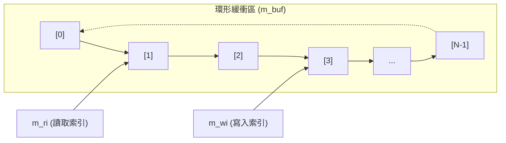
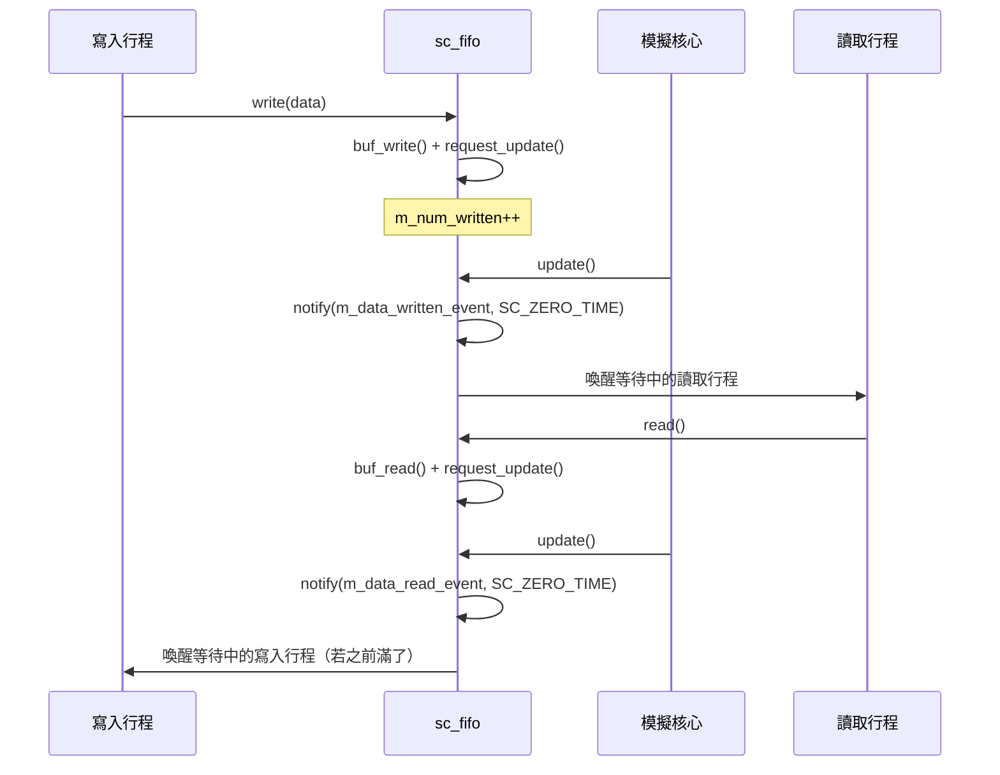

# sc_fifo.h - FIFO 通道的完整實作

## 概觀

`sc_fifo` 是 SystemC 中的 FIFO（先進先出）原始通道類別。它提供了一個固定大小的緩衝區，讓一個生產者模組寫入資料、一個消費者模組讀取資料，並自動處理滿/空的阻塞與同步。

這個檔案之所以存在，是因為硬體設計中經常需要在兩個模組之間建立一個資料佇列，讓生產端和消費端能以不同速率運作，而 FIFO 正是最基本的解耦機制。

## 核心概念 / 生活化比喻

### 排隊買飯的窗口

想像學校餐廳的取餐窗口：

- **廚房**（生產者）把做好的餐盤放到出餐台上
- **學生**（消費者）從出餐台的另一頭取餐
- 出餐台只能放 **16 個餐盤**（預設大小）
- 出餐台滿了，廚房就要**等**（阻塞寫入）
- 出餐台空了，學生就要**等**（阻塞讀取）
- 先放上去的餐盤一定先被取走（先進先出）

```
廚房 ──寫入──> [盤1][盤2][盤3]...[盤N] ──讀取──> 學生
               ^                        ^
               wi (寫入索引)              ri (讀取索引)
```

### 環形緩衝區

底層使用**環形緩衝區**（circular buffer）實作。就像旋轉壽司的迴轉台，寫入和讀取的指標繞著環形陣列轉，避免搬移資料。



## 類別詳細說明

### `sc_fifo<T>` 樣板類別

```cpp
template <class T>
class sc_fifo
: public sc_fifo_in_if<T>,
  public sc_fifo_out_if<T>,
  public sc_prim_channel
```

同時實作輸入介面和輸出介面，並繼承原始通道以獲得 `update()` 與 `request_update()` 機制。

### 建構子

| 建構子 | 說明 |
|--------|------|
| `sc_fifo(int size_ = 16)` | 建立大小為 `size_` 的 FIFO，自動命名 |
| `sc_fifo(const char* name_, int size_ = 16)` | 建立具名 FIFO |

預設大小 16 是個常見的工程慣例，對大多數管線場景都夠用。

### 阻塞讀取 / 寫入

```cpp
void read(T& val_);
T read();
void write(const T& val_);
```

- `read()`：如果 FIFO 為空，行程會**阻塞**（呼叫 `wait(m_data_written_event)`），直到有新資料寫入
- `write()`：如果 FIFO 為滿，行程會**阻塞**（呼叫 `wait(m_data_read_event)`），直到有資料被讀走

### 非阻塞讀取 / 寫入

```cpp
bool nb_read(T& val_);
bool nb_write(const T& val_);
```

- 如果操作不能立即完成，回傳 `false` 而不阻塞
- 成功時回傳 `true`，並呼叫 `request_update()` 排程更新

### 查詢方法

| 方法 | 說明 |
|------|------|
| `num_available()` | 回傳可讀取的樣本數 (`m_num_readable - m_num_read`) |
| `num_free()` | 回傳可寫入的空位數 (`m_size - m_num_readable - m_num_written`) |
| `data_written_event()` | 資料被寫入時觸發的事件（讀取端可用來監聽） |
| `data_read_event()` | 資料被讀走時觸發的事件（寫入端可用來監聽） |

### 連接規則：單讀單寫

```cpp
void register_port(sc_port_base&, const char*);
```

FIFO 強制 **只允許一個讀者、一個寫者**。`register_port` 會用 RTTI 檢查綁定的介面類型，如果已有第二個讀者或寫者就報錯。

### update() 機制

```cpp
void update();
```

在 delta cycle 的更新階段被呼叫：
1. 如果有讀取操作，通知 `m_data_read_event`（使用 `SC_ZERO_TIME` 延遲通知）
2. 如果有寫入操作，通知 `m_data_written_event`
3. 重置計數器

這確保了事件通知在正確的時間點發生，而不是在讀/寫的當下。

### 內部環形緩衝區操作

| 方法 | 說明 |
|------|------|
| `buf_init(int)` | 配置陣列、初始化索引 |
| `buf_write(const T&)` | 寫入 `m_buf[m_wi]`，推進 `m_wi`，減少 `m_free` |
| `buf_read(T&)` | 讀取 `m_buf[m_ri]`，清空欄位（支援 shared_ptr），推進 `m_ri`，增加 `m_free` |

索引推進使用 `(index + 1) % m_size`，實現環形。

### 成員變數

| 變數 | 類型 | 說明 |
|------|------|------|
| `m_size` | `int` | 緩衝區大小 |
| `m_buf` | `T*` | 動態配置的陣列 |
| `m_free` | `int` | 空位數量 |
| `m_ri` | `int` | 下一個讀取位置 |
| `m_wi` | `int` | 下一個寫入位置 |
| `m_reader` | `sc_port_base*` | 已連接的讀者（設計規則檢查） |
| `m_writer` | `sc_port_base*` | 已連接的寫者（設計規則檢查） |
| `m_num_readable` | `int` | 可讀樣本數 |
| `m_num_read` | `int` | 本 delta cycle 已讀取數 |
| `m_num_written` | `int` | 本 delta cycle 已寫入數 |

## 設計原理 / RTL 背景

在 RTL 設計中，FIFO 是最常見的跨時脈域或管線解耦元件。SystemC 的 `sc_fifo` 模擬了同步 FIFO 的行為：

- **單讀單寫**限制：對應硬體 FIFO 通常只有一個讀埠和一個寫埠
- **request_update / update 分離**：對應硬體中寫入在時脈邊緣生效，而非即時可見
- **SC_ZERO_TIME 通知**：確保事件在下一個 delta cycle 才傳播，模擬寄存器延遲



## 相關檔案

- `sc_fifo_ifs.h` - FIFO 輸入/輸出介面定義
- `sc_fifo_ports.h` - FIFO 專用埠類別
- `sc_prim_channel.h` - 原始通道基礎類別（提供 update 機制）
- `sc_communication_ids.h` - 通訊錯誤訊息 ID
