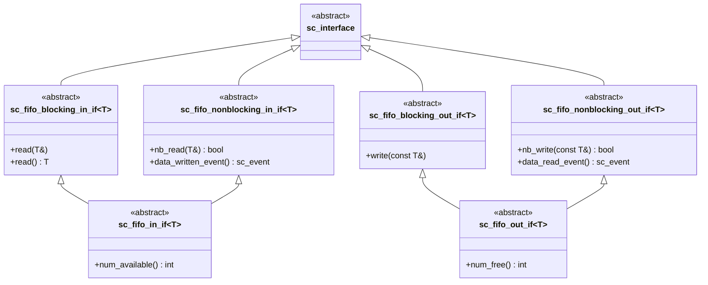

# sc_fifo_ifs.h - FIFO 通道的介面定義

## 概觀

這個檔案定義了 `sc_fifo` 通道的所有抽象介面類別。它把 FIFO 的讀取和寫入操作拆分成阻塞版與非阻塞版，讓使用者可以根據需求只使用部分功能。

這些介面存在的意義是**解耦**：模組只需要知道「我能從這裡讀資料」或「我能往這裡寫資料」，不需要知道背後是 `sc_fifo` 還是其他實作。

## 核心概念 / 生活化比喻

### 餐廳的不同服務窗口

想像一家餐廳有不同的服務窗口：

- **阻塞窗口**（`blocking`）：你排隊等，直到有餐點可以取。沒東西就站著等
- **非阻塞窗口**（`nonblocking`）：你問一下有沒有餐點，沒有就走，不等
- **完整服務窗口**（`in_if` / `out_if`）：兩種窗口都有，還能查詢「還有幾份」

## 介面繼承關係



## 各介面詳細說明

### `sc_fifo_blocking_in_if<T>` - 阻塞讀取介面

```cpp
virtual void read(T&) = 0;
virtual T read() = 0;
```

兩個版本：一個把結果寫入參考，一個直接回傳值。呼叫時如果 FIFO 為空，行程會暫停直到有資料。

### `sc_fifo_nonblocking_in_if<T>` - 非阻塞讀取介面

```cpp
virtual bool nb_read(T&) = 0;
virtual const sc_event& data_written_event() const = 0;
```

- `nb_read`：嘗試讀取，成功回傳 `true`，失敗回傳 `false`
- `data_written_event`：回傳「有新資料被寫入」的事件，讓你用 `wait()` 自行等待

### `sc_fifo_in_if<T>` - 完整輸入介面

結合阻塞和非阻塞介面，再加上：

```cpp
virtual int num_available() const = 0;
```

查詢目前有多少筆資料可讀。禁止拷貝和賦值。

### `sc_fifo_blocking_out_if<T>` - 阻塞寫入介面

```cpp
virtual void write(const T&) = 0;
```

如果 FIFO 已滿，行程會暫停直到有空位。

### `sc_fifo_nonblocking_out_if<T>` - 非阻塞寫入介面

```cpp
virtual bool nb_write(const T&) = 0;
virtual const sc_event& data_read_event() const = 0;
```

- `nb_write`：嘗試寫入，成功回傳 `true`
- `data_read_event`：「有資料被讀走」的事件

### `sc_fifo_out_if<T>` - 完整輸出介面

結合阻塞和非阻塞介面，再加上：

```cpp
virtual int num_free() const = 0;
```

查詢目前有多少空位可寫。

## 設計原理

### 為何拆分阻塞與非阻塞？

這是 2004 年 Cadence 的 Bishnupriya Bhattacharye 加入的改進。拆分的好處：

1. **細粒度的介面綁定**：如果模組只需要非阻塞操作，它的埠可以只綁定 `sc_fifo_nonblocking_in_if`
2. **介面隔離原則**（ISP）：不強迫使用者實作不需要的方法
3. **向後相容**：完整介面 `sc_fifo_in_if` 繼承兩者，舊程式碼不受影響

### 虛擬繼承

所有介面都用 `virtual public sc_interface` 繼承，避免菱形繼承時出現多個 `sc_interface` 副本。

## 相關檔案

- `sc_fifo.h` - FIFO 通道的實作
- `sc_fifo_ports.h` - FIFO 專用埠類別
- `sc_interface.h` - 所有介面的基礎類別
