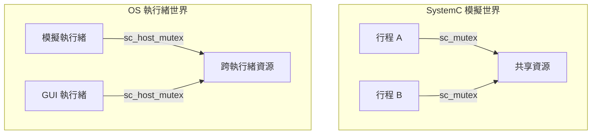

# sc_host_mutex.h - 作業系統層級的互斥鎖封裝

## 概觀

`sc_host_mutex` 是一個封裝了作業系統真實互斥鎖（`std::mutex`）的類別，實作了 `sc_mutex_if` 介面。與 `sc_mutex`（在 SystemC 模擬環境中運作）不同，`sc_host_mutex` 使用的是**真正的 OS 執行緒同步機制**，適用於 SystemC 模擬核心與外部執行緒之間的同步。

## 核心概念 / 生活化比喻

### 兩種門鎖

- **sc_mutex**（模擬互斥鎖）：像是遊戲裡的門鎖。遊戲角色（SystemC 行程）輪流使用，由遊戲引擎（模擬核心）排程，同一時間只有一個角色在動
- **sc_host_mutex**（真實互斥鎖）：像是真實世界的門鎖。多個人（OS 執行緒）可能同時嘗試開門，需要硬體級別的同步機制

### 何時需要真實鎖？

當你的 SystemC 模擬需要與外部系統互動時：
- 外部 GUI 執行緒更新視覺化
- 外部硬體介面（HW-in-the-loop）
- async_request_update() 的跨執行緒通知

## 類別詳細說明

### `sc_host_mutex` 類別

```cpp
class sc_host_mutex : public sc_mutex_if
{
public:
    sc_host_mutex() = default;
    virtual ~sc_host_mutex() = default;

    virtual int lock()    { m_mtx.lock(); return 0; }
    virtual int trylock() { return m_mtx.try_lock() ? 0 : -1; }
    virtual int unlock()  { m_mtx.unlock(); return 0; }

private:
    std::mutex m_mtx;
};
```

極其簡單的封裝，直接轉發給 `std::mutex`。

### 方法對照

| `sc_host_mutex` | `std::mutex` | 說明 |
|-----------------|-------------|------|
| `lock()` | `m_mtx.lock()` | 阻塞直到取得鎖 |
| `trylock()` | `m_mtx.try_lock()` | 嘗試取鎖，失敗回傳 -1 |
| `unlock()` | `m_mtx.unlock()` | 解鎖 |

### 限制

原始碼註解提到：`unlock()` 應該在非擁有者呼叫時回傳 -1，但目前**無法檢查這一點**。這是因為 `std::mutex` 本身不追蹤擁有者資訊（不像 `sc_mutex` 有 `m_owner`）。

## 與 `sc_mutex` 的比較

| 特性 | `sc_mutex` | `sc_host_mutex` |
|------|-----------|-----------------|
| 繼承 | `sc_mutex_if` + `sc_object` | `sc_mutex_if` |
| 底層機制 | `sc_event` + `wait()` | `std::mutex` |
| 適用場景 | SystemC 行程間同步 | OS 執行緒間同步 |
| 擁有者追蹤 | 有（`m_owner`） | 無 |
| 可重入 | 是 | 否（`std::mutex` 不可重入） |
| 命名 | 有（繼承 `sc_object`） | 無 |
| 阻塞方式 | 模擬核心排程 | OS 執行緒阻塞 |



## 設計原理

### 為何不直接用 `std::mutex`？

透過實作 `sc_mutex_if`，`sc_host_mutex` 可以用在任何需要 `sc_mutex_if` 的地方。例如 `sc_scoped_lock` 可以同時搭配 `sc_mutex` 和 `sc_host_mutex` 使用，程式碼不需要修改。

### 平台相容性

檔案中有針對 MSVC 的 DLL 警告抑制（`#pragma warning(push/pop)`），因為 `std::mutex` 作為私有成員在 DLL 匯出類別中會產生警告。

## 相關檔案

- `sc_mutex_if.h` - 互斥鎖介面（含 `sc_scoped_lock`）
- `sc_mutex.h` - 模擬環境中的互斥鎖
- `sc_host_semaphore.h` - 作業系統層級的號誌封裝
