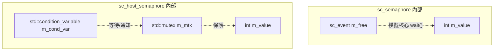

# sc_host_semaphore.h - 作業系統層級的號誌封裝

## 概觀

`sc_host_semaphore` 是一個封裝了作業系統真實號誌的類別，使用 `std::mutex` 和 `std::condition_variable` 實作，實作了 `sc_semaphore_if` 介面。與 `sc_semaphore`（在 SystemC 模擬環境中運作）不同，它使用**真正的 OS 執行緒同步機制**。

## 核心概念 / 生活化比喻

### 兩種停車場管理

- **sc_semaphore**（模擬號誌）：像遊戲裡的停車場，由遊戲引擎管理，一次只有一台車在移動
- **sc_host_semaphore**（真實號誌）：像真實世界的停車場，多台車可能同時到達，需要真正的閘門和感測器

## 類別詳細說明

### `sc_host_semaphore` 類別

```cpp
class sc_host_semaphore : public sc_semaphore_if
{
public:
    explicit sc_host_semaphore(int init = 0);
    virtual ~sc_host_semaphore() = default;

    virtual int wait();
    virtual int trywait();
    virtual int post();
    virtual int get_value() const;

private:
    std::mutex m_mtx;
    std::condition_variable m_cond_var;
    int m_value = 0;
};
```

### 方法實作

#### `wait()` - 阻塞取得

```cpp
virtual int wait()
{
    std::unique_lock lock(m_mtx);
    while (m_value <= 0) {
        m_cond_var.wait(lock);
    }
    --m_value;
    return 0;
}
```

使用 `std::condition_variable` 的經典等待模式：
1. 取得 mutex 鎖
2. 在迴圈中檢查條件（`m_value > 0`），不滿足就等待
3. 條件滿足後減少計數

`while` 迴圈（而非 `if`）是為了防止**假喚醒**（spurious wakeup），這是 OS 執行緒同步的標準做法。

#### `trywait()` - 嘗試取得

```cpp
virtual int trywait()
{
    std::unique_lock lock(m_mtx);
    if (m_value <= 0) return -1;
    --m_value;
    return 0;
}
```

不等待，直接檢查並回傳結果。

#### `post()` - 釋放

```cpp
virtual int post()
{
    std::unique_lock lock(m_mtx);
    ++m_value;
    m_cond_var.notify_one();
    return 0;
}
```

增加計數後通知一個等待中的執行緒。

#### `get_value()` - 查詢

```cpp
virtual int get_value() const { return m_value; }
```

注意：這個方法沒有加鎖，回傳的值可能在讀取後立即過時。這在多執行緒環境中是可接受的，因為精確值通常只用於除錯或日誌。

### 成員變數

| 變數 | 型別 | 說明 |
|------|------|------|
| `m_mtx` | `std::mutex` | 保護 `m_value` 的互斥鎖 |
| `m_cond_var` | `std::condition_variable` | 阻塞等待的條件變數 |
| `m_value` | `int` | 號誌計數值 |

## 與 `sc_semaphore` 的比較

| 特性 | `sc_semaphore` | `sc_host_semaphore` |
|------|---------------|---------------------|
| 繼承 | `sc_semaphore_if` + `sc_object` | `sc_semaphore_if` |
| 底層機制 | `sc_event` + `wait()` | `std::mutex` + `std::condition_variable` |
| 適用場景 | SystemC 行程間同步 | OS 執行緒間同步 |
| 命名 | 有（繼承 `sc_object`） | 無 |
| 預設初始值 | 必須指定 | 0 |
| 阻塞方式 | 模擬核心排程 | OS 執行緒阻塞 |



## 設計原理

### 為何用 mutex + condition_variable 而非 OS semaphore？

C++ 標準庫（截至 C++20）沒有 `std::semaphore`（C++20 才加入 `std::counting_semaphore`）。使用 `std::mutex` + `std::condition_variable` 是最可攜的方式。

### 預設初始值為 0

與 `sc_semaphore` 不同（必須明確指定），`sc_host_semaphore` 預設初始值為 0。這意味著如果你建立一個 `sc_host_semaphore` 而不指定初始值，第一個呼叫 `wait()` 的執行緒就會阻塞，直到有人呼叫 `post()`。這種用法常見於「生產者-消費者」模式的初始化。

## 相關檔案

- `sc_semaphore_if.h` - 號誌介面定義
- `sc_semaphore.h` / `.cpp` - 模擬環境中的號誌
- `sc_host_mutex.h` - 作業系統層級的互斥鎖封裝
