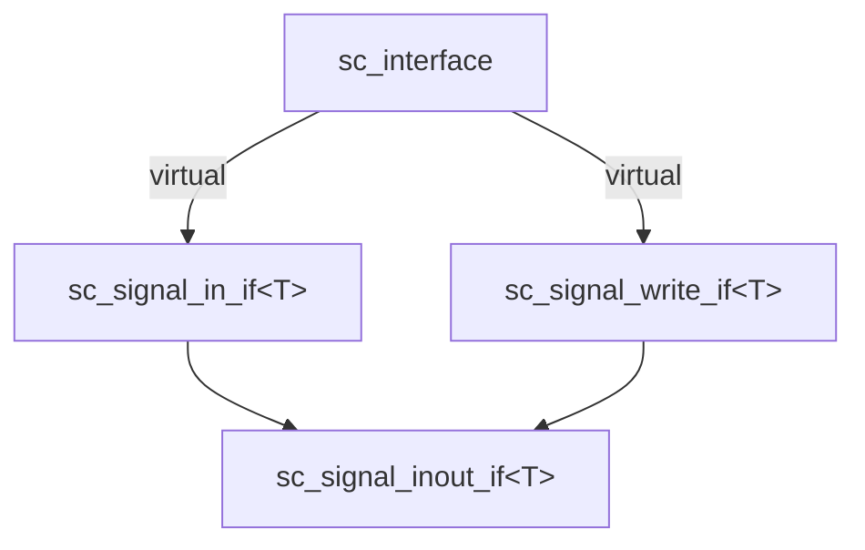

# sc_interface -- 所有介面類別的抽象基底類別

## 概述

`sc_interface` 是 SystemC 通訊架構中最頂層的抽象類別。所有的介面（如 `sc_signal_in_if`、`sc_signal_write_if`）都必須虛擬繼承自此類別。它定義了介面的最基本契約：提供預設事件和註冊埠的能力。

**原始檔案：** `sc_interface.h`, `sc_interface.cpp`

## 日常比喻

想像 `sc_interface` 是「服務契約的範本」。就像所有合約都必須有「簽署日期」和「服務條款」這兩個基本欄位一樣，所有 SystemC 介面都必須能夠：
1. 提供一個「預設事件」（讓監聽者知道何時有變化）
2. 允許「埠來註冊」（讓使用者宣告自己要使用這個服務）

## 類別定義

```cpp
class sc_interface
{
public:
    // 註冊一個埠到這個介面（預設不做任何事）
    virtual void register_port( sc_port_base& port_, const char* if_typename_ );

    // 取得預設事件
    virtual const sc_event& default_event() const;

    // 解構子
    virtual ~sc_interface();

protected:
    // 建構子（受保護，不能直接建立實例）
    sc_interface();

private:
    // 禁止複製
    sc_interface( const sc_interface& );
    sc_interface& operator = ( const sc_interface& );
};
```

## 關鍵方法說明

### `register_port()`

當一個埠 (port) 被綁定到實現此介面的通道時，系統會呼叫這個方法。預設實現什麼也不做。

實際的通道（如 `sc_signal`）會覆寫此方法來做額外的檢查，例如確保只有一個輸出埠綁定到同一個訊號（寫入者檢查）。

### `default_event()`

回傳這個介面的「預設事件」。當你用 `sensitive << port` 語法設定 process 的敏感列表時，系統會呼叫此方法來找到要監聽的事件。

預設實現會發出警告 `SC_ID_NO_DEFAULT_EVENT_` 並回傳 `sc_event::none()`，因為不是所有介面都有預設事件。

## 設計重點

### 為什麼必須用虛擬繼承？

原始碼註解強調：**直接繼承自 `sc_interface` 必須使用 `virtual` 繼承**。

這是因為 `sc_signal_inout_if<T>` 同時繼承了 `sc_signal_in_if<T>` 和 `sc_signal_write_if<T>`，而這兩者都繼承自 `sc_interface`。如果不使用虛擬繼承，會產生「鑽石繼承問題」，導致一個物件中有兩份 `sc_interface` 的副本。



### 為什麼禁止複製？

介面代表的是一個「服務端點」，就像一個電話號碼不能被複製到另一支電話上使用一樣。複製一個介面會導致身份混亂，因此建構子和賦值運算子都被放在 `private` 區段中禁止使用。

## 與 RTL 的關聯

在 RTL 硬體設計中，沒有「介面」這個顯式概念。線路 (wire) 就直接連接模組。`sc_interface` 是 SystemC 借鑒軟體工程（特別是 Java 的 interface 概念）的產物，目的是在較高抽象層級支援靈活的模組互連。

## 相關檔案

- `sc_port.h` - 埠會綁定到實現 `sc_interface` 的通道
- `sc_export.h` - 匯出會暴露實現 `sc_interface` 的物件
- `sc_prim_channel.h` - 原始通道通常會實現某個 `sc_interface` 的子介面
- `sc_communication_ids.h` - 定義了 `SC_ID_NO_DEFAULT_EVENT_` 等錯誤訊息
