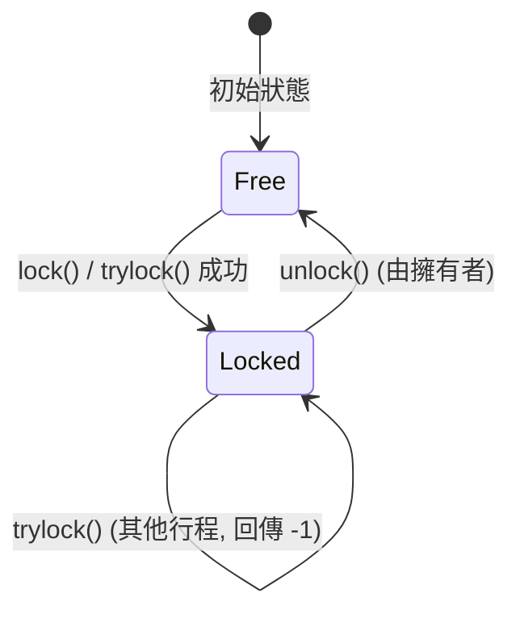
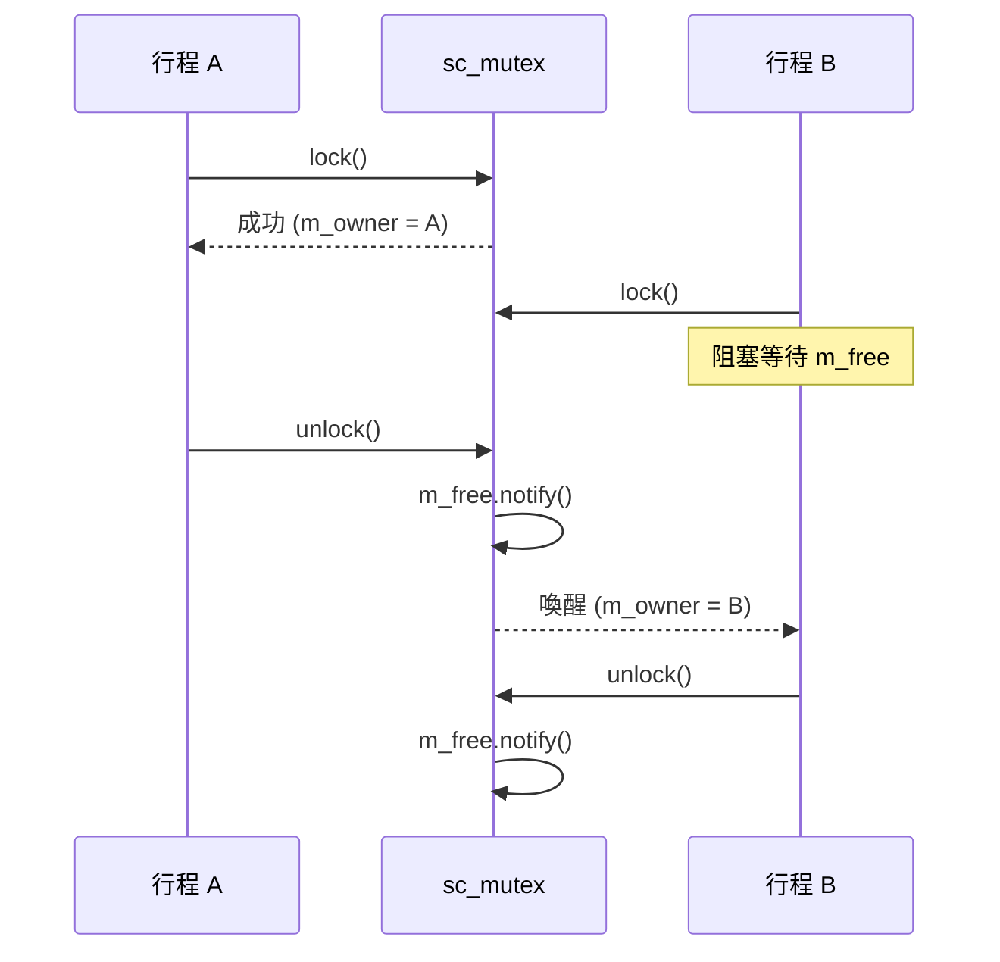

# sc_mutex.h / .cpp - 互斥鎖原始通道

## 概觀

`sc_mutex` 是 SystemC 中的互斥鎖（mutex）原始通道，用於保護共享資源，確保同一時間只有一個行程（process）能存取該資源。它實作了 `sc_mutex_if` 介面，提供 `lock()`、`trylock()`、`unlock()` 三個經典操作。

## 核心概念 / 生活化比喻

### 廁所的鎖

想像一間只有一個隔間的廁所：

- **lock()**：你想進去。如果有人在裡面（鎖著），你就**排隊等**。等到裡面的人出來，你進去並鎖上門
- **trylock()**：你看一眼門上的標示。如果「使用中」，你**馬上離開**（回傳 -1）。如果「空閒」，你進去鎖門
- **unlock()**：你用完了，開門出來。門外如果有人在等，他就可以進去了
- 重要規則：只有鎖門的人才能開門！別人不能替你開鎖（`unlock` 會檢查 `m_owner`）



## 類別詳細說明

### `sc_mutex` 類別

```cpp
class sc_mutex
: public sc_mutex_if,
  public sc_object
```

注意它繼承的是 `sc_object` 而非 `sc_prim_channel`。這是因為 mutex 不需要 `update()` / `request_update()` 機制，它的狀態變更是即時生效的。

### 建構子

```cpp
sc_mutex();                        // 自動命名 "mutex_0", "mutex_1", ...
sc_mutex(const char* name_);       // 指定名稱
```

兩者都會將 `m_owner` 初始化為 `0`（無擁有者），`m_free` 事件標記為核心事件。

### 介面方法

#### `lock()` - 阻塞鎖定

```cpp
int sc_mutex::lock()
{
    if (m_owner == sc_get_current_process_b()) return 0;
    while (in_use()) {
        sc_core::wait(m_free, sc_get_curr_simcontext());
    }
    m_owner = sc_get_current_process_b();
    return 0;
}
```

關鍵行為：
- 如果**自己已經是擁有者**，直接回傳 0（可重入，reentrant）
- 如果被其他行程佔用，透過 `wait(m_free)` 阻塞，等待 `m_free` 事件
- 取得鎖時設定 `m_owner` 為當前行程

#### `trylock()` - 嘗試鎖定

```cpp
int sc_mutex::trylock()
{
    if (m_owner == sc_get_current_process_b()) return 0;
    if (in_use()) return -1;
    m_owner = sc_get_current_process_b();
    return 0;
}
```

與 `lock()` 相同，但不阻塞。鎖不到就回傳 -1。

#### `unlock()` - 解鎖

```cpp
int sc_mutex::unlock()
{
    if (m_owner != sc_get_current_process_b()) return -1;
    m_owner = 0;
    m_free.notify();
    return 0;
}
```

- 只有擁有者才能解鎖，否則回傳 -1
- 解鎖後立即通知 `m_free` 事件（使用即時通知），喚醒等待中的行程

### 成員變數

| 變數 | 型別 | 說明 |
|------|------|------|
| `m_owner` | `sc_process_b*` | 目前持有鎖的行程指標，`0` 表示無人持有 |
| `m_free` | `sc_event` | 鎖被釋放時觸發的事件 |

### 輔助方法

```cpp
bool in_use() const { return (m_owner != 0); }
```

## 設計原理 / RTL 背景

### 為何繼承 `sc_object` 而非 `sc_prim_channel`？

在 SystemC 2.3 中做了這個改變。`sc_prim_channel` 提供的 `update()` 機制是為了模擬硬體的「寫入延遲」（值在下一個 delta cycle 才生效）。但 mutex 不需要這種行為——鎖定/解鎖應該**立即**生效，所以只需繼承 `sc_object` 來擁有命名功能即可。

### 即時通知 vs 延遲通知

`m_free.notify()` 使用的是**即時通知**（不帶參數），而不是 `notify(SC_ZERO_TIME)`。這意味著等待中的行程可以在同一個 delta cycle 被喚醒，避免不必要的延遲。

### 可重入設計

`lock()` 和 `trylock()` 都允許擁有者重複取得鎖而不會死鎖。這在硬體模擬中很實用，因為同一個行程可能在不同的呼叫路徑中多次存取相同的共享資源。



## 相關檔案

- `sc_mutex_if.h` - 互斥鎖介面定義（含 `sc_scoped_lock`）
- `sc_host_mutex.h` - 作業系統層級的互斥鎖封裝
- `sc_semaphore.h` - 號誌（允許多個行程同時存取）
