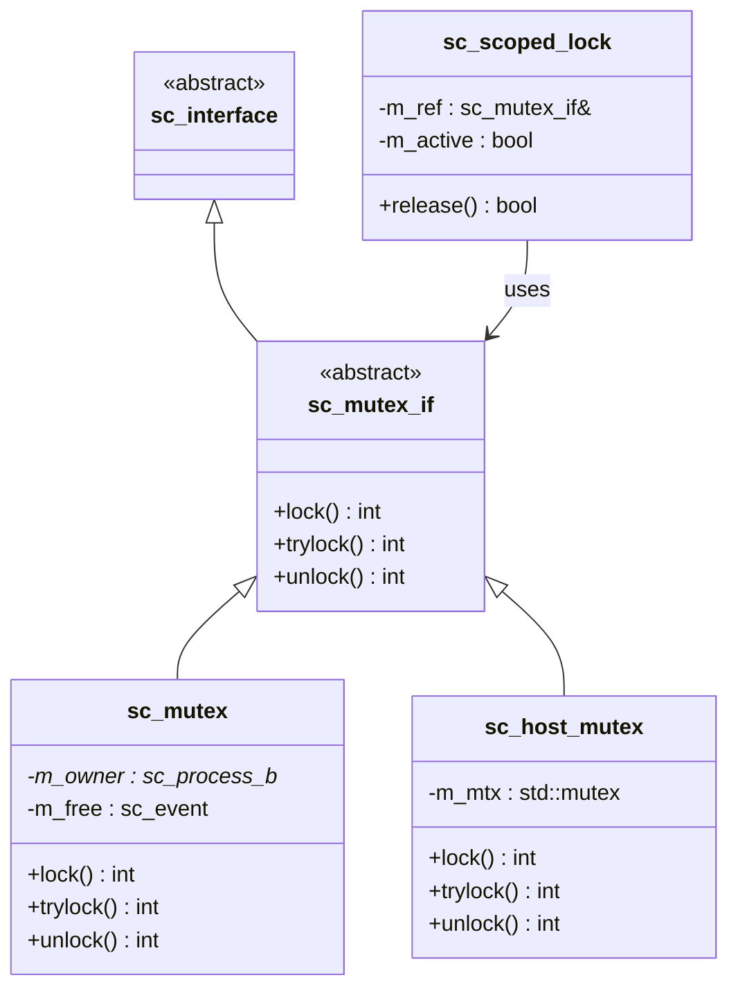

# sc_mutex_if.h - 互斥鎖介面與 RAII 鎖定器

## 概觀

這個檔案定義了兩個類別：
1. `sc_mutex_if` - 互斥鎖的抽象介面，宣告 `lock()`、`trylock()`、`unlock()` 三個經典操作
2. `sc_scoped_lock` - RAII 風格的自動鎖定/解鎖工具類別

## 核心概念 / 生活化比喻

### 鑰匙與智慧鎖

- **sc_mutex_if** 就像一把鎖的「操作規範」：任何符合規範的鎖都能用同樣的方式操作（轉動、嘗試、解開）
- **sc_scoped_lock** 就像「智慧門鎖」：你走進房間時自動上鎖，離開房間（離開作用域）時自動解鎖。即使你忘記手動解鎖，門也會自動打開

### RAII 模式

RAII（Resource Acquisition Is Initialization）是 C++ 的經典模式：
- 建構子取得資源（上鎖）
- 解構子釋放資源（解鎖）
- 即使發生例外也不會忘記解鎖

## 類別詳細說明

### `sc_mutex_if` - 抽象介面

```cpp
class sc_mutex_if : virtual public sc_interface
{
public:
    virtual int lock() = 0;      // 阻塞直到取得鎖，回傳 0
    virtual int trylock() = 0;   // 嘗試取鎖，失敗回傳 -1
    virtual int unlock() = 0;    // 解鎖，非擁有者回傳 -1
};
```

三個純虛擬函式定義了互斥鎖的完整契約。回傳值使用整數而非布林，是為了未來可能的錯誤碼擴展。

### `sc_scoped_lock` - 自動鎖定器

```cpp
class sc_scoped_lock
{
public:
    typedef sc_mutex_if lockable_type;

    explicit sc_scoped_lock(lockable_type& mtx);
    bool release();
    ~sc_scoped_lock();
};
```

#### 使用方式

```cpp
void some_process() {
    sc_scoped_lock guard(my_mutex);  // 自動 lock()
    // ... 操作共享資源 ...
    // guard 離開作用域時自動 unlock()
}
```

#### `release()` 方法

允許提前手動解鎖：

```cpp
void some_process() {
    sc_scoped_lock guard(my_mutex);
    // ... 關鍵操作 ...
    guard.release();  // 提前解鎖，回傳 true
    // ... 不需要鎖的操作 ...
    guard.release();  // 已解鎖，回傳 false（不重複解鎖）
}
```

`m_active` 旗標確保不會重複解鎖。

### 成員變數

| 變數 | 型別 | 說明 |
|------|------|------|
| `m_ref` | `lockable_type&` | 被鎖定的 mutex 參考 |
| `m_active` | `bool` | 目前是否持有鎖 |

## 設計原理

### 為何需要介面類別？

`sc_mutex_if` 讓不同的 mutex 實作（`sc_mutex`、`sc_host_mutex`）能透過相同介面使用。模組的埠可以綁定到 `sc_mutex_if`，而不需要知道具體實作。

### 虛擬繼承 `sc_interface`

使用 `virtual public sc_interface` 避免菱形繼承問題，這是 SystemC 介面類別的標準做法。

### `sc_scoped_lock` 的設計選擇

原始碼中有被註解掉的模板版本：

```cpp
//template< typename Lockable = sc_mutex_if >
```

最終選擇了非模板版本，直接使用 `sc_mutex_if`。這簡化了使用，但犧牲了一些泛型能力。類似 C++11 的 `std::lock_guard`，但更簡單。



## 相關檔案

- `sc_mutex.h` / `sc_mutex.cpp` - 模擬環境中的互斥鎖實作
- `sc_host_mutex.h` - 作業系統層級的互斥鎖封裝
- `sc_interface.h` - 所有介面的基礎類別
