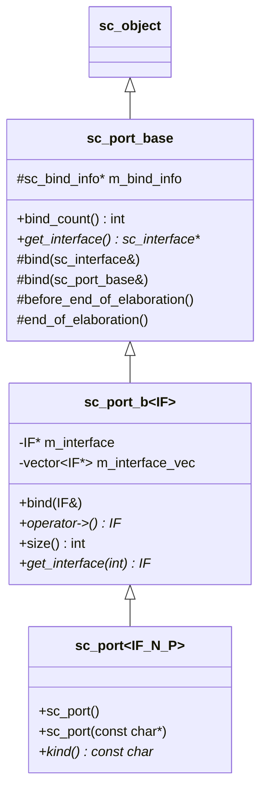
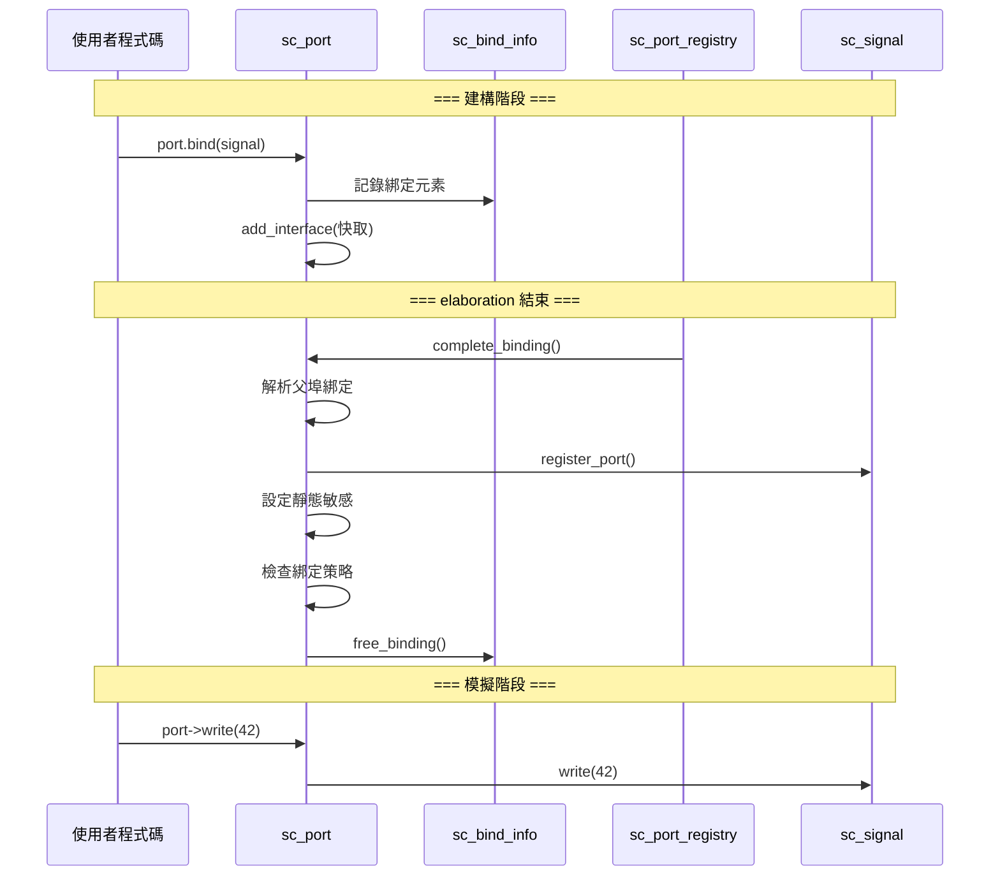

# sc_port -- 埠的基底類別，模組存取外部通道的入口

## 概述

`sc_port` 是 SystemC 中模組對外通訊的「門戶」。每個模組透過埠來連接外部的通道 (channel)。埠在建構階段 (elaboration) 被綁定到通道，之後在模擬階段透過 `operator->()` 來呼叫通道的介面方法。

本檔案定義了三層類別階層：
1. `sc_port_base` - 非模板化的基底類別
2. `sc_port_b<IF>` - 模板化的中間基底類別
3. `sc_port<IF, N, P>` - 最終使用者面對的模板類別

**原始檔案：** `sc_port.h`, `sc_port.cpp`

## 日常比喻

想像一棟辦公大樓：
- **模組 (Module)** 就是大樓裡的一間辦公室
- **埠 (Port)** 就是辦公室牆上的「網路孔」
- **通道 (Channel)** 就是建築物內的實體網路線路
- **介面 (Interface)** 就是網路協定（例如 Ethernet）

辦公室不需要知道牆壁後面的線路怎麼走，只需要透過網路孔（埠）按照協定（介面）來通訊。裝潢階段（elaboration）會把網路孔接上線路（綁定），之後就可以正常使用了。

## 類別階層



## 綁定策略 (Port Policy)

```cpp
enum sc_port_policy
{
    SC_ONE_OR_MORE_BOUND,   // 預設：至少綁定一個通道
    SC_ZERO_OR_MORE_BOUND,  // 可以不綁定（可選的埠）
    SC_ALL_BOUND            // 必須綁定滿 N 個通道
};
```

模板參數 `N` 控制最大綁定數量（N <= 0 表示不限制），`P` 控制綁定策略。

## 關鍵方法說明

### `bind()` - 綁定

```cpp
void sc_port_base::bind( sc_interface& interface_ );  // 綁定到介面（通道）
void sc_port_base::bind( sc_port_base& parent_ );     // 綁定到父埠
```

綁定只能在 elaboration 階段進行。綁定到父埠是用於階層式設計，例如子模組的埠連接到父模組的埠。

### `operator->()` - 存取介面

```cpp
template <class IF>
IF* sc_port_b<IF>::operator -> ()
{
    if( m_interface == 0 ) {
        report_error( SC_ID_GET_IF_, "port is not bound" );
        sc_core::sc_abort();
    }
    return m_interface;
}
```

這是使用埠最常見的方式。透過 `->` 運算子，你可以直接呼叫綁定通道的介面方法：

```cpp
// port 是 sc_port<sc_signal_inout_if<int>>
port->write(42);         // 透過埠寫入值
int val = port->read();  // 透過埠讀取值
```

### `complete_binding()` - 完成綁定

這是 elaboration 結束時系統內部呼叫的方法，負責：
1. 遞迴解析父埠的綁定
2. 將所有綁定的介面加入快取
3. 呼叫 `register_port()` 通知通道
4. 完成靜態敏感列表的設定
5. 檢查綁定數量是否符合策略要求

## 綁定流程



## 內部結構

### `sc_bind_info` - 綁定資訊

儲存在 elaboration 期間的所有綁定資訊，包含：
- `vec` - 綁定元素列表（介面或父埠指標）
- `has_parent` - 是否有父埠綁定
- `is_leaf` - 是否為葉節點（沒有子埠綁定到此埠）
- `thread_vec` / `method_vec` - 待完成的敏感列表設定

elaboration 完成後，`sc_bind_info` 會被釋放以節省記憶體。

### `sc_port_registry` - 埠登錄中心

由 `sc_simcontext` 持有，負責管理所有埠的生命週期回呼：
- `construction_done()` - 建構完成
- `complete_binding()` - 完成綁定
- `elaboration_done()` - elaboration 完成
- `start_simulation()` / `simulation_done()` - 模擬開始/結束

## 設計重點

### 為什麼埠不能在模擬開始後建立？

埠在建構時會註冊到 `sc_port_registry`，這個動作必須在 elaboration 階段完成。如果在模擬運行中建立埠，綁定和敏感列表的設定都會出問題。

### 多重綁定 (Multi-bind)

當 `N > 1` 時，一個埠可以綁定到多個通道。這在硬體設計中對應於匯流排 (bus) 的概念。透過 `operator[]` 或 `get_interface(int)` 可以存取特定索引的介面。

## 相關檔案

- `sc_interface.h` - 埠綁定的目標介面基底類別
- `sc_export.h` - 匯出是埠的「反向」概念
- `sc_signal_ports.h` - 訊號專用的埠類別
- `sc_event_finder.h` - 配合埠使用的事件尋找器
- `sc_communication_ids.h` - 綁定相關的錯誤訊息
