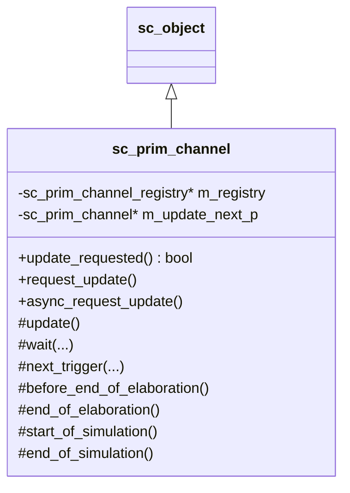
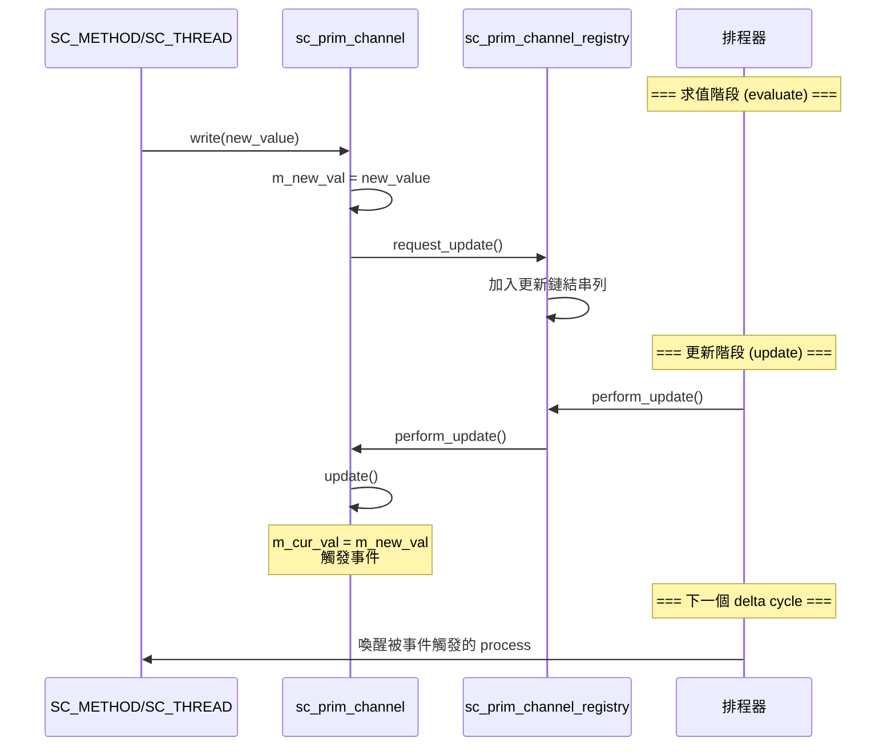

# sc_prim_channel -- 原始通道的抽象基底類別

## 概述

`sc_prim_channel` 是所有「原始通道」(primitive channel) 的基底類別。原始通道是 SystemC 中實現通訊的核心元件，能夠參與模擬器的 **更新階段 (update phase)**。最重要的子類別就是 `sc_signal`。

與階層式通道 (hierarchical channel，繼承自 `sc_module`) 不同，原始通道直接與模擬引擎的排程器互動，透過「請求更新 - 執行更新」的兩階段機制確保模擬的正確性。

**原始檔案：** `sc_prim_channel.h`, `sc_prim_channel.cpp`

## 日常比喻

想像一個佈告欄系統：
- **寫入 (write)** 就像在便利貼上寫下新訊息，貼在「待更新區」
- **request_update()** 就像告訴管理員「我有新訊息要上架」
- **update()** 就像管理員在特定時間統一把「待更新區」的便利貼移到佈告欄上
- **事件通知** 就像管理員更換佈告欄後廣播「佈告欄已更新！」

這個「先暫存、後統一更新」的機制確保了在同一個時間點，所有人看到的佈告欄內容是一致的。

## 類別定義



## 關鍵方法說明

### `request_update()` - 請求更新

```cpp
inline void sc_prim_channel::request_update()
{
    if( ! m_update_next_p ) {
        m_registry->request_update( *this );
    }
}
```

當通道的新值被寫入時，呼叫此方法將自己加入更新佇列。重複的請求會被忽略（透過檢查 `m_update_next_p` 是否為空）。

### `update()` - 執行更新

```cpp
virtual void sc_prim_channel::update();  // default: does nothing
```

在模擬器的 update phase 被呼叫。子類別（如 `sc_signal`）覆寫此方法來將新值寫入目前值，並觸發事件通知。

### `async_request_update()` - 非同步更新請求

```cpp
inline void sc_prim_channel::async_request_update()
{
    m_registry->async_request_update(*this);
}
```

從模擬器外部的執行緒安全地請求更新。這對於 SystemC 與外部系統（如 OS 執行緒、硬體加速器）的整合非常重要。

### `async_attach_suspending()` / `async_detach_suspending()`

告知核心這個通道可能從外部產生非同步更新。核心在沒有其他事件時會暫停等待，而不是直接結束模擬。

## 更新機制



## 內部實現：更新鏈結串列

`sc_prim_channel_registry` 使用侵入式鏈結串列 (intrusive linked list) 管理待更新的通道：

- `m_update_next_p` 成員指向串列中的下一個通道
- `m_update_list_p` 是串列頭
- `m_update_list_end` 是串列終結標記（使用 registry 自身的位址，保證不會與任何通道位址衝突）

這種設計避免了動態記憶體分配，效能極高。

## 內建的 `wait()` 和 `next_trigger()`

`sc_prim_channel` 提供了大量的 `wait()` 和 `next_trigger()` 重載方法，這些方法只是轉發到 `sc_core::wait()` 和 `sc_core::next_trigger()`，差別在於它們自動帶入了模擬上下文 (`simcontext()`)，讓通道實現中不需要手動取得上下文。

支援的等待模式包括：
- **無參數** - 等待靜態敏感列表中的事件
- **事件** - `wait(event)`, `wait(event_or_list)`, `wait(event_and_list)`
- **計時** - `wait(sc_time)`, `wait(double, sc_time_unit)`
- **計時+事件** - `wait(time, event)`, `wait(time, event_or_list)`
- **delta cycle 數** - `wait(int n)`

## sc_prim_channel_registry::async_update_list

用於處理外部執行緒的非同步更新請求。使用 mutex 和 semaphore 實現執行緒安全：

- `append()` - 從外部執行緒安全地加入更新請求
- `accept_updates()` - 在模擬器執行緒中將外部請求轉為內部請求
- `suspend()` / `attach_suspending()` - 管理模擬器的暫停/恢復

## 設計重點

### 為什麼需要兩階段更新？

這對應於硬體中的時序邏輯行為。在真正的硬體中，暫存器 (register) 在時脈邊緣**同時**更新它們的值。兩階段更新機制模擬了這個行為：
1. **求值階段**：計算新值但不立即生效
2. **更新階段**：所有新值同時生效

如果沒有這個機制，訊號更新的順序會影響模擬結果，這不符合硬體的並行行為特性。

### 與 RTL 的對應

| SystemC 概念 | RTL 對應 |
|-------------|---------|
| `request_update()` | 非阻塞賦值 (`<=`) 的排程 |
| `update()` | 非阻塞賦值在 delta cycle 結束時生效 |
| delta cycle | 一次求值+更新的循環 |

## 相關檔案

- `sc_signal.h` - 最重要的原始通道子類別
- `sc_buffer.h` - `sc_signal` 的變體
- `sc_interface.h` - 原始通道通常實現某個介面
- `sc_communication_ids.h` - 相關錯誤訊息
