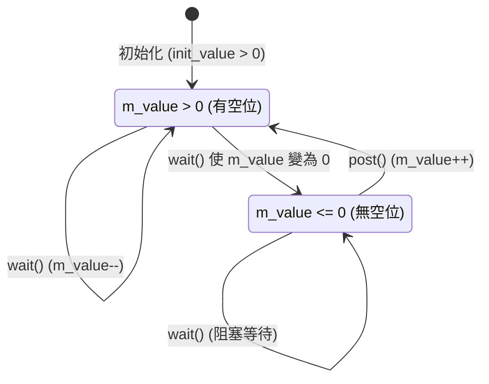

# sc_semaphore.h / .cpp - 號誌原始通道

## 概觀

`sc_semaphore` 是 SystemC 中的號誌（semaphore）原始通道。與互斥鎖只允許一個行程存取不同，號誌允許**最多 N 個行程**同時存取共享資源，其中 N 是號誌的初始值。

## 核心概念 / 生活化比喻

### 停車場的計數器

想像一個有 3 個車位的停車場：

- **入口顯示牌**：「剩餘車位：3」（初始值 `m_value = 3`）
- **wait()**：開車進場。如果有車位（`m_value > 0`），車位數減 1，你停進去。如果車位數是 0，你在入口排隊等
- **trywait()**：你看一眼顯示牌。有車位就進去（車位數減 1），沒車位就掉頭走（回傳 -1）
- **post()**：開車離場。車位數加 1，如果有人在等就通知第一台車
- **get_value()**：看看現在還剩幾個車位

```
車位數 (m_value): 3 → 2 → 1 → 0 → (阻塞) → 1 → 0
                  ^    ^    ^    ^              ^    ^
                wait wait wait wait           post wait
```



## 類別詳細說明

### `sc_semaphore` 類別

```cpp
class sc_semaphore
: public sc_semaphore_if,
  public sc_object
```

與 `sc_mutex` 類似，繼承 `sc_object` 而非 `sc_prim_channel`。

### 建構子

```cpp
sc_semaphore(int init_value_);                    // 自動命名
sc_semaphore(const char* name_, int init_value_); // 指定名稱
```

- `init_value_` 不可為負數，否則報告 `SC_ID_INVALID_SEMAPHORE_VALUE_` 錯誤
- 與 `sc_mutex` 不同，號誌**必須指定初始值**（沒有預設值）

### 介面方法

#### `wait()` - 阻塞取得

```cpp
int sc_semaphore::wait()
{
    while (in_use()) {
        sc_core::wait(m_free, sc_get_curr_simcontext());
    }
    --m_value;
    return 0;
}
```

- `in_use()` 檢查 `m_value <= 0`
- 阻塞直到 `m_value > 0`
- 成功後將 `m_value` 減 1

#### `trywait()` - 嘗試取得

```cpp
int sc_semaphore::trywait()
{
    if (in_use()) return -1;
    --m_value;
    return 0;
}
```

不阻塞版本。

#### `post()` - 釋放

```cpp
int sc_semaphore::post()
{
    ++m_value;
    m_free.notify();
    return 0;
}
```

- 增加 `m_value`
- 即時通知 `m_free` 事件，喚醒一個等待中的行程
- 注意：**任何行程都能呼叫 `post()`**，不像 mutex 只有擁有者能 unlock

#### `get_value()` - 查詢當前值

```cpp
int get_value() const { return m_value; }
```

### 成員變數

| 變數 | 型別 | 說明 |
|------|------|------|
| `m_free` | `sc_event` | 號誌被釋放時觸發的事件 |
| `m_value` | `int` | 號誌的當前值 |

### 錯誤報告

```cpp
void report_error(const char* id, const char* add_msg = 0) const;
```

格式化錯誤訊息，包含號誌名稱，例如：`"semaphore 'my_sem'"`。

## 設計原理 / RTL 背景

### mutex vs semaphore

| 特性 | mutex | semaphore |
|------|-------|-----------|
| 最大同時存取數 | 1 | N（由初始值決定） |
| 擁有權 | 有（只有擁有者能解鎖） | 無（任何人都能 post） |
| 可重入 | 是（擁有者可重複 lock） | 否 |
| 用途 | 互斥存取 | 資源池、速率控制 |

### 硬體對應

在硬體中，semaphore 常見於：
- **DMA 通道管理**：系統有 4 個 DMA 通道，用 semaphore(4) 管理
- **匯流排仲裁**：限制同時在匯流排上傳輸的主設備數量
- **緩衝區管理**：追蹤可用的記憶體區塊數量

### 即時通知

與 `sc_mutex` 相同，`post()` 使用 `m_free.notify()`（即時通知），讓等待的行程在同一 delta cycle 被喚醒。

## 相關檔案

- `sc_semaphore_if.h` - 號誌介面定義
- `sc_host_semaphore.h` - 作業系統層級的號誌封裝
- `sc_mutex.h` - 互斥鎖（只允許一個行程）
