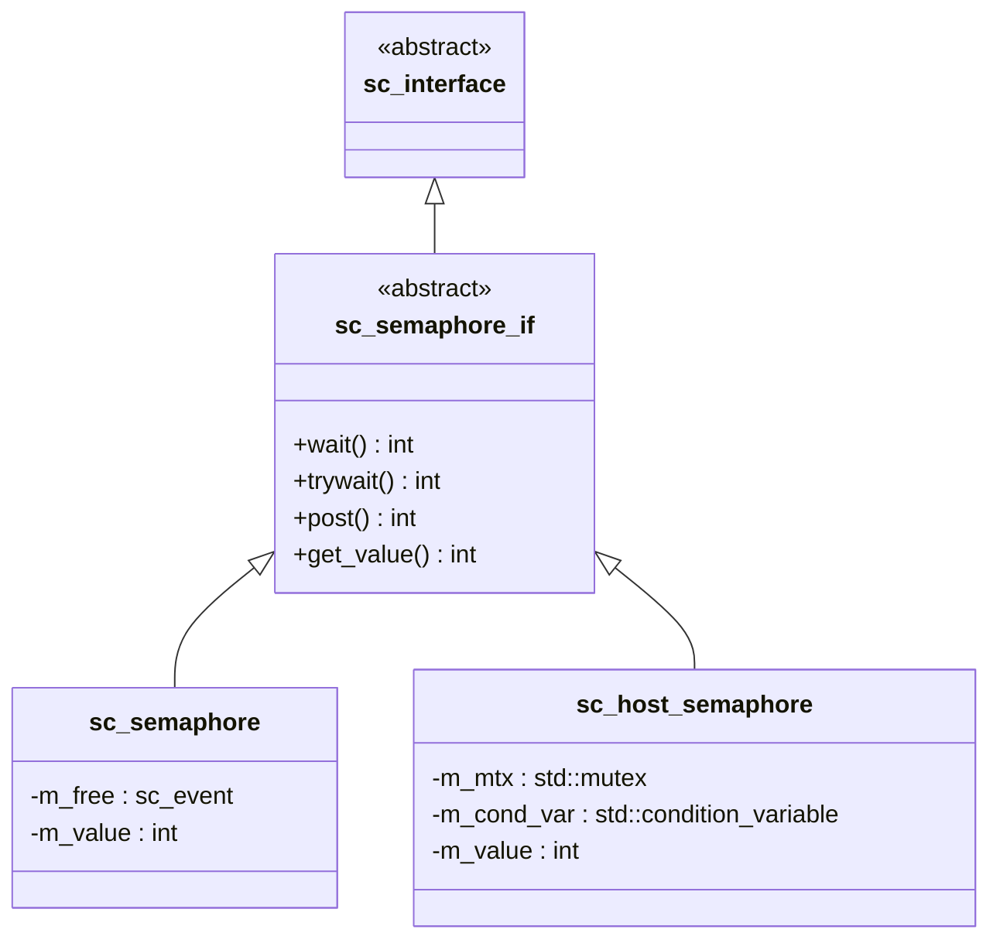

# sc_semaphore_if.h - 號誌介面定義

## 概觀

`sc_semaphore_if` 定義了號誌（semaphore）的抽象介面，宣告 `wait()`、`trywait()`、`post()` 和 `get_value()` 四個純虛擬函式。任何實作此介面的類別都能當作號誌使用。

## 核心概念 / 生活化比喻

### 停車場管理規範

這個介面就像「停車場管理規範」：

- 不管是室內停車場、露天停車場還是機械停車場，只要遵守這四個規則就是「合格的停車場」
- `wait()` = 進場取位
- `trywait()` = 查看有沒有空位
- `post()` = 離場歸位
- `get_value()` = 查看剩餘車位數

## 介面方法

```cpp
class sc_semaphore_if : virtual public sc_interface
{
public:
    virtual int wait() = 0;           // 阻塞取得，無空位就等
    virtual int trywait() = 0;        // 嘗試取得，無空位回傳 -1
    virtual int post() = 0;           // 釋放
    virtual int get_value() const = 0; // 查詢當前值
};
```

| 方法 | 成功回傳 | 失敗回傳 | 說明 |
|------|---------|---------|------|
| `wait()` | 0 | 不回傳（阻塞） | 減少計數，無空位時阻塞 |
| `trywait()` | 0 | -1 | 減少計數，無空位時立即回傳 -1 |
| `post()` | 0 | - | 增加計數，通知等待者 |
| `get_value()` | 當前值 | - | 只讀查詢 |

## 設計原理

### 與 `sc_mutex_if` 的差異

| 設計面向 | `sc_mutex_if` | `sc_semaphore_if` |
|----------|---------------|-------------------|
| 方法命名 | lock / trylock / unlock | wait / trywait / post |
| 查詢方法 | 無 | `get_value()` |
| 擁有權概念 | 隱含（只有擁有者能 unlock） | 無（任何人都能 post） |

命名慣例來自 POSIX 標準：`sem_wait`、`sem_trywait`、`sem_post`。



## 相關檔案

- `sc_semaphore.h` / `sc_semaphore.cpp` - 模擬環境中的號誌實作
- `sc_host_semaphore.h` - 作業系統層級的號誌封裝
- `sc_mutex_if.h` - 互斥鎖介面（類似但只允許單一存取）
- `sc_interface.h` - 所有介面的基礎類別
