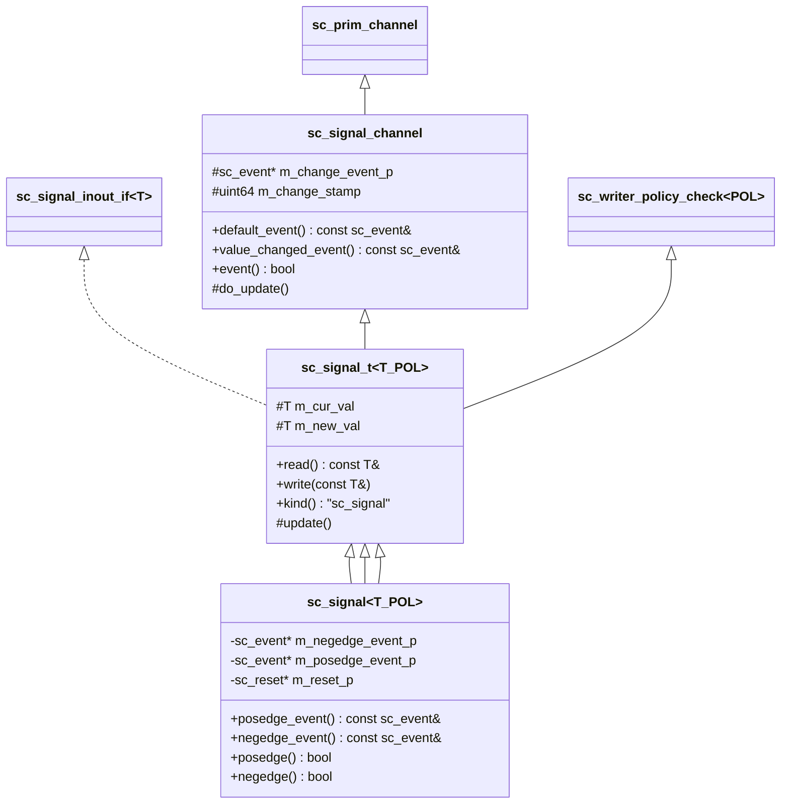
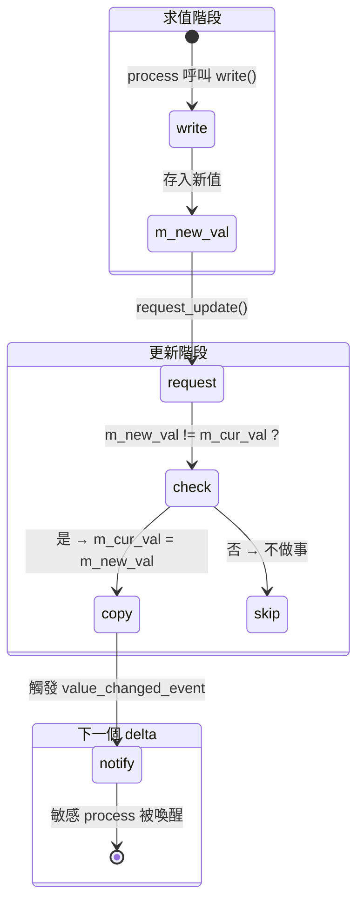

# sc_signal -- 泛型訊號通道 `sc_signal<T>`

## 概述

`sc_signal<T>` 是 SystemC 中最常用的原始通道，模擬硬體中的「線路 (wire)」或「暫存器 (register)」。它持有一個型別為 `T` 的值，支援讀取和寫入，並在值改變時觸發事件。

本檔案定義了完整的訊號類別階層：
1. `sc_signal_channel` - 與型別無關的通道基底
2. `sc_signal_t<T, POL>` - 泛型訊號模板基底
3. `sc_signal<T, POL>` - 最終使用者面對的泛型訊號
4. `sc_signal<bool, POL>` - `bool` 的特化版本（支援 posedge/negedge）
5. `sc_signal<sc_dt::sc_logic, POL>` - `sc_logic` 的特化版本

**原始檔案：** `sc_signal.h`, `sc_signal.cpp`

## 日常比喻

想像一個「電子看板」：
- 任何時候你可以「讀取」看板上顯示的內容（`read()`）
- 你可以「寫入」新的內容（`write()`），但不會立即顯示
- 在「換頁時間」（update phase），看板統一更新到最新內容
- 如果內容真的變了，看板會閃一下燈（觸發 `value_changed_event`）
- 特別的是，如果看板顯示的是「開/關」（bool），還會有「開燈事件」(posedge) 和「關燈事件」(negedge)

## 類別階層



## 關鍵方法說明

### `write()` - 寫入新值

```cpp
template< class T, sc_writer_policy POL >
void sc_signal_t<T,POL>::write( const T& value_ )
{
    bool value_changed = !( m_new_val == value_ );
    if ( !policy_type::check_write(this, value_changed) )
        return;

    m_new_val = value_;
    if( value_changed || policy_type::needs_update() ) {
        request_update();
    }
}
```

寫入流程：
1. 檢查寫入策略（是否允許多重寫入者）
2. 將新值存入 `m_new_val`
3. 如果值有變化（或策略需要），請求 update phase 更新

### `update()` - 更新當前值

```cpp
template< class T, sc_writer_policy POL >
void sc_signal_t<T,POL>::update()
{
    policy_type::update();
    if( !( m_new_val == m_cur_val ) ) {
        do_update();  // m_cur_val = m_new_val; notify event
    }
}
```

在 update phase 被呼叫。只有當新值與當前值不同時，才真正更新並觸發事件。

### `read()` - 讀取當前值

```cpp
virtual const T& read() const
    { return m_cur_val; }
```

永遠回傳**當前值** (`m_cur_val`)，而非正在寫入的新值。這確保在同一個 delta cycle 內，所有讀取者看到的值是一致的。

## 雙值暫存器機制



## bool 特化版本

`sc_signal<bool>` 除了 `value_changed_event()` 之外，還額外提供：

| 方法 | 說明 |
|------|------|
| `posedge_event()` | 正緣事件（值從 false 變為 true） |
| `negedge_event()` | 負緣事件（值從 true 變為 false） |
| `posedge()` | 是否剛發生正緣？ |
| `negedge()` | 是否剛發生負緣？ |

這些對應於硬體中時脈訊號的上升緣和下降緣。`sc_signal<bool>` 也支援 reset 機制，透過 `is_reset()` 回傳 `sc_reset` 指標。

## sc_logic 特化版本

`sc_signal<sc_dt::sc_logic>` 與 `bool` 類似，也有 `posedge_event()` 和 `negedge_event()`，差別在於判斷條件：
- `posedge()`: 值變為 `SC_LOGIC_1`
- `negedge()`: 值變為 `SC_LOGIC_0`

## 寫入策略整合

`sc_signal_t` 繼承了 `sc_writer_policy_check<POL>`，在 `write()` 和 `register_port()` 時呼叫策略檢查：

```cpp
template< class T, sc_writer_policy POL >
void sc_signal_t<T,POL>::register_port( sc_port_base& port_, const char* if_typename_ )
{
    bool is_output = std::string( if_typename_ ) == typeid(if_type).name();
    if( !policy_type::check_port( this, &port_, is_output ) )
       ((void)0); // error suppressed
}
```

## 事件的延遲建立

`sc_signal_channel` 使用延遲建立策略（lazy initialization）來處理事件：
- `m_change_event_p` 初始為 `nullptr`
- 只有在第一次呼叫 `value_changed_event()` 時才建立事件物件
- 這節省了大量記憶體，因為很多訊號從未被監聽

## 設計重點

### 與 RTL 的對應

| SystemC `sc_signal` | Verilog |
|---------------------|---------|
| `write()` | 非阻塞賦值 `<=` |
| `read()` | 讀取 wire/reg 的值 |
| `value_changed_event()` | `@(signal)` |
| `posedge_event()` | `@(posedge clk)` |
| `negedge_event()` | `@(negedge clk)` |
| `m_cur_val` / `m_new_val` | 暫存器的當前值和 next-state 值 |

### 為什麼用 `==` 而不是 `!=`？

注意 `update()` 中的判斷是 `!( m_new_val == m_cur_val )`，而非 `m_new_val != m_cur_val`。這是因為 C++ 的使用者自定義型別可能只實現了 `operator==` 而沒有實現 `operator!=`，用否定 `==` 可以減少對型別的要求。

## 相關檔案

- `sc_signal_ifs.h` - 定義 `sc_signal_in_if`, `sc_signal_inout_if` 等介面
- `sc_prim_channel.h` - 基底類別，提供 `request_update()` 等方法
- `sc_writer_policy.h` - 寫入策略的定義
- `sc_buffer.h` - `sc_signal` 的變體，每次寫入都觸發事件
- `sc_clock.h` - 繼承自 `sc_signal<bool>`
- `sc_signal_ports.h` - 訊號專用的埠類別
