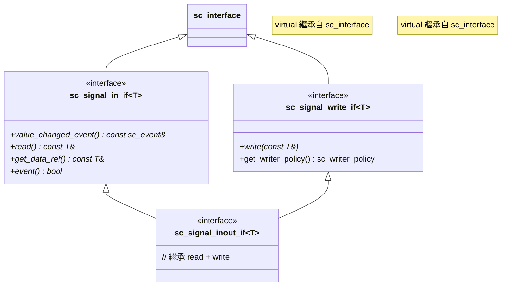
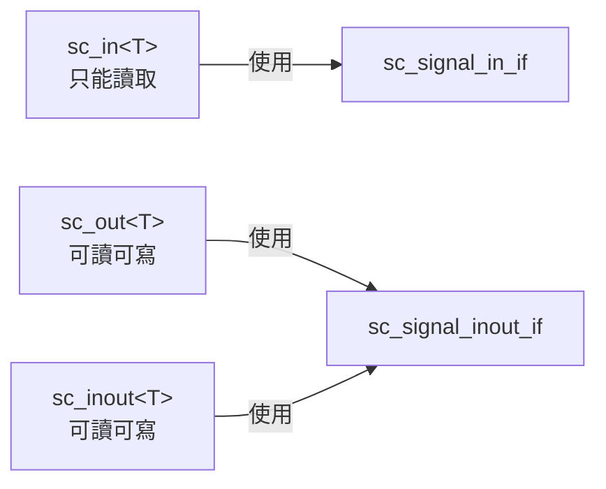

# sc_signal_ifs -- 訊號相關的介面定義

## 概述

`sc_signal_ifs.h` 定義了所有訊號通道（`sc_signal`、`sc_buffer` 等）的介面層。這些介面決定了透過埠能對訊號做哪些操作（讀取、寫入、查詢事件）。透過介面分離，模組只需要知道「能做什麼」，不需要知道背後的通道實現。

**原始檔案：** `sc_signal_ifs.h`（僅標頭檔）

## 日常比喻

想像一組「遙控器協定」：
- **sc_signal_in_if** 像是「唯讀遙控器」-- 只能看螢幕上的內容，不能改
- **sc_signal_write_if** 像是「寫入按鈕」-- 只定義了寫入操作
- **sc_signal_inout_if** 像是「完整遙控器」-- 既能讀也能寫
- **sc_signal_out_if** 跟 `sc_signal_inout_if` 相同 -- 因為輸出埠也需要能讀回當前值

## 介面繼承關係



## 各介面詳解

### `sc_signal_in_if<T>` - 輸入介面

定義了讀取訊號所需的所有方法：

| 方法 | 說明 |
|------|------|
| `value_changed_event()` | 回傳值改變事件的參考 |
| `read()` | 讀取目前的值 |
| `get_data_ref()` | 取得目前值的 const 參考（主要用於波形追蹤） |
| `event()` | 在目前 delta cycle 中是否發生了值改變事件 |

### `sc_signal_in_if<bool>` - bool 特化輸入介面

除了泛型版本的方法外，還增加了邊緣偵測：

| 方法 | 說明 |
|------|------|
| `posedge_event()` | 正緣（上升緣）事件 |
| `negedge_event()` | 負緣（下降緣）事件 |
| `posedge()` | 是否剛發生正緣 |
| `negedge()` | 是否剛發生負緣 |

這個特化版本還有一個 `is_reset()` 虛擬方法，供 `sc_reset` 機制使用。預設回傳 `NULL`，`sc_signal<bool>` 會覆寫它。

### `sc_signal_in_if<sc_dt::sc_logic>` - sc_logic 特化輸入介面

與 `bool` 版本類似，也提供 `posedge_event()`、`negedge_event()`、`posedge()` 和 `negedge()`。差別在於四值邏輯 (`0`, `1`, `X`, `Z`) 的邊緣定義。

### `sc_signal_write_if<T>` - 寫入介面

```cpp
template< typename T >
class sc_signal_write_if : public virtual sc_interface
{
public:
    virtual void write( const T& ) = 0;
    virtual sc_writer_policy get_writer_policy() const
        { return SC_DEFAULT_WRITER_POLICY; }
};
```

只定義了一個核心方法 `write()`，以及查詢寫入策略的 `get_writer_policy()`。

### `sc_signal_inout_if<T>` - 輸入輸出介面

```cpp
template <class T>
class sc_signal_inout_if
: public sc_signal_in_if<T>, public sc_signal_write_if<T>
{};
```

同時繼承了讀取和寫入介面，是 `sc_signal<T>` 實際實現的介面。

### `sc_signal_out_if<T>` - 輸出介面

```cpp
template<typename T>
using sc_signal_out_if = sc_signal_inout_if<T>;
```

只是 `sc_signal_inout_if<T>` 的型別別名。在硬體設計中，輸出埠通常也需要能讀回當前值（例如用於 feedback），所以輸出介面與輸入輸出介面相同。

## 設計重點

### 為什麼要分成 in / write / inout？

這三個介面的分離服務於不同的埠型別：



`sc_in` 綁定到 `sc_signal_in_if`，所以編譯時期就能阻止透過輸入埠寫入值。這是「最小權限原則」的體現。

### 為什麼 bool 和 sc_logic 需要特化？

因為只有布林型態和四值邏輯型態有「邊緣」(edge) 的概念。對於 `int` 或 `double` 這種型別，問「是否有上升緣」是沒有意義的。

### 與 RTL 的對應

| 介面 | Verilog 對應 |
|------|-------------|
| `sc_signal_in_if<T>` | `input` port |
| `sc_signal_write_if<T>` | 寫入操作 |
| `sc_signal_inout_if<T>` | `inout` port |
| `posedge_event()` | `posedge` 事件 |
| `negedge_event()` | `negedge` 事件 |

## 相關檔案

- `sc_interface.h` - 所有介面的基底類別
- `sc_signal.h` - 實現這些介面的通道
- `sc_signal_ports.h` - 使用這些介面的埠
- `sc_writer_policy.h` - `sc_signal_write_if` 中引用的寫入策略
