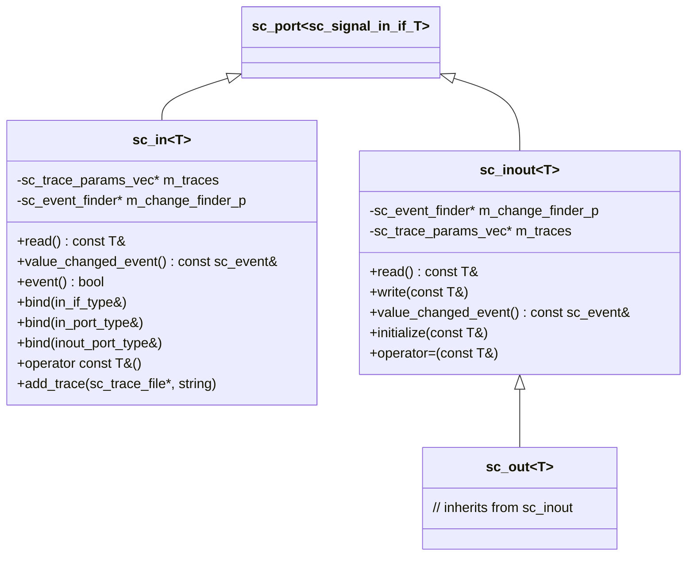
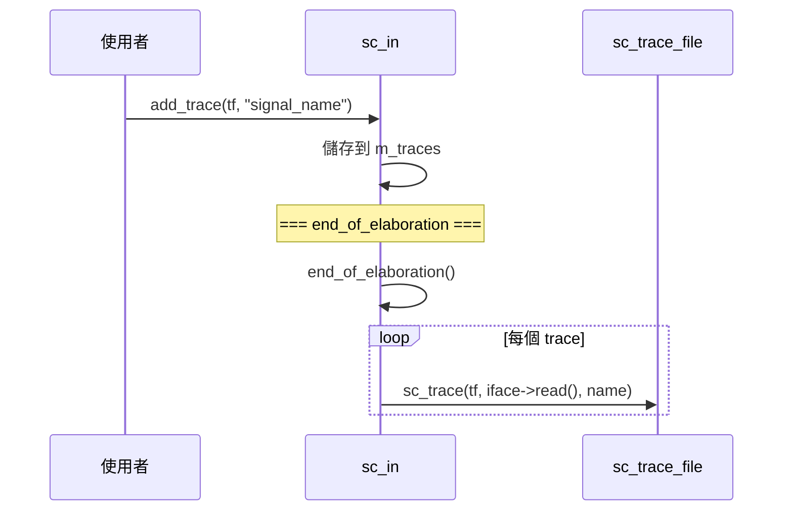

# sc_signal_ports -- 訊號專用的埠類別

## 概述

`sc_signal_ports.h` 定義了三個常用的訊號埠類別：`sc_in<T>`、`sc_inout<T>` 和 `sc_out<T>`。這些是使用者在日常 SystemC 設計中最常接觸的埠型別，它們是 `sc_port` 針對訊號介面的特化版本，提供了便利的語法糖和額外功能（如波形追蹤、事件查詢）。

**原始檔案：** `sc_signal_ports.h`, `sc_signal_ports.cpp`

## 日常比喻

想像一棟辦公大樓的通訊系統：
- **sc_in** 就像「只讀信箱」-- 你只能收信，不能往外寄
- **sc_inout** 就像「雙向郵件槽」-- 既能收信也能寄信
- **sc_out** 就像「寄信口」-- 雖然名稱暗示只能寄信，但實際上也能查看最後寄出的內容

## 類別階層



## 各埠型別詳解

### `sc_in<T>` - 輸入埠

綁定到 `sc_signal_in_if<T>`，只提供讀取操作。

**主要功能：**

| 方法 | 說明 |
|------|------|
| `read()` | 讀取訊號值 |
| `operator const T&()` | 隱式轉型為值（可直接用在運算式中） |
| `value_changed_event()` | 取得值改變事件 |
| `event()` | 是否剛發生值改變 |
| `value_changed()` | 取得事件尋找器（用於 `sensitive` 語法） |

**多種綁定方式：**

```cpp
// 綁定到介面（通道）
void bind( const in_if_type& interface_ );

// 綁定到同型別的輸入埠（父埠）
void bind( in_port_type& parent_ );

// 綁定到輸入輸出埠（父埠）-- 允許 sc_in 綁定到 sc_inout
void bind( inout_port_type& parent_ );
```

### `sc_in<bool>` - 布林輸入埠（特化版本）

除了一般 `sc_in` 的功能外，增加了邊緣偵測：

| 方法 | 說明 |
|------|------|
| `posedge_event()` | 正緣事件 |
| `negedge_event()` | 負緣事件 |
| `posedge()` | 是否剛發生正緣 |
| `negedge()` | 是否剛發生負緣 |
| `pos()` | 正緣的事件尋找器 |
| `neg()` | 負緣的事件尋找器 |

這些在時脈敏感的設計中非常常用：

```cpp
SC_CTOR(MyModule) {
    SC_METHOD(my_method);
    sensitive << clk.pos();  // 對 clk 的正緣敏感
}
```

### `sc_inout<T>` - 輸入輸出埠

綁定到 `sc_signal_inout_if<T>`，同時支援讀取和寫入。

**額外功能：**

| 方法 | 說明 |
|------|------|
| `write(const T&)` | 寫入新值 |
| `operator=(const T&)` | 賦值運算子（等同於 write） |
| `initialize(const T&)` | 設定初始值（在 elaboration 階段使用） |

`initialize()` 方法特別重要：它在綁定完成前暫存初始值，綁定完成後自動寫入通道。

### `sc_out<T>` - 輸出埠

```cpp
template <class T>
class sc_out : public sc_inout<T>
{
    // ...
};
```

`sc_out` 只是 `sc_inout` 的子類別，沒有新增方法。它的存在純粹是為了程式碼的可讀性，讓設計者能表達「這個埠是用來輸出的」的設計意圖。

## 事件尋找器 (Event Finder)

每個埠都有事件尋找器成員，用於在綁定完成前提供事件引用：

```cpp
// sc_in<T> 中
sc_event_finder& value_changed() const {
    return sc_event_finder::cached_create(
        m_change_finder_p, *this,
        &in_if_type::value_changed_event );
}
```

事件尋找器使用延遲建立策略（`cached_create`），只在第一次使用時才分配記憶體。

## 波形追蹤 (Tracing)

`sc_in` 和 `sc_inout` 支援透過 `add_trace()` 方法加入波形追蹤。追蹤參數在 elaboration 階段收集，在 `end_of_elaboration()` 回呼中實際設定追蹤。



## 設計重點

### 為什麼 sc_in 可以綁定到 sc_inout 埠？

在階層式設計中，子模組可能只需要讀取一個值，但父模組的埠是 `sc_inout`。允許 `sc_in` 綁定到 `sc_inout` 避免了不必要的介面不匹配錯誤。

### 初始化機制

`sc_inout` 的 `initialize()` 使用一個內部的 `sc_inout_opt_if` 類別來暫存初始值。如果在綁定前呼叫 `initialize()`，值會被暫存；在 `end_of_elaboration()` 中，暫存的值會被寫入已綁定的通道。

### 與 RTL 的對應

| SystemC | Verilog |
|---------|---------|
| `sc_in<T>` | `input` port |
| `sc_out<T>` | `output` port |
| `sc_inout<T>` | `inout` port |
| `sc_in<bool> clk` | `input clk` |
| `sensitive << clk.pos()` | `always @(posedge clk)` |

## 相關檔案

- `sc_port.h` - 基底類別 `sc_port`
- `sc_signal_ifs.h` - 綁定目標的介面定義
- `sc_event_finder.h` - 事件尋找器實現
- `sc_signal.h` - 通常綁定的通道類別
- `sc_clock_ports.h` - 時脈埠的型別別名
