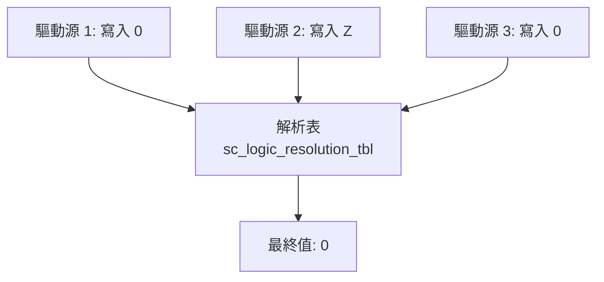
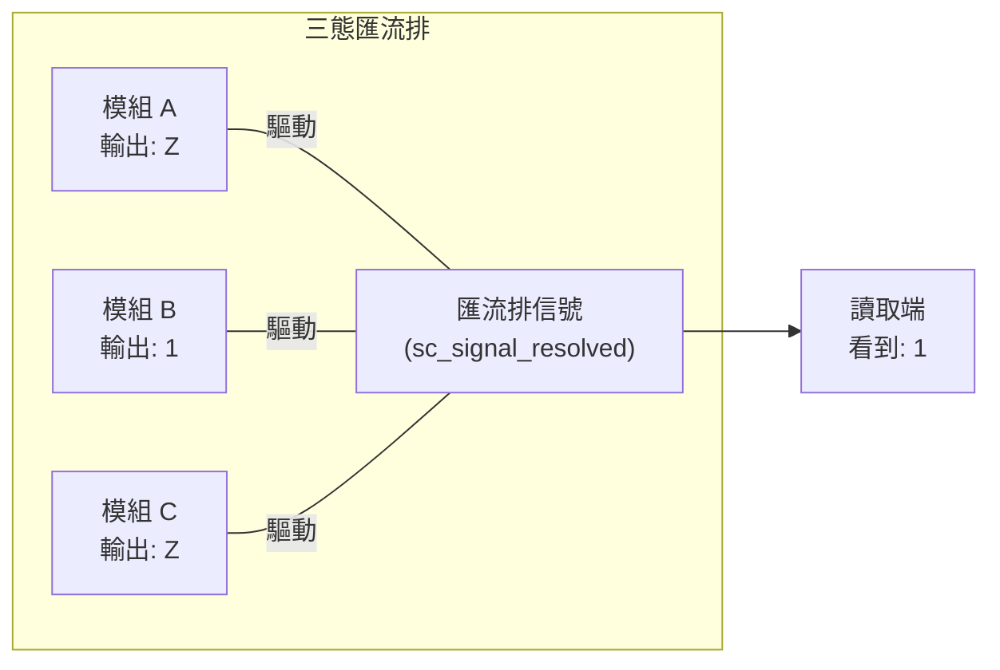

# sc_signal_resolved.h / .cpp - 解析信號通道

## 概觀

`sc_signal_resolved` 是一個特殊的信號通道，允許**多個行程同時寫入**同一個 `sc_logic` 信號。當多個驅動源（driver）同時寫入時，它會透過**解析表**（resolution table）自動計算出最終值。這是模擬硬體中多重驅動（multi-driver）匯流排的關鍵元件。

## 核心概念 / 生活化比喻

### 投票表決

想像一場會議的投票：

- 每個人（行程）可以投票「贊成」(1)、「反對」(0)、「棄權」(Z)、或「不確定」(X)
- 如果所有人都投「贊成」→ 結果是「贊成」
- 如果有人投「贊成」、有人投「反對」→ 結果是「衝突/未知」(X)
- 如果有人投票、其他人「棄權」(Z) → 結果跟投票的人一樣
- 只要有一個「不確定」(X) → 結果就是「不確定」(X)

### 硬體的多重驅動匯流排

在真實硬體中，多個晶片共用一條匯流排（如 I2C、開集極 open-drain 電路）。每個晶片都可以拉高（1）、拉低（0）、或放手（Z，高阻抗）。`sc_signal_resolved` 就是模擬這種行為。

## 解析表

```
         驅動值 B
         0    1    Z    X
    0 [  0    X    0    X  ]
驅  1 [  X    1    1    X  ]
動  Z [  0    1    Z    X  ]
值  X [  X    X    X    X  ]
A
```

解析規則：
- **相同值**：結果就是該值（0+0=0, 1+1=1）
- **Z + 任何值**：結果是那個值（Z 不影響結果）
- **0 + 1**：衝突！結果是 X
- **X + 任何值**：結果是 X（不確定會傳染）



## 類別詳細說明

### `sc_signal_resolved` 類別

```cpp
class sc_signal_resolved
: public sc_signal<sc_dt::sc_logic, SC_MANY_WRITERS>
```

繼承自 `sc_signal`，但使用 `SC_MANY_WRITERS` 策略，允許多個寫者。

### 建構子

| 建構子 | 說明 |
|--------|------|
| `sc_signal_resolved()` | 自動命名 `"signal_resolved_0"` 等 |
| `sc_signal_resolved(const char* name_)` | 指定名稱 |
| `sc_signal_resolved(const char* name_, const value_type& initial_value_)` | 指定名稱和初始值 |

### `register_port()` - 無限制

```cpp
virtual void register_port(sc_port_base&, const char*) {}
```

空實作！與 `sc_fifo` 限制單讀單寫不同，resolved signal 允許任意數量的埠連接。

### `write()` - 多驅動寫入

```cpp
void sc_signal_resolved::write(const value_type& value_)
{
    sc_process_b* cur_proc = sc_get_current_process_b();
    // 找到當前行程在 m_proc_vec 中的位置
    // 如果找到，更新值；如果沒找到，新增
    // 值有變化就 request_update()
}
```

關鍵設計：
- 每個行程的寫入值**分別存儲**在 `m_val_vec` 中
- 不是直接覆蓋信號值，而是記錄「誰寫了什麼」
- 只有值真正改變時才觸發更新

### `update()` - 解析最終值

```cpp
void sc_signal_resolved::update()
{
    sc_logic_resolve(m_new_val, m_val_vec);
    base_type::update();
}
```

在 delta cycle 的更新階段：
1. 呼叫 `sc_logic_resolve` 對所有驅動值進行解析
2. 呼叫基礎類別的 `update()` 來完成信號更新（通知事件等）

### `sc_logic_resolve()` 解析函式

```cpp
static void sc_logic_resolve(sc_dt::sc_logic& result_,
                             const std::vector<sc_dt::sc_logic>& values_)
```

- 如果只有一個驅動源，直接使用該值
- 多個驅動源時，逐一用解析表合併
- 一旦結果變成 X，提前結束（X 不會再變）

### 成員變數

| 變數 | 型別 | 說明 |
|------|------|------|
| `m_proc_vec` | `std::vector<sc_process_b*>` | 寫入此信號的行程列表 |
| `m_val_vec` | `std::vector<value_type>` | 各行程寫入的值 |

## 設計原理 / RTL 背景

### CMOS 中的多重驅動

原始碼中的註解提到：「我們假設兩個驅動源驅動 resolved signal 到 1 或 0 是可以的。這可能不適用於所有技術，但對 CMOS（目前主流技術）來說確實如此。」

在 CMOS 中：
- 兩個驅動源都輸出 0（拉低）→ 結果是 0（兩個 NMOS 都開，沒有衝突）
- 兩個驅動源都輸出 1（拉高）→ 結果是 1
- 一個輸出 0，一個輸出 1 → **短路！** 結果是 X（未定義）

### 三態匯流排

最常見的使用場景是**三態匯流排**（tri-state bus）：



只有一個模組在驅動（輸出 0 或 1），其他模組都輸出 Z（高阻抗/斷開），最終值就是那個驅動模組的輸出。

## 相關檔案

- `sc_signal_resolved_ports.h` / `.cpp` - 解析信號專用埠
- `sc_signal_rv.h` - 解析向量信號（多位元版本）
- `sc_signal.h` - 基礎信號通道
- `sc_logic.h`（datatypes）- `sc_logic` 四值邏輯型別
