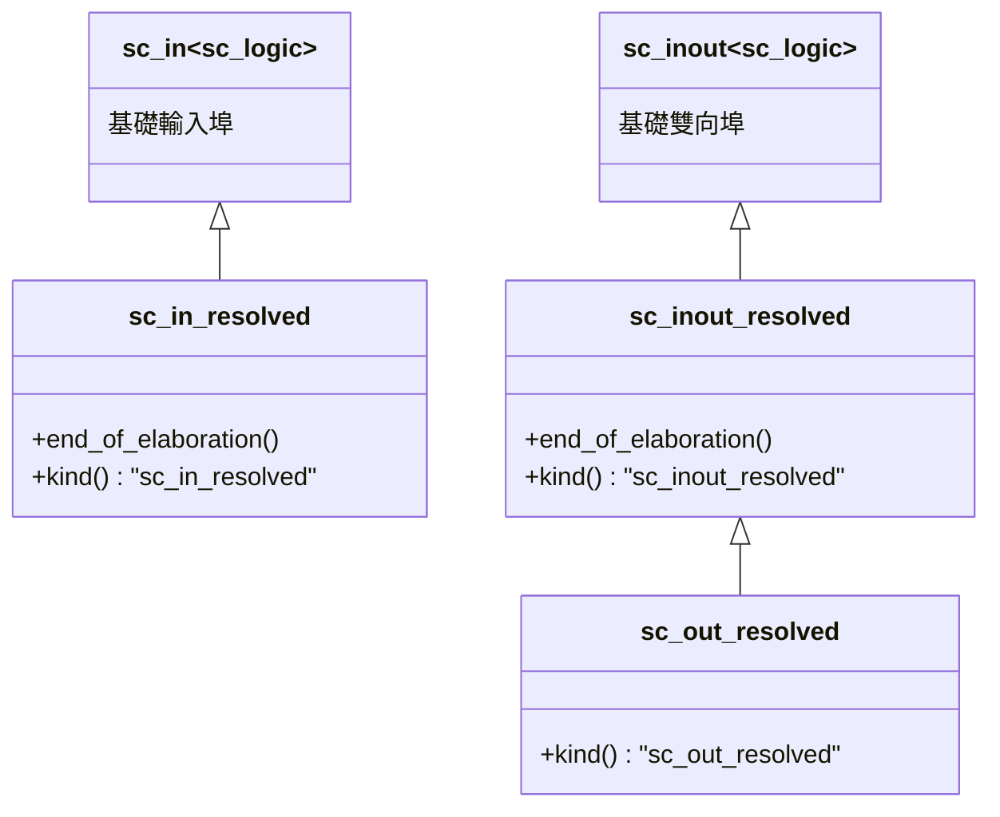
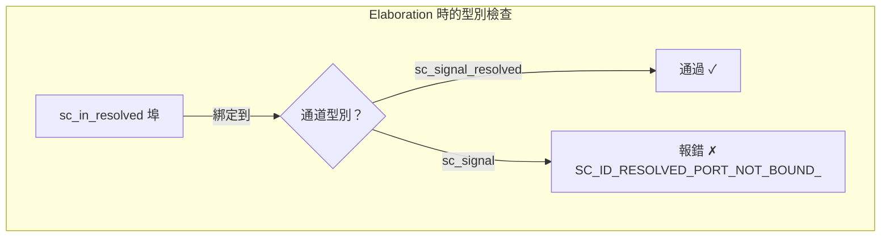

# sc_signal_resolved_ports.h / .cpp - 解析信號專用埠

## 概觀

這個檔案定義了三個專用於 `sc_signal_resolved` 的埠類別：`sc_in_resolved`（輸入）、`sc_inout_resolved`（雙向）、`sc_out_resolved`（輸出）。它們的核心功能是在 elaboration 完成時**檢查所綁定的通道是否確實是 `sc_signal_resolved`**，確保解析邏輯不會被遺漏。

## 核心概念 / 生活化比喻

### 特殊規格的插頭

想像你有一台需要特殊電壓的設備（解析信號）：

- 普通插座（`sc_signal`）不安全，可能燒壞設備
- **解析專用插座**（`sc_signal_resolved`）才是正確的
- 這些埠就像「帶有安全檢測的插頭」：插上去時會自動檢查插座是不是正確類型。如果插錯了，會在啟動前報錯

## 類別繼承關係



## 類別詳細說明

### `sc_in_resolved` - 解析信號輸入埠

```cpp
class sc_in_resolved : public sc_in<sc_dt::sc_logic>
```

繼承自 `sc_in<sc_logic>`，功能完全相同，唯一的差別是 `end_of_elaboration()` 中的檢查：

```cpp
void sc_in_resolved::end_of_elaboration()
{
    base_type::end_of_elaboration();
    if (dynamic_cast<sc_signal_resolved*>(get_interface()) == 0) {
        report_error(SC_ID_RESOLVED_PORT_NOT_BOUND_, 0);
    }
}
```

使用 `dynamic_cast` 確認綁定的通道確實是 `sc_signal_resolved`（或其子類別）。如果綁定到普通的 `sc_signal<sc_logic>`，就會報錯。

### `sc_inout_resolved` - 解析信號雙向埠

```cpp
class sc_inout_resolved : public sc_inout<sc_dt::sc_logic>
```

同樣在 `end_of_elaboration()` 中做型別檢查。提供讀寫雙向存取。

### `sc_out_resolved` - 解析信號輸出埠

```cpp
class sc_out_resolved : public sc_inout_resolved
```

繼承自 `sc_inout_resolved`（而非 `sc_out`）。原始碼註解說明：「`sc_out_resolved` 也能從埠讀取，因此與 `sc_inout_resolved` 沒有區別。為了除錯目的提供獨立的類別。」

不需要覆寫 `end_of_elaboration()`，因為父類別已經做了檢查。

## 建構子

三個類別都提供完整的建構子集合，與基礎類別一致：

| 建構方式 | 說明 |
|----------|------|
| 預設建構 | 自動命名 |
| `const char* name_` | 指定名稱 |
| 介面參考 | 直接綁定 |
| 埠參考 | 綁定到父埠 |
| 名稱 + 介面/埠 組合 | 以上的具名版本 |

## 設計原理

### 為何需要獨立的埠類別？

普通的 `sc_in<sc_logic>` 也能綁定到 `sc_signal_resolved`（因為 `sc_signal_resolved` 繼承自 `sc_signal<sc_logic>`）。但反過來，如果你的設計**依賴**多驅動解析行為，你應該使用 `sc_in_resolved` 來確保：

1. **設計意圖明確**：程式碼讀者一看就知道這是多驅動場景
2. **提早發現錯誤**：如果不小心綁定到普通 signal，在 elaboration 時就會報錯
3. **型別安全**：`kind()` 回傳不同的字串，便於除錯和日誌

### `sc_out_resolved` 繼承 `sc_inout_resolved`

這是 SystemC 中常見的設計模式。在硬體中，輸出埠通常也需要能回讀自己的值（用於回饋或除錯），所以 `sc_out` 系列通常繼承自 `sc_inout`。



## 相關檔案

- `sc_signal_resolved.h` / `.cpp` - 解析信號通道實作
- `sc_signal_ports.h` - 基礎信號埠類別
- `sc_signal_rv_ports.h` - 解析向量信號埠（多位元版本）
- `sc_logic.h`（datatypes）- `sc_logic` 四值邏輯型別
