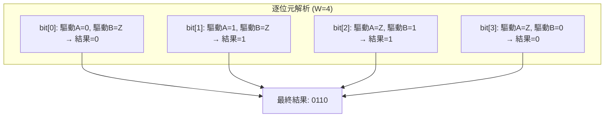
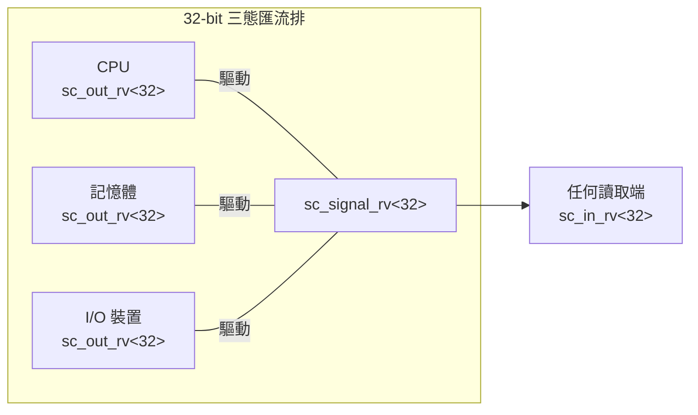

# sc_signal_rv.h - 解析向量信號通道

## 概觀

`sc_signal_rv<W>` 是 `sc_signal_resolved` 的多位元版本。它允許多個行程同時寫入一個 W 位元寬的 `sc_lv<W>`（邏輯向量）信號，並透過解析表逐位元計算最終值。

簡單來說：`sc_signal_resolved` 處理 1 位元的多驅動，`sc_signal_rv<W>` 處理 W 位元的多驅動。

## 核心概念 / 生活化比喻

### 多人同時操控的電子看板

想像一塊有 8 個燈泡的電子看板（W=8），多個控制器同時控制：

- 控制器 A 想讓看板顯示 `01ZZ ZZZZ`（只關心前兩個燈）
- 控制器 B 想讓看板顯示 `ZZZZ ZZ10`（只關心最後兩個燈）
- 解析結果：`01ZZ ZZ10`（Z 的位置由實際驅動的控制器決定）

每個位元的解析邏輯與 `sc_signal_resolved` 完全相同，只是一次做 W 個位元。

## 類別詳細說明

### `sc_lv_resolve<W>` - 解析函式類別

```cpp
template <int W>
class sc_lv_resolve
{
public:
    static void resolve(sc_dt::sc_lv<W>&, const std::vector<sc_dt::sc_lv<W>*>&);
};
```

靜態方法，對 `sc_lv<W>` 向量進行逐位元解析：

```cpp
for (int j = result_.length() - 1; j >= 0; --j) {
    sc_dt::sc_logic_value_t res = (*values_[0])[j].value();
    for (int i = sz - 1; i > 0 && res != 3; --i) {
        res = sc_logic_resolution_tbl[res][(*values_[i])[j].value()];
    }
    result_[j] = res;
}
```

- 外層迴圈遍歷每個位元
- 內層迴圈對所有驅動源的該位元做解析
- `res != 3`（3 = `Log_X`）是提前結束的優化：一旦結果是 X 就不用再看了



### `sc_signal_rv<W>` - 解析向量信號

```cpp
template <int W>
class sc_signal_rv
: public sc_signal<sc_dt::sc_lv<W>, SC_MANY_WRITERS>
```

#### 建構子

| 建構子 | 說明 |
|--------|------|
| `sc_signal_rv()` | 自動命名 `"signal_rv_0"` 等 |
| `sc_signal_rv(const char* name_)` | 指定名稱，初始值為空向量 |
| `sc_signal_rv(const char* name_, const value_type& initial_value_)` | 指定名稱和初始值 |

#### `register_port()` - 無限制

```cpp
virtual void register_port(sc_port_base&, const char*) {}
```

與 `sc_signal_resolved` 相同，空實作，允許任意數量的埠連接。

#### `write()` - 多驅動寫入

```cpp
void sc_signal_rv<W>::write(const value_type& value_)
```

邏輯與 `sc_signal_resolved::write()` 幾乎相同：
1. 取得當前行程指標
2. 在 `m_proc_vec` 中尋找該行程
3. 找到就更新值，沒找到就新增
4. 值有變化就 `request_update()`

主要差異：`m_val_vec` 存的是 `value_type*`（指標），而非值，所以需要 `new` 配置記憶體。

#### `update()` - 解析更新

```cpp
void sc_signal_rv<W>::update()
{
    sc_lv_resolve<W>::resolve(this->m_new_val, m_val_vec);
    base_type::update();
}
```

#### 解構子

```cpp
sc_signal_rv<W>::~sc_signal_rv()
{
    for (int i = m_val_vec.size() - 1; i >= 0; --i) {
        delete m_val_vec[i];
    }
}
```

因為 `m_val_vec` 存的是指標，解構時需要手動釋放記憶體。

### 成員變數

| 變數 | 型別 | 說明 |
|------|------|------|
| `m_proc_vec` | `std::vector<sc_process_b*>` | 寫入此信號的行程列表 |
| `m_val_vec` | `std::vector<value_type*>` | 各行程寫入的值（指標） |

## 與 `sc_signal_resolved` 的比較

| 特性 | `sc_signal_resolved` | `sc_signal_rv<W>` |
|------|---------------------|-------------------|
| 資料型別 | `sc_logic`（1 位元） | `sc_lv<W>`（W 位元） |
| 解析函式 | `sc_logic_resolve` | `sc_lv_resolve<W>::resolve` |
| 值存儲 | `vector<value_type>`（值） | `vector<value_type*>`（指標） |
| 模板參數 | 無 | `W`（位元寬度） |
| 定義形式 | 非模板類別 | 模板類別 |

## 設計原理 / RTL 背景

### 多位元三態匯流排

典型的硬體場景：32 位元資料匯流排由多個裝置共用。



每個裝置在不佔用匯流排時輸出全 Z（高阻抗），佔用匯流排時輸出實際資料值。

### 為何用指標存儲值？

`sc_signal_resolved` 用值存儲（`vector<value_type>`），而 `sc_signal_rv` 用指標存儲（`vector<value_type*>`）。這可能是因為 `sc_lv<W>` 物件較大（W 可能很大），用指標可以避免 vector 擴容時的大量拷貝。

## 相關檔案

- `sc_signal_rv_ports.h` - 解析向量信號專用埠
- `sc_signal_resolved.h` - 單位元解析信號
- `sc_signal.h` - 基礎信號通道
- `sc_lv.h`（datatypes）- 邏輯向量型別
