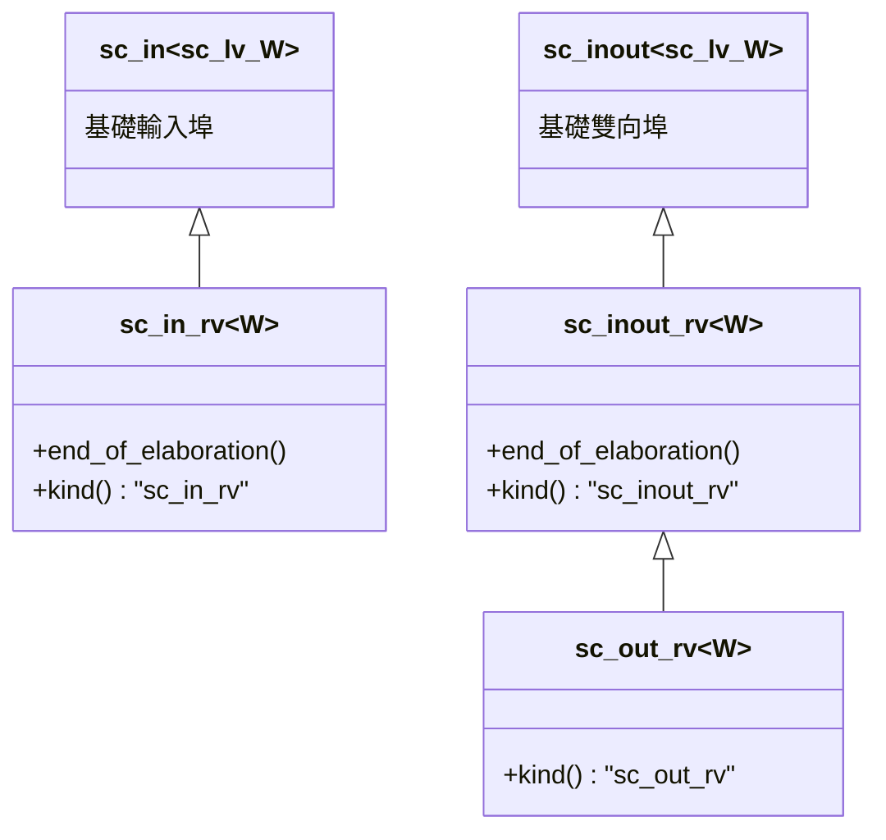
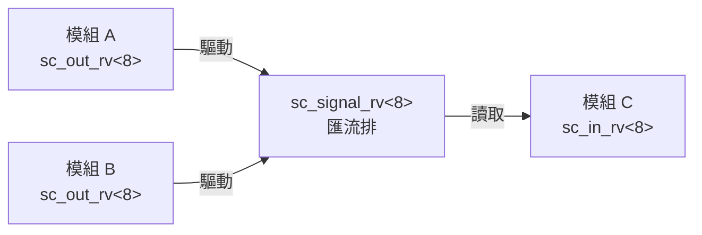

# sc_signal_rv_ports.h - 解析向量信號專用埠

## 概觀

這個檔案定義了三個專用於 `sc_signal_rv<W>` 的埠類別：`sc_in_rv<W>`（輸入）、`sc_inout_rv<W>`（雙向）、`sc_out_rv<W>`（輸出）。它們是 `sc_signal_resolved_ports` 的多位元泛化版本，在 elaboration 時檢查所綁定的通道是否確實是 `sc_signal_rv<W>`。

## 核心概念 / 生活化比喻

### 多線纜的專用接頭

就像 `sc_signal_resolved_ports` 是單線的專用接頭，`sc_signal_rv_ports` 是**多線纜**的專用接頭。你不能把一條 32 針的排線接到只有 1 針的插座上，型別系統和 elaboration 檢查會幫你攔截這類錯誤。

## 類別繼承關係



## 類別詳細說明

### `sc_in_rv<W>` - 解析向量輸入埠

```cpp
template <int W>
class sc_in_rv : public sc_in<sc_dt::sc_lv<W>>
```

#### elaboration 檢查

```cpp
template <int W>
void sc_in_rv<W>::end_of_elaboration()
{
    base_type::end_of_elaboration();
    if (dynamic_cast<sc_signal_rv<W>*>(this->get_interface()) == 0) {
        this->report_error(SC_ID_RESOLVED_PORT_NOT_BOUND_, 0);
    }
}
```

確認綁定到的是 `sc_signal_rv<W>` 而非普通的 `sc_signal<sc_lv<W>>`。

### `sc_inout_rv<W>` - 解析向量雙向埠

```cpp
template <int W>
class sc_inout_rv : public sc_inout<sc_dt::sc_lv<W>>
```

與 `sc_in_rv` 相同的 elaboration 檢查，但額外提供寫入功能。

### `sc_out_rv<W>` - 解析向量輸出埠

```cpp
template <int W>
class sc_out_rv : public sc_inout_rv<W>
```

繼承自 `sc_inout_rv<W>`。原始碼註解：「`sc_out_rv` 也能從埠讀取，因此與 `sc_inout_rv` 沒有區別。為了除錯目的提供獨立的類別。」

不需要覆寫 `end_of_elaboration()`。

## 與 `sc_signal_resolved_ports` 的比較

| 特性 | resolved ports | rv ports |
|------|---------------|----------|
| 資料型別 | `sc_logic` | `sc_lv<W>` |
| 模板 | 非模板類別 | 模板類別（參數 W） |
| 檢查目標 | `sc_signal_resolved` | `sc_signal_rv<W>` |
| 定義位置 | `.h` + `.cpp` | 只有 `.h`（模板需要在標頭檔中完整定義） |

### 為何 rv ports 沒有 .cpp 檔？

因為它們是模板類別。C++ 模板的完整定義必須在標頭檔中，編譯器需要看到整個實作才能生成特定寬度的程式碼。而 `sc_signal_resolved_ports` 是非模板類別，可以將實作放在 .cpp 中。

## 建構子

三個類別都提供與基礎類別一致的建構子集合：

- 預設建構
- 具名建構
- 介面綁定
- 埠綁定
- 以上的具名組合

## 使用範例概念

```cpp
// 模組宣告
sc_in_rv<8>   data_in;    // 8-bit 解析向量輸入
sc_out_rv<8>  data_out;   // 8-bit 解析向量輸出

// 頂層連接
sc_signal_rv<8> bus;       // 8-bit 解析向量匯流排
module_a.data_out(bus);    // 模組 A 驅動匯流排
module_b.data_out(bus);    // 模組 B 也驅動匯流排（多驅動）
module_c.data_in(bus);     // 模組 C 讀取匯流排
```



## 相關檔案

- `sc_signal_rv.h` - 解析向量信號通道
- `sc_signal_resolved_ports.h` - 單位元解析信號埠
- `sc_signal_ports.h` - 基礎信號埠
- `sc_lv.h`（datatypes）- 邏輯向量型別
