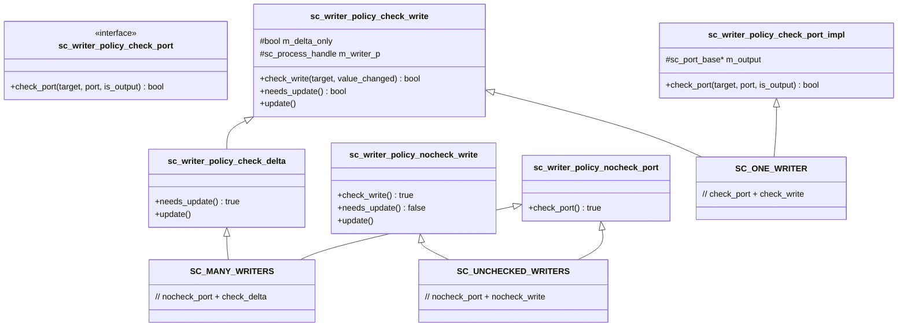
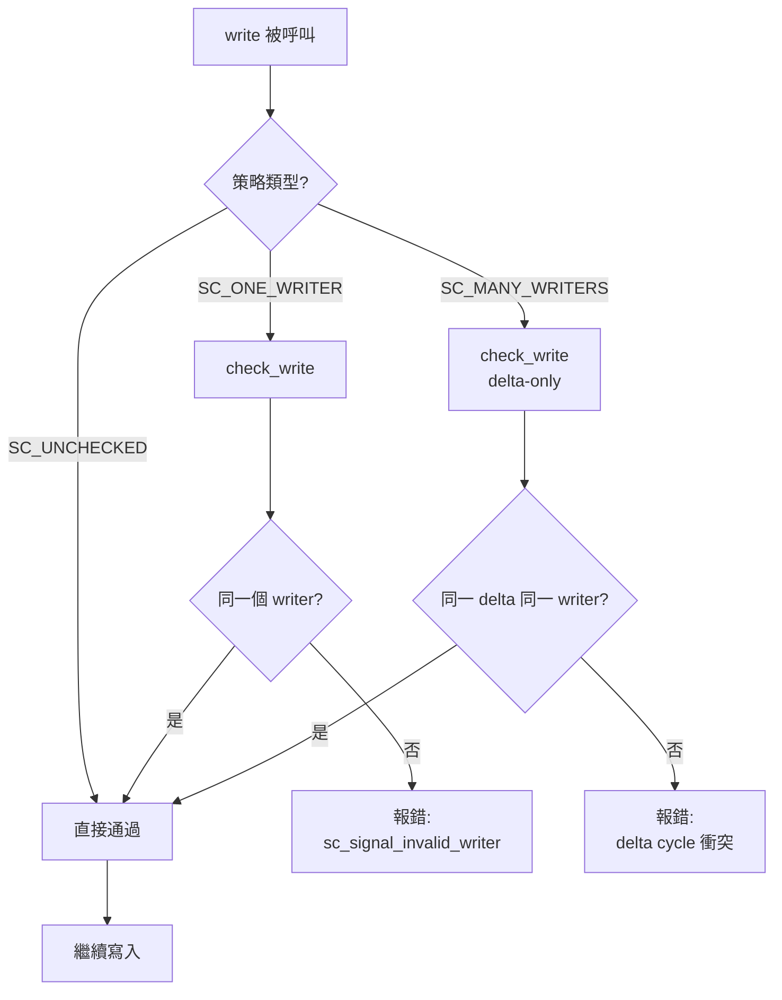

# sc_writer_policy -- 訊號寫入策略

## 概述

`sc_writer_policy.h` 定義了 `sc_signal` 的寫入者檢查策略。在硬體設計中，一條線路通常只能由一個驅動器驅動。SystemC 透過寫入策略在軟體層面模擬這個限制，有三種等級的檢查可供選擇。

**原始檔案：** `sc_writer_policy.h`（僅標頭檔）

## 日常比喻

想像一塊白板：
- **SC_ONE_WRITER**（一人獨享）：這塊白板只有一個人能寫，其他人試圖拿筆就會被阻止。在裝修時（elaboration）就決定好誰是唯一的寫入者。
- **SC_MANY_WRITERS**（輪流使用）：多人可以寫，但同一瞬間（delta cycle）只能有一個人在寫。如果兩個人同時拿起筆就會報錯。
- **SC_UNCHECKED_WRITERS**（自由使用）：誰都可以寫，不做任何檢查。快但危險。

## 策略枚舉

```cpp
enum sc_writer_policy
{
    SC_ONE_WRITER        = 0, // 唯一寫入者（從唯一的輸出埠）
    SC_MANY_WRITERS      = 1, // 允許多個寫入者（不同埠）
    SC_UNCHECKED_WRITERS = 3  // 允許 delta cycle 衝突（非標準）
};
```

預設策略取決於編譯選項：
- 定義了 `SC_NO_WRITE_CHECK` → 預設為 `SC_UNCHECKED_WRITERS`
- 否則 → 預設為 `SC_ONE_WRITER`

## 策略組合結構



## 各策略詳解

### SC_ONE_WRITER - 唯一寫入者

**埠檢查 (`check_port`)：**
- 在 `register_port()` 時記錄第一個輸出埠
- 如果第二個輸出埠嘗試綁定，報錯

**寫入檢查 (`check_write`)：**
- 記錄第一個寫入的 process
- 如果不同的 process 嘗試寫入，報錯

這是最嚴格的策略，對應硬體中「一條線只能有一個驅動器」的規則。

### SC_MANY_WRITERS - 多重寫入者

**埠檢查：** 不檢查（允許多個輸出埠綁定）

**寫入檢查 (`check_delta`)：**
- 每個 delta cycle 重置寫入者記錄
- 在同一個 delta cycle 內，只允許一個 process 寫入
- 不同 delta cycle 可以由不同 process 寫入

```cpp
struct sc_writer_policy_check_delta : sc_writer_policy_check_write
{
    bool needs_update() const { return true; }  // always force update
    void update() { sc_process_handle().swap( m_writer_p ); }  // reset writer
};
```

### SC_UNCHECKED_WRITERS - 不檢查

**埠檢查：** 不檢查
**寫入檢查：** 不檢查

效能最好但最不安全。用於確定不會有衝突的場景，或需要最大效能時。

## 檢查流程



## 與 `sc_signal` 的整合

`sc_signal_t<T, POL>` 透過 protected 繼承來取得策略功能：

```cpp
template< class T, sc_writer_policy POL >
class sc_signal_t
  : public    sc_signal_inout_if<T>
  , public    sc_signal_channel
  , protected sc_writer_policy_check<POL>  // 策略混入
{
    // ...
};
```

策略方法會在三個時機被呼叫：
1. `register_port()` → `check_port()` - 綁定時檢查
2. `write()` → `check_write()` - 寫入時檢查
3. `update()` → `update()` - 更新時重置（SC_MANY_WRITERS）

## 設計重點

### 為什麼需要三種策略？

| 策略 | 適用場景 | 硬體對應 |
|------|---------|---------|
| SC_ONE_WRITER | 一般訊號線 | 單一驅動器 |
| SC_MANY_WRITERS | 匯流排仲裁 | 三態匯流排 |
| SC_UNCHECKED_WRITERS | 效能測試 | 無 |

### 為什麼 SC_MANY_WRITERS 的枚舉值是 1 而 SC_UNCHECKED_WRITERS 是 3？

這些值不是連續的，中間預留了空間給未來可能新增的策略。值 2 被保留未使用。

## 相關檔案

- `sc_signal.h` - 使用寫入策略的訊號通道
- `sc_signal_ifs.h` - `sc_signal_write_if` 中引用了 `sc_writer_policy`
- `sc_port.h` - 埠的綁定觸發 `check_port()`
