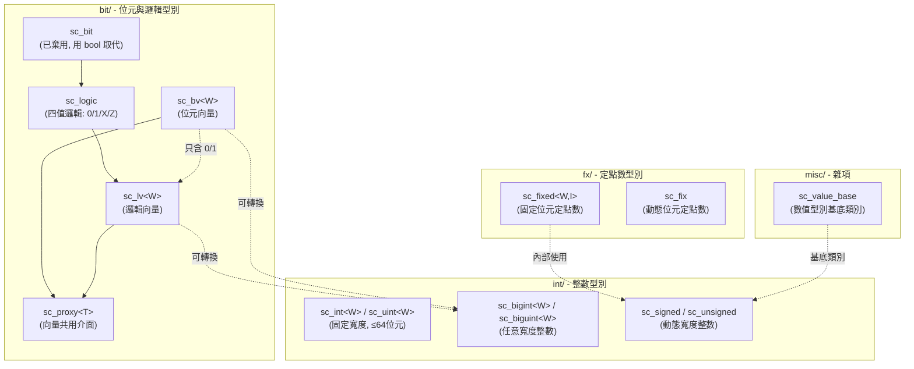
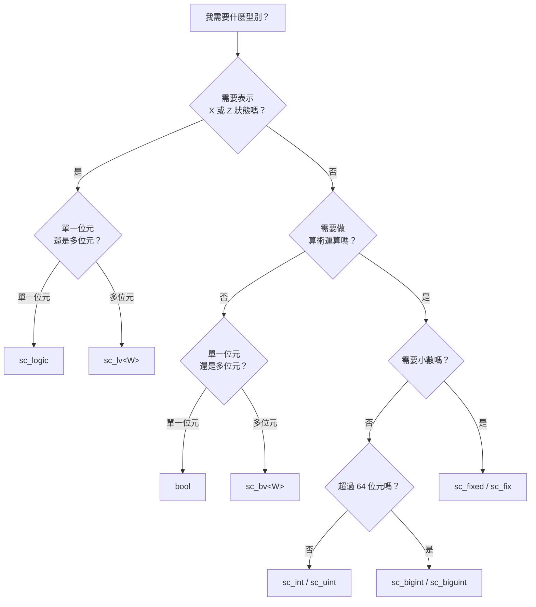

# SystemC 資料型別總覽 - datatypes 目錄

本目錄包含 SystemC 所有硬體模擬用的資料型別實作。這些型別是 SystemC 區別於一般 C++ 程式庫的核心：它們讓軟體工程師能夠在 C++ 中精確描述硬體電路中的數位訊號。

## 為什麼需要特殊的資料型別？

想像你在用樂高積木蓋房子。普通的 C++ 型別（`int`、`bool`）就像是固定大小的樂高磚塊——你只能用 8 位元、16 位元、32 位元或 64 位元。但在硬體設計中，你可能需要一個 13 位元的計數器，或是一條 128 位元的匯流排。SystemC 的資料型別就像是可以任意切割大小的樂高磚塊。

此外，真實的電路裡，一條線不只有 0 和 1 兩種狀態——它還可能處於「高阻抗」(Z) 或「未知」(X) 狀態。這就像交通號誌除了紅燈和綠燈之外，還可能故障（未知）或完全關閉（高阻抗）。

## 子目錄總覽

| 子目錄 | 用途 | 日常比喻 |
|--------|------|----------|
| `bit/` | 位元與邏輯向量型別 | 開關陣列——每個開關可以是開/關（二值）或開/關/斷線/未知（四值） |
| `int/` | 任意寬度整數型別 | 可調大小的數字計算器，支援有號/無號、任意位元寬度 |
| `fx/`  | 定點數型別 | 帶小數點的硬體計算器，用於 DSP 和需要精確小數運算的場合 |
| `misc/`| 雜項工具型別 | 輔助工具箱，包含數值表示法轉換等通用功能 |

## 型別之間的關係

## 如何選擇合適的型別？

## 相關檔案

- `bit/` - [位元與邏輯型別詳細文件](bit/_index.md)
- `int/` - 整數型別（sc_int, sc_uint, sc_bigint, sc_biguint, sc_signed, sc_unsigned）
- `fx/` - 定點數型別（sc_fixed, sc_ufixed, sc_fix, sc_ufix）
- `misc/` - 雜項工具（sc_value_base, sc_concatref）
