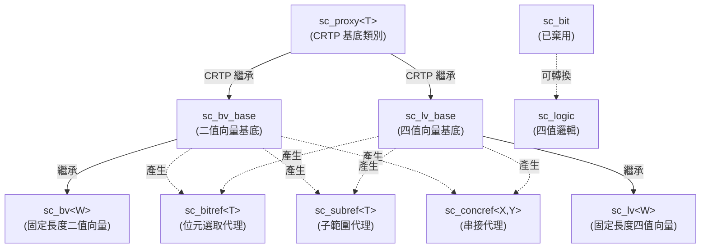

# 位元與邏輯型別 - bit 目錄

本目錄實作了 SystemC 中所有與位元（bit）和邏輯（logic）相關的資料型別，是硬體數位訊號模擬的基礎。

## 日常比喻

想像一棟大樓的電燈控制面板：

- **`sc_bit`** / **`bool`**：最簡單的開關——只有「開」和「關」兩個狀態。就像家裡的電燈開關。
- **`sc_logic`**：進階的四段式開關——除了「開」(1) 和「關」(0)，還有「斷線」(Z，高阻抗) 和「不確定」(X，未知)。就像一個可能壞掉的交通號誌。
- **`sc_bv<W>`**：一整排簡單開關——W 個開關排成一列，每個只有開/關。就像教室裡一排電燈的開關面板。
- **`sc_lv<W>`**：一整排進階開關——W 個四段式開關排成一列。就像控制中心的大型控制面板，每個開關都可能有四種狀態。

## 檔案總覽

| 檔案 | 類別 | 說明 |
|------|------|------|
| `sc_bit.h/.cpp` | `sc_bit` | 單一位元類別（已棄用，建議用 `bool`） |
| `sc_logic.h/.cpp` | `sc_logic` | 四值邏輯類別（0, 1, X, Z） |
| `sc_bv_base.h/.cpp` | `sc_bv_base` | 二值位元向量基底類別（動態長度） |
| `sc_bv.h` | `sc_bv<W>` | 二值位元向量模板類別（編譯期固定長度） |
| `sc_lv_base.h/.cpp` | `sc_lv_base` | 四值邏輯向量基底類別（動態長度） |
| `sc_lv.h` | `sc_lv<W>` | 四值邏輯向量模板類別（編譯期固定長度） |
| `sc_proxy.h` | `sc_proxy<T>` | 向量型別的 CRTP 基底類別，提供共用操作 |
| `sc_bit_proxies.h` | 多種 proxy 類別 | 位元選取、子範圍選取、串接的代理類別 |
| `sc_bit_ids.h` | 錯誤訊息 ID | 定義 bit 模組使用的錯誤/警告訊息代碼 |

## 類別繼承關係



## 二值 vs 四值

| 特性 | 二值（sc_bv） | 四值（sc_lv） |
|------|--------------|--------------|
| 可能的值 | 0, 1 | 0, 1, X, Z |
| 記憶體用量 | 較少（只需資料位元） | 較多（需要資料位元 + 控制位元） |
| 效能 | 較快 | 較慢 |
| 適用場景 | 純數位邏輯 | 三態匯流排、未初始化訊號 |
| `is_01()` | 永遠回傳 `true` | 需要檢查 |

## 內部儲存方式

向量型別內部使用 `sc_digit`（通常是 `unsigned int`，32 位元）陣列儲存位元：

- **`sc_bv_base`**：只有一個 `m_data[]` 陣列，每個 bit 佔一個位元位置
- **`sc_lv_base`**：有兩個陣列 `m_data[]`（資料）和 `m_ctrl[]`（控制），兩者組合表示四種狀態

```
sc_lv 的編碼方式：
  data=0, ctrl=0 => '0'
  data=1, ctrl=0 => '1'
  data=0, ctrl=1 => 'Z'
  data=1, ctrl=1 => 'X'
```

## 相關檔案

- [sc_bit.md](sc_bit.md) - 單一位元類別（已棄用）
- [sc_logic.md](sc_logic.md) - 四值邏輯類別
- [sc_bv_base.md](sc_bv_base.md) - 二值向量基底類別
- [sc_bv.md](sc_bv.md) - 固定長度二值向量模板
- [sc_lv_base.md](sc_lv_base.md) - 四值向量基底類別
- [sc_lv.md](sc_lv.md) - 固定長度四值向量模板
- [sc_proxy.md](sc_proxy.md) - 向量共用介面基底
- [sc_bit_proxies.md](sc_bit_proxies.md) - 位元/子範圍/串接代理類別
- [sc_bit_ids.md](sc_bit_ids.md) - 錯誤訊息 ID 定義
