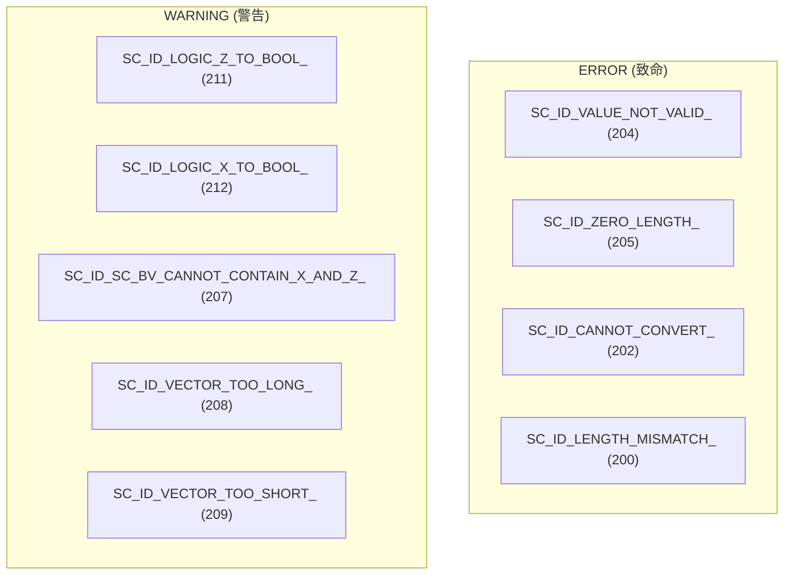

# sc_bit_ids - 位元模組錯誤與警告訊息 ID

## 概述

`sc_bit_ids.h` 定義了 `datatypes/bit` 模組中使用的所有錯誤和警告訊息 ID。每個 ID 對應一個特定的錯誤情境，由 SystemC 的報告系統 (`SC_REPORT_ERROR` / `SC_REPORT_WARNING`) 使用。

**原始檔案：** `sc_bit_ids.h`

## 日常比喻

這個檔案就像一本「錯誤碼手冊」。就像醫院的診斷代碼一樣——每個代碼對應一種特定的問題，方便醫生（開發者）快速識別並處理。

## 訊息 ID 列表

所有 ID 的數值範圍為 200~299，屬於 `datatypes/bit` 模組。

| ID | 數值 | 訊息 | 觸發場景 |
|----|------|------|----------|
| `SC_ID_LENGTH_MISMATCH_` | 200 | "length mismatch in bit/logic vector assignment" | 不同長度的向量賦值 |
| `SC_ID_INCOMPATIBLE_TYPES_` | 201 | "incompatible types" | 型別不相容的操作 |
| `SC_ID_CANNOT_CONVERT_` | 202 | "cannot perform conversion" | 字串轉換失敗（空字串、非法字元等） |
| `SC_ID_INCOMPATIBLE_VECTORS_` | 203 | "incompatible vectors" | 向量操作中的不相容 |
| `SC_ID_VALUE_NOT_VALID_` | 204 | "value is not valid" | `sc_bit` 或 `sc_logic` 收到非法值 |
| `SC_ID_ZERO_LENGTH_` | 205 | "zero length" | 建立長度為 0 的向量 |
| `SC_ID_VECTOR_CONTAINS_LOGIC_VALUE_` | 206 | "vector contains 4-value logic" | 四值向量嘗試轉換為二值 |
| `SC_ID_SC_BV_CANNOT_CONTAIN_X_AND_Z_` | 207 | "sc_bv cannot contain values X and Z" | `sc_bv` 試圖存入 X 或 Z |
| `SC_ID_VECTOR_TOO_LONG_` | 208 | "vector is too long: truncated" | 賦值時來源向量過長，被截斷 |
| `SC_ID_VECTOR_TOO_SHORT_` | 209 | "vector is too short: 0-padded" | 賦值時來源向量過短，用 0 補齊 |
| `SC_ID_WRONG_VALUE_` | 210 | "wrong value" | 一般性的值錯誤 |
| `SC_ID_LOGIC_Z_TO_BOOL_` | 211 | "sc_logic value 'Z' cannot be converted to bool" | `sc_logic(Z).to_bool()` |
| `SC_ID_LOGIC_X_TO_BOOL_` | 212 | "sc_logic value 'X' cannot be converted to bool" | `sc_logic(X).to_bool()` |

## 使用方式

### SC_DEFINE_MESSAGE 巨集

```cpp
SC_DEFINE_MESSAGE(SC_ID_VALUE_NOT_VALID_, 204, "value is not valid")
```

此巨集展開後會在 `sc_core` 命名空間中宣告一個外部字串常數。實際的字串定義在 `sc_report_handler.cpp` 中。

### 在程式碼中觸發

```cpp
// in sc_bit.cpp
void sc_bit::invalid_value(char c) {
    std::stringstream msg;
    msg << "sc_bit( '" << c << "' )";
    SC_REPORT_ERROR(sc_core::SC_ID_VALUE_NOT_VALID_, msg.str().c_str());
}

// in sc_logic.cpp
void sc_logic::invalid_01() const {
    if ((int)m_val == Log_Z) {
        SC_REPORT_WARNING(sc_core::SC_ID_LOGIC_Z_TO_BOOL_, 0);
    } else {
        SC_REPORT_WARNING(sc_core::SC_ID_LOGIC_X_TO_BOOL_, 0);
    }
}
```

## 嚴重等級分類



- **ERROR**：通常會中止模擬（呼叫 `sc_abort()`），代表程式有嚴重錯誤
- **WARNING**：模擬會繼續，但結果可能不正確，需要開發者檢查

## 設計理由

集中定義錯誤 ID 有幾個好處：

1. **唯一性**：每個 ID 有唯一的數值，方便在日誌中快速搜尋
2. **模組化**：200~299 範圍專屬 bit 模組，不會與其他模組衝突
3. **可配置性**：使用者可以透過 `SC_REPORT_HANDLER` 自訂某些錯誤的行為（例如把 WARNING 改成 ERROR，或忽略某個 WARNING）

## 相關檔案

- [sc_bit.md](sc_bit.md) - 使用 `SC_ID_VALUE_NOT_VALID_`
- [sc_logic.md](sc_logic.md) - 使用 `SC_ID_VALUE_NOT_VALID_`、`SC_ID_LOGIC_Z_TO_BOOL_`、`SC_ID_LOGIC_X_TO_BOOL_`
- [sc_bv_base.md](sc_bv_base.md) - 使用 `SC_ID_ZERO_LENGTH_`、`SC_ID_CANNOT_CONVERT_`、`SC_ID_SC_BV_CANNOT_CONTAIN_X_AND_Z_`
- [sc_lv_base.md](sc_lv_base.md) - 使用 `SC_ID_ZERO_LENGTH_`
- 原始碼：`ref/systemc/src/sysc/datatypes/bit/sc_bit_ids.h`
