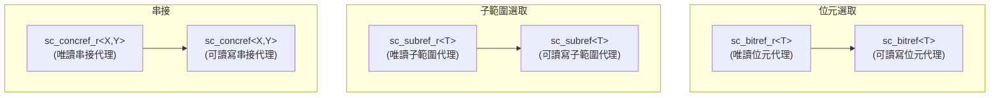
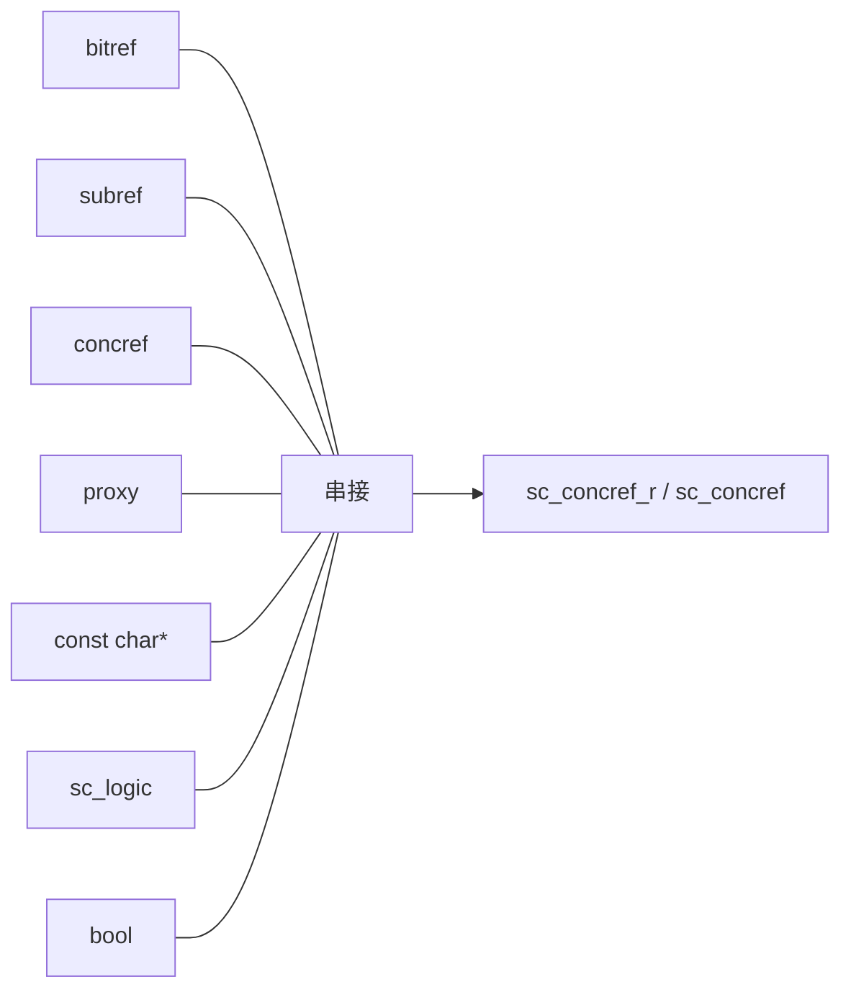

# sc_bit_proxies - 位元選取、子範圍、串接的代理類別

## 概述

`sc_bit_proxies.h` 定義了一系列代理（proxy）類別，用於實作位元向量的三種存取操作：單一位元選取（bit select）、子範圍選取（sub-range / part select）、以及串接（concatenation）。這些代理類別讓你可以用直覺的語法操作位元向量的部分內容。

**原始檔案：** `sc_bit_proxies.h`（僅標頭檔，約 3930 行）

## 日常比喻

想像你有一排儲物櫃（位元向量），代理類別就像不同的「取物方式」：

- **`sc_bitref`**（位元選取）：你打開單一個櫃子，取出或放入東西。就像 `locker[3]`——只操作第 3 號櫃子。
- **`sc_subref`**（子範圍選取）：你一次打開連續好幾個櫃子。就像 `locker.range(7, 4)`——操作第 4 到第 7 號櫃子。
- **`sc_concref`**（串接）：你把兩排不同的櫃子接在一起，當作一排來使用。就像 `(lockerA, lockerB)`——把 A 排和 B 排串接成一排。

## 關鍵概念

### 為什麼需要代理類別？

在 C++ 中，`operator[]` 回傳的不能既支援讀取又支援寫入（左值和右值語義不同）。代理類別解決了這個問題：

```cpp
sc_bv<8> vec("10110011");
// vec[3] returns sc_bitref<sc_bv_base>, not bool
// This proxy can:
//   - be read:  bool b = vec[3];         (implicit conversion)
//   - be written: vec[3] = true;          (assignment operator)
//   - be used in expressions: vec[3] & vec[2]
```

### r-value vs l-value 代理

每種代理都有兩個版本：

- **`_r` 版本**（read-only）：只能讀取，不能修改。用於 `const` 物件。
- **無後綴版本**（read-write）：繼承自 `_r` 版本，增加了寫入功能。



## 類別詳解

### sc_bitref_r<T> / sc_bitref<T> - 位元選取代理

```cpp
// Internal: stores reference to parent object + bit index
T&  m_obj;    // reference to parent vector
int m_index;  // bit position
```

**主要方法：**

```cpp
// r-value operations
value_type value() const;          // get bit value (0,1,X,Z)
bool is_01() const;                // check if 0 or 1
bool to_bool() const;              // convert to bool
char to_char() const;              // convert to char
bit_type operator ~ () const;      // bitwise complement
operator bit_type() const;         // implicit conversion to logic

// l-value operations (sc_bitref only)
sc_bitref<T>& operator = (value_type v);
sc_bitref<T>& operator = (const sc_logic& v);
sc_bitref<T>& operator &= (value_type v);
sc_bitref<T>& operator |= (value_type v);
sc_bitref<T>& operator ^= (value_type v);
```

**sc_bitref_conv_r<T>**：一個輔助類別，針對 `sc_bv_base`（二值向量）的位元代理提供隱式到 `bool` 的轉換和 `operator!`。因為二值向量的位元一定是 0 或 1，轉換到 `bool` 是安全的。

### sc_subref_r<T> / sc_subref<T> - 子範圍選取代理

```cpp
// Internal: stores reference to parent + range
T&  m_obj;   // reference to parent vector
int m_hi;    // high bit index
int m_lo;    // low bit index
int m_len;   // length = hi - lo + 1
```

子範圍代理讓你可以把向量的一段當作獨立的向量來操作：

```cpp
sc_lv<16> data("1010110011001100");
// data.range(11, 8) returns sc_subref, representing bits 8-11
sc_lv<4> nibble = data.range(11, 8);  // "1100"
data.range(11, 8) = "0101";           // modify in place
```

**主要方法：**

```cpp
int length() const;                // sub-range length
value_type get_bit(int i) const;   // get bit relative to sub-range
sc_digit get_word(int i) const;    // get word (packed bits)
sc_digit get_cword(int i) const;   // get control word

// l-value operations
void set_bit(int i, value_type v);
void set_word(int i, sc_digit w);
void set_cword(int i, sc_digit w);
```

### sc_concref_r<X,Y> / sc_concref<X,Y> - 串接代理

```cpp
// Internal: stores references to two parts
X& m_left;   // left (high) part
Y& m_right;  // right (low) part
int m_len;   // total length = left.length() + right.length()
```

串接代理把兩個向量（或代理）接在一起：

```cpp
sc_lv<4> high("1010");
sc_lv<4> low("0011");
// (high, low) returns sc_concref, representing "10100011"
sc_lv<8> full = (high, low);
```

**主要方法：**

```cpp
int length() const;                // total length
value_type get_bit(int i) const;   // get bit from combined view

// l-value operations
void set_bit(int i, value_type v);
```

位元索引的對應方式：低位元（index < right.length()）對應右側向量，高位元對應左側向量。

## 串接運算子

檔案中定義了大量的 `operator,` 和 `concat()` 函式重載，處理所有可能的組合：



任何兩個可串接的物件都可以用 `(a, b)` 或 `concat(a, b)` 來串接。

## 設計理由 / RTL 背景

在 Verilog 中，位元選取、子範圍和串接是語言內建的語法：

```verilog
wire [7:0] data;
wire bit3 = data[3];           // bit select
wire [3:0] nibble = data[7:4]; // part select
wire [15:0] wide = {data, data}; // concatenation
```

SystemC 用 C++ 的運算子重載和代理類別來模擬這些操作。雖然程式碼比 Verilog 複雜得多（約 3900 行），但提供了相同的功能和相似的語法。

代理類別的關鍵設計原則是「延遲求值」——`vec[3]` 不會立即複製一個 bit，而是回傳一個知道「去哪裡找 bit」的代理物件。這在左值情境（如 `vec[3] = 1`）中特別重要。

## 相關檔案

- [sc_proxy.md](sc_proxy.md) - 代理的基底類別，定義了 `operator[]` 和 `range()` 等方法
- [sc_bv_base.md](sc_bv_base.md) - 二值向量，使用這些代理類別
- [sc_lv_base.md](sc_lv_base.md) - 四值向量，使用這些代理類別
- [sc_bit_ids.md](sc_bit_ids.md) - 錯誤訊息定義
- 原始碼：`ref/systemc/src/sysc/datatypes/bit/sc_bit_proxies.h`
