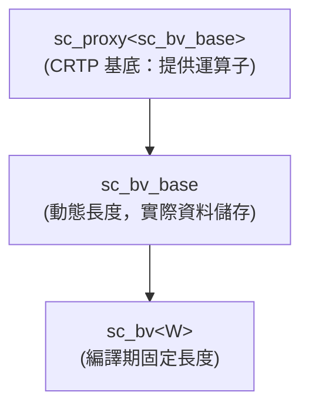

# sc_bv<W> - 固定長度二值位元向量

## 概述

`sc_bv<W>` 是一個模板類別，提供編譯期固定長度為 W 位元的二值位元向量。它繼承自 `sc_bv_base`，模板參數 `W` 在編譯時就確定了向量的寬度。這是 SystemC 中最常用的位元向量型別之一。

**原始檔案：** `sc_bv.h`（僅標頭檔，無 .cpp）

## 日常比喻

如果 `sc_bv_base` 是「可以剪成任意長度的開關面板」，那 `sc_bv<W>` 就是「出廠就已經固定好長度的開關面板」。例如 `sc_bv<8>` 就是一個 8 格開關面板——你不能在執行時改變它的長度。

這就像買衣服：`sc_bv_base` 是布匹（可以量身訂做），`sc_bv<W>` 是成衣（尺寸固定，但更方便使用）。

## 關鍵概念

### 為什麼需要模板版本？

1. **型別安全**：`sc_bv<8>` 和 `sc_bv<16>` 是不同的型別，編譯器能在編譯時檢查位元寬度
2. **硬體對應**：硬體訊號的寬度在設計時就確定了，用模板參數表達最自然
3. **效能**：編譯器可能針對固定長度做最佳化

### 薄包裝層（Thin Wrapper）

`sc_bv<W>` 本身幾乎沒有自己的邏輯——它只是把 `W` 傳給 `sc_bv_base` 的建構子，然後把所有運算委託給基底類別。這種設計模式叫做「薄包裝層」。

## 類別介面

### 建構子

```cpp
sc_bv();                              // all bits = 0
explicit sc_bv(bool init_value);      // all bits = init_value
explicit sc_bv(char init_value);      // '0' or '1'
sc_bv(const char* a);                 // from string
sc_bv(const bool* a);                 // from bool array
sc_bv(const sc_logic* a);             // from logic array
sc_bv(const sc_unsigned& a);          // from integer types
sc_bv(const sc_signed& a);
sc_bv(unsigned long a);
sc_bv(long a);
sc_bv(int a);
sc_bv(uint64 a);
sc_bv(int64 a);
sc_bv(const sc_proxy<X>& a);         // from any proxy
sc_bv(const sc_bv<W>& a);            // copy
```

所有建構子都遵循同一個模式：先用 `W` 初始化基底類別 `sc_bv_base`，然後用 `sc_bv_base::operator=` 設定值。

### 賦值運算子

```cpp
sc_bv<W>& operator = (const sc_proxy<X>& a);
sc_bv<W>& operator = (const sc_bv<W>& a);
sc_bv<W>& operator = (const char* a);
sc_bv<W>& operator = (const bool* a);
sc_bv<W>& operator = (const sc_logic* a);
sc_bv<W>& operator = (const sc_unsigned& a);
sc_bv<W>& operator = (unsigned long a);
sc_bv<W>& operator = (int a);
// ... etc
```

所有賦值運算子也都只是呼叫 `sc_bv_base::operator=` 再回傳 `*this`。

## 使用範例

```cpp
// 8-bit bus
sc_bv<8> data_bus;
data_bus = "10110011";

// 32-bit register
sc_bv<32> reg_value = 0x12345678;

// bit operations (inherited from sc_proxy)
sc_bv<8> a("11001100");
sc_bv<8> b("10101010");
sc_bv<8> c = a & b;   // "10001000"
sc_bv<8> d = a | b;   // "11101110"
sc_bv<8> e = ~a;      // "00110011"

// single bit access
bool bit0 = a[0];     // returns sc_bitref proxy

// sub-range access
sc_bv<4> nibble = a.range(7, 4);  // upper nibble
```

## 繼承結構



## 設計理由 / RTL 背景

在硬體設計中，每條訊號線的寬度在合成（synthesis）之前就必須確定。例如一個 8 位元的暫存器、一條 32 位元的匯流排，寬度都是固定的。`sc_bv<W>` 的模板參數 `W` 精確地對應了這個概念。

與 `std::bitset<N>` 的差異：
- `sc_bv<W>` 支援 SystemC 的訊號系統（可以綁定到 `sc_signal<sc_bv<W>>`）
- `sc_bv<W>` 支援字串格式轉換（二進位、八進位、十六進位）
- `sc_bv<W>` 支援與 `sc_lv<W>`、整數型別的互轉
- `sc_bv<W>` 支援位元選取和子範圍的代理物件

## 相關檔案

- [sc_bv_base.md](sc_bv_base.md) - 基底類別，包含所有實作細節
- [sc_lv.md](sc_lv.md) - 四值版本 `sc_lv<W>`
- [sc_proxy.md](sc_proxy.md) - CRTP 基底，提供位元運算和比較
- 原始碼：`ref/systemc/src/sysc/datatypes/bit/sc_bv.h`
