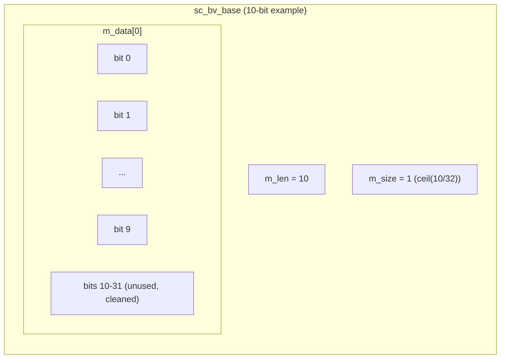
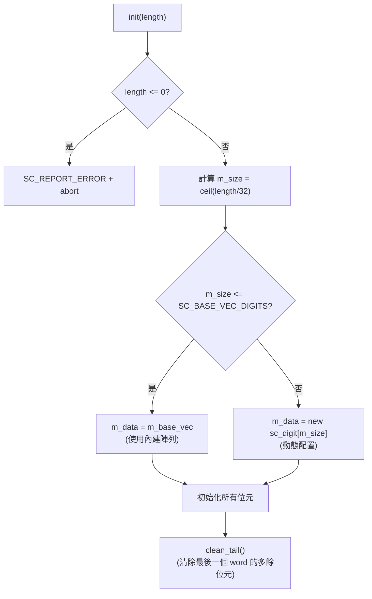

# sc_bv_base - 任意寬度二值位元向量基底類別

## 概述

`sc_bv_base` 是任意寬度的二值（只有 0 和 1）位元向量基底類別。它是 `sc_bv<W>` 模板類別的非模板基底，負責所有實際的資料儲存和操作邏輯。繼承自 `sc_proxy<sc_bv_base>`，獲得豐富的位元操作介面。

**原始檔案：** `sc_bv_base.h` + `sc_bv_base.cpp`

## 日常比喻

想像一排電燈開關面板。`sc_bv_base` 就像一個「可調長度的開關面板」——你可以指定面板上有幾個開關（每個只有開/關），而面板會自動分配足夠的空間來存放所有開關的狀態。

如果你需要 100 個開關，面板內部其實是用幾個 32 格的抽屜（`sc_digit`）來存放——需要 4 個抽屜（4 x 32 = 128 格，多餘的格子忽略）。

## 關鍵概念

### 與 sc_lv_base 的差異

`sc_bv_base` 只儲存 0 和 1，沒有 X 和 Z。這意味著：

- 記憶體用量只有 `sc_lv_base` 的一半（不需要控制位元陣列）
- `is_01()` 永遠回傳 `true`
- 試圖設定 X 或 Z 值會觸發警告
- 效能更好，適合純數位邏輯的場景

### 內部儲存結構



### 小型向量最佳化 (Small Vector Optimization)

`sc_bv_base` 內建了一個固定大小的 `m_base_vec` 陣列。如果向量夠小（不超過 `SC_BASE_VEC_DIGITS` 個 digit），就直接使用這個內建陣列，避免堆積記憶體配置。只有向量較大時才會動態分配 `new sc_digit[m_size]`。

這就像是：小件行李直接放口袋（內建空間），大件行李才去租行李箱（動態分配）。

## 類別介面

### 建構子

```cpp
explicit sc_bv_base(int length_);                    // all bits = 0
explicit sc_bv_base(bool a, int length_);            // all bits = a
sc_bv_base(const char* a);                           // from string, length auto
sc_bv_base(const char* a, int length_);              // from string, fixed length
sc_bv_base(const sc_proxy<X>& a);                    // from another proxy
sc_bv_base(const sc_bv_base& a);                     // copy
```

### 賦值運算子

```cpp
sc_bv_base& operator = (const sc_proxy<X>& a);      // from proxy
sc_bv_base& operator = (const char* a);              // from string
sc_bv_base& operator = (const bool* a);              // from bool array
sc_bv_base& operator = (const sc_logic* a);          // from logic array
sc_bv_base& operator = (unsigned long a);            // from integer types
sc_bv_base& operator = (const sc_unsigned& a);       // from sc_unsigned
// ... and more integer types
```

### 核心方法

```cpp
int length() const;                     // bit count
int size() const;                       // number of sc_digit words

value_type get_bit(int i) const;        // get bit i
void set_bit(int i, value_type value);  // set bit i

sc_digit get_word(int i) const;         // get data word i
void set_word(int i, sc_digit w);       // set data word i

sc_digit get_cword(int i) const;        // always returns 0 (no X/Z)
void set_cword(int i, sc_digit w);      // warns if w != 0

bool is_01() const;                     // always returns true
void clean_tail();                      // clean unused bits in last word
```

### 位元操作細節

```cpp
// get_bit: extract single bit from packed array
value_type get_bit(int i) const {
    int wi = i / SC_DIGIT_SIZE;    // which word
    int bi = i % SC_DIGIT_SIZE;    // which bit in the word
    return value_type((m_data[wi] >> bi) & SC_DIGIT_ONE);
}

// set_bit: set single bit in packed array
void set_bit(int i, value_type value) {
    int wi = i / SC_DIGIT_SIZE;
    int bi = i % SC_DIGIT_SIZE;
    sc_digit mask = SC_DIGIT_ONE << bi;
    m_data[wi] |= mask;               // set to 1 first
    m_data[wi] &= value << bi | ~mask; // then apply actual value
}
```

## 字串轉換

`sc_bv_base` 支援多種格式的字串初始化，透過全域函式 `convert_to_bin()` 處理：

| 格式 | 範例 | 說明 |
|------|------|------|
| 二進位 | `"0b1010"` | 0b 前綴 |
| 八進位 | `"0o17"` | 0o 前綴 |
| 十進位 | `"0d42"` | 0d 前綴 |
| 十六進位 | `"0x2A"` | 0x 前綴 |
| 無前綴 | `"1010"` | 當作四值邏輯字元 |

`convert_to_bin()` 函式會將所有格式統一轉換成二進位字串，並在末尾加上格式標記（`F` 表示有格式前綴，`U` 表示無格式）。

## 記憶體配置流程



## clean_tail() 的重要性

當向量長度不是 32 的倍數時，最後一個 `sc_digit` 中會有未使用的位元。`clean_tail()` 確保這些位元為 0，避免比較和運算時產生錯誤結果。

例如一個 10 位元的向量佔用 1 個 32-bit word，其中 bit 10~31 必須為 0。

## 設計理由 / RTL 背景

在硬體設計中，位元向量（bit vector）是最基本的資料型別之一。VHDL 的 `std_logic_vector` 和 Verilog 的 `wire [N:0]` 都是位元向量。`sc_bv_base` 提供了動態大小的版本，而 `sc_bv<W>` 提供了編譯期固定大小的版本。

使用壓縮的 `sc_digit` 陣列而非 `bool` 陣列，是因為：
1. 記憶體效率：32 個 bit 只佔 4 bytes，而非 32 bytes
2. 操作效率：位元運算可以一次處理 32 個 bit（整字運算）

## 相關檔案

- [sc_bv.md](sc_bv.md) - 固定長度二值向量模板（繼承自 `sc_bv_base`）
- [sc_lv_base.md](sc_lv_base.md) - 四值向量基底（`sc_bv_base` 的四值對應）
- [sc_proxy.md](sc_proxy.md) - CRTP 基底類別，提供共用介面
- [sc_bit_proxies.md](sc_bit_proxies.md) - 位元選取與子範圍代理
- 原始碼：`ref/systemc/src/sysc/datatypes/bit/sc_bv_base.h`
- 原始碼：`ref/systemc/src/sysc/datatypes/bit/sc_bv_base.cpp`
