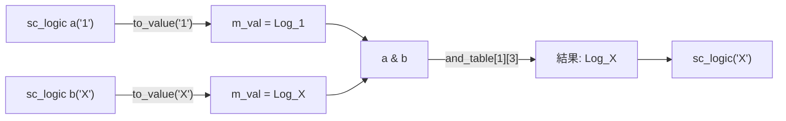

# sc_logic - 四值邏輯型別

## 概述

`sc_logic` 是 SystemC 中的四值邏輯型別，能夠表示硬體訊號的四種狀態：`0`（低電位）、`1`（高電位）、`X`（未知）、`Z`（高阻抗）。這是 SystemC 中最重要的基本型別之一，對應 Verilog 的四值邏輯和 VHDL 的 `std_logic`。

**原始檔案：** `sc_logic.h` + `sc_logic.cpp`

## 日常比喻

想像一個交通號誌控制系統：

- **`0`（紅燈）**：明確的「停」，對應邏輯低電位
- **`1`（綠燈）**：明確的「行」，對應邏輯高電位
- **`X`（故障閃爍）**：號誌故障，無法確定是紅還是綠——這就是「未知」狀態
- **`Z`（完全關閉）**：號誌斷電，完全沒有訊號——這就是「高阻抗」狀態

在真實電路中，一條線可能因為尚未被驅動（例如重置前）而處於 X 狀態，或者因為三態緩衝器關閉而處於 Z 狀態。

## 關鍵概念

### 四值邏輯列舉

```cpp
enum sc_logic_value_t {
    Log_0 = 0,   // logic 0
    Log_1,       // logic 1
    Log_Z,       // high impedance
    Log_X        // unknown
};
```

### 真值表（查表法實作）

`sc_logic` 的位元運算不像一般程式用 `if-else` 判斷，而是直接用查表法（lookup table），這在硬體模擬中是非常高效的做法。

**AND 真值表：**

| & | 0 | 1 | Z | X |
|---|---|---|---|---|
| **0** | 0 | 0 | 0 | 0 |
| **1** | 0 | 1 | X | X |
| **Z** | 0 | X | X | X |
| **X** | 0 | X | X | X |

規律：只要有一邊是 0，結果就是 0（因為 AND 只要有一個輸入是 0 就確定是 0）。其他不確定的情況都是 X。

**OR 真值表：**

| \| | 0 | 1 | Z | X |
|----|---|---|---|---|
| **0** | 0 | 1 | X | X |
| **1** | 1 | 1 | 1 | 1 |
| **Z** | X | 1 | X | X |
| **X** | X | 1 | X | X |

規律：只要有一邊是 1，結果就是 1（因為 OR 只要有一個輸入是 1 就確定是 1）。

**XOR 真值表：**

| ^ | 0 | 1 | Z | X |
|---|---|---|---|---|
| **0** | 0 | 1 | X | X |
| **1** | 1 | 0 | X | X |
| **Z** | X | X | X | X |
| **X** | X | X | X | X |

**NOT 表：**

| 輸入 | 0 | 1 | Z | X |
|------|---|---|---|---|
| **輸出** | 1 | 0 | X | X |

## 類別介面

### 建構子

```cpp
sc_logic();                     // default: X (unknown)
sc_logic(sc_logic_value_t v);   // from enum
explicit sc_logic(bool a);      // from bool: true->1, false->0
explicit sc_logic(char a);      // from '0','1','x','X','z','Z'
explicit sc_logic(int a);       // from 0,1,2,3
explicit sc_logic(const sc_bit& a); // from sc_bit
```

注意：預設值是 `X`（未知），這模擬了硬體中未初始化訊號的真實行為。

### 位元運算子

```cpp
const sc_logic operator & (const sc_logic& a, const sc_logic& b); // AND
const sc_logic operator | (const sc_logic& a, const sc_logic& b); // OR
const sc_logic operator ^ (const sc_logic& a, const sc_logic& b); // XOR
const sc_logic operator ~ () const;                                // NOT

sc_logic& operator &= (const sc_logic& b); // AND assign
sc_logic& operator |= (const sc_logic& b); // OR assign
sc_logic& operator ^= (const sc_logic& b); // XOR assign
```

### 轉換方法

```cpp
sc_logic_value_t value() const; // get raw enum value
bool is_01() const;             // check if 0 or 1
bool to_bool() const;           // convert to bool (warns if X or Z)
char to_char() const;           // convert to '0','1','Z','X'
```

### 比較運算子

```cpp
bool operator == (const sc_logic& a, const sc_logic& b);
bool operator != (const sc_logic& a, const sc_logic& b);
```

### 預定義常數

```cpp
extern const sc_logic SC_LOGIC_0;  // logic 0
extern const sc_logic SC_LOGIC_1;  // logic 1
extern const sc_logic SC_LOGIC_Z;  // high impedance
extern const sc_logic SC_LOGIC_X;  // unknown
```

## 內部實作

### 記憶體管理

`sc_logic` 使用 SystemC 的 `sc_mempool` 進行記憶體配置，這對大量建立/銷毀 `sc_logic` 物件時能顯著提升效能（例如大型向量的操作）。

### 查表法

所有位元運算都透過靜態的 4x4 二維陣列實作。例如 AND 運算：

```cpp
sc_logic& operator &= (const sc_logic& b) {
    m_val = and_table[m_val][b.m_val];
    return *this;
}
```

這比 `if-else` 或 `switch` 更快，因為只需要一次陣列索引。

### to_bool() 的安全檢查

```cpp
bool to_bool() const {
    if (!is_01()) { invalid_01(); }
    return ((int)m_val != Log_0);
}
```

將 X 或 Z 轉換為 `bool` 時會發出警告（不是錯誤），因為在模擬過程中這種情況很常見（例如重置前的訊號），硬性中斷會讓模擬無法進行。

## 運算流程



## 設計理由 / RTL 背景

在硬體描述語言中，四值邏輯是基本需求：

- **Verilog**：`wire` 和 `reg` 都是四值（0, 1, x, z）
- **VHDL**：`std_logic` 實際上有九種狀態，但最常用的也是這四種

`X` 狀態在硬體模擬中非常重要——它能幫助工程師發現「訊號衝突」（兩個驅動器同時驅動同一條線）和「未初始化」問題。如果只有 0 和 1，這些問題會被隱藏起來。

`Z` 狀態代表高阻抗，用於三態匯流排（tri-state bus）。例如多個裝置共用一條資料線時，只有一個裝置在驅動，其他裝置輸出 Z，代表「我不驅動這條線」。

## 相關檔案

- [sc_bit.md](sc_bit.md) - 已棄用的二值位元型別
- [sc_lv_base.md](sc_lv_base.md) - 使用 `sc_logic` 的向量型別
- [sc_lv.md](sc_lv.md) - 固定長度四值向量
- [sc_bit_ids.md](sc_bit_ids.md) - 錯誤訊息定義
- 原始碼：`ref/systemc/src/sysc/datatypes/bit/sc_logic.h`
- 原始碼：`ref/systemc/src/sysc/datatypes/bit/sc_logic.cpp`
