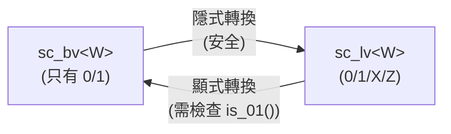
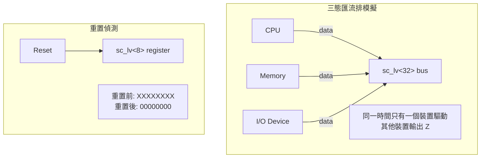
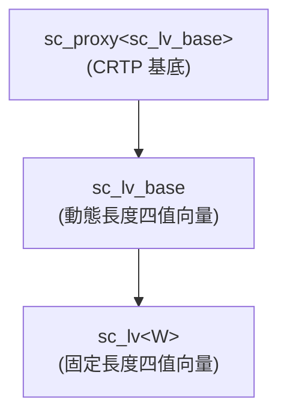

# sc_lv<W> - 固定長度四值邏輯向量

## 概述

`sc_lv<W>` 是一個模板類別，提供編譯期固定長度為 W 位元的四值邏輯向量（0, 1, X, Z）。它繼承自 `sc_lv_base`，是 SystemC 中最常用的四值向量型別，對應硬體中的多位元訊號線。

**原始檔案：** `sc_lv.h`（僅標頭檔，無 .cpp）

## 日常比喻

`sc_lv<W>` 就像是「出廠時長度已固定的進階開關面板」。與 `sc_bv<W>`（只有開/關兩種狀態）不同，`sc_lv<W>` 的每個開關都有四個位置——這讓你能表達更多真實世界的情境。

想像你是一個網路管理員，監控 8 個網路埠的狀態：
- `sc_lv<8> port_status;`
- 每個埠可能是：連線中(1)、斷線(0)、被拔掉(Z)、或狀態不明(X)

## 關鍵概念

### 與 sc_bv<W> 的關係



`sc_bv<W>` 可以安全地轉換成 `sc_lv<W>`（因為 0/1 是 0/1/X/Z 的子集），但反向轉換需要確認沒有 X 或 Z。

### 薄包裝層

和 `sc_bv<W>` 一樣，`sc_lv<W>` 只是 `sc_lv_base` 的薄包裝——它的唯一職責是在建構時傳入寬度 `W`，然後將所有操作委託給基底類別。

## 類別介面

### 建構子

```cpp
sc_lv();                              // all bits = X (unknown)
explicit sc_lv(const sc_logic& init);  // all bits = init
explicit sc_lv(bool init);            // all bits = init (0 or 1)
explicit sc_lv(char init);            // all bits = init ('0','1','x','z')
sc_lv(const char* a);                 // from string
sc_lv(const bool* a);                 // from bool array
sc_lv(const sc_logic* a);             // from logic array
sc_lv(const sc_unsigned& a);          // from integer types
sc_lv(unsigned long a);
sc_lv(int a);
// ... more integer types
sc_lv(const sc_proxy<X>& a);         // from any proxy
sc_lv(const sc_lv<W>& a);            // copy
```

**重要：** 預設建構子將所有位元初始化為 X（未知），模擬硬體中未初始化訊號的行為。

### 賦值運算子

所有賦值運算子都遵循相同模式——呼叫 `sc_lv_base::operator=` 再回傳 `*this`。

## 使用範例

```cpp
// 8-bit tri-state bus
sc_lv<8> tri_bus;           // initialized to "XXXXXXXX"
tri_bus = "0110ZZZZ";       // lower 4 bits are hi-Z

// check for valid data before conversion
if (tri_bus.is_01()) {
    int value = tri_bus.to_int();
}

// bit operations with 4-value logic
sc_lv<4> a("01XZ");
sc_lv<4> b("1100");
sc_lv<4> c = a & b;        // result: "0100" (X&1=X, Z&0=0)

// concatenation
sc_lv<8> full = (a, b);    // "01XZ1100"

// pattern matching
sc_lv<4> mask("1111");
bool match = (a == mask);   // false
```

## 典型應用場景



## 繼承結構



## 設計理由 / RTL 背景

`sc_lv<W>` 是 SystemC 中對應 Verilog `wire [W-1:0]` 或 VHDL `std_logic_vector(W-1 downto 0)` 的型別。在以下場景中特別有用：

- **匯流排仲裁**：模擬多個主設備（master）爭用同一條匯流排
- **三態 I/O**：FPGA 的雙向引腳（bidirectional pin）
- **電源上電模擬**：系統啟動時的未定義狀態
- **故障注入測試**：刻意注入 X 值來測試電路的容錯能力

與 `sc_bv<W>` 的選擇原則：如果你的訊號永遠只有 0 和 1（例如內部暫存器、純組合邏輯），用 `sc_bv<W>` 效能更好。如果需要表達高阻抗或未知狀態，用 `sc_lv<W>`。

## 相關檔案

- [sc_lv_base.md](sc_lv_base.md) - 基底類別，包含所有實作細節
- [sc_bv.md](sc_bv.md) - 二值版本 `sc_bv<W>`
- [sc_logic.md](sc_logic.md) - 單一四值邏輯元素
- [sc_proxy.md](sc_proxy.md) - CRTP 基底類別
- 原始碼：`ref/systemc/src/sysc/datatypes/bit/sc_lv.h`
