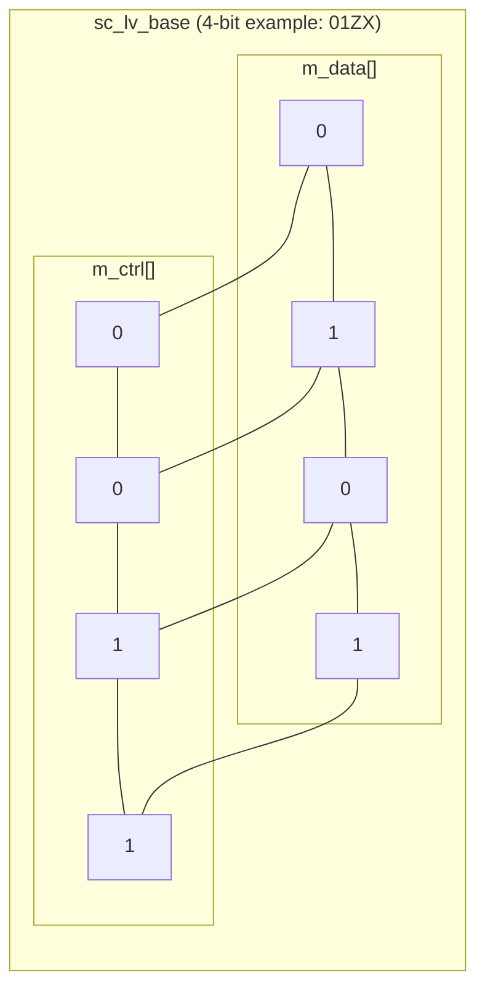
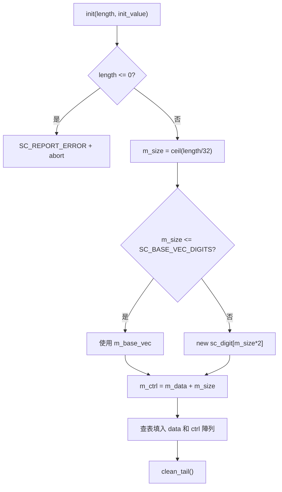

# sc_lv_base - 任意寬度四值邏輯向量基底類別

## 概述

`sc_lv_base` 是任意寬度的四值邏輯向量基底類別，能儲存 0、1、X、Z 四種狀態。它是 `sc_lv<W>` 模板類別的非模板基底，也是 `sc_bv_base` 的四值對應版本。繼承自 `sc_proxy<sc_lv_base>`。

**原始檔案：** `sc_lv_base.h` + `sc_lv_base.cpp`

## 日常比喻

如果 `sc_bv_base` 是一排只有「開/關」的簡單開關面板，那 `sc_lv_base` 就是一排進階開關面板——每個開關有四個位置：

- **0**：關
- **1**：開
- **Z**：斷線（開關被拆掉了，不接任何東西）
- **X**：不確定（開關壞了，不知道是開還是關）

這在控制中心的監控系統中很常見：除了知道設備開/關之外，你還需要知道設備是否斷線或故障。

## 關鍵概念

### 雙陣列儲存（Data + Control）

`sc_lv_base` 最重要的設計特點是使用兩個平行的 `sc_digit` 陣列來編碼四種狀態：

```
data bit | ctrl bit | meaning
---------|----------|--------
   0     |    0     |   '0'
   1     |    0     |   '1'
   0     |    1     |   'Z'
   1     |    1     |   'X'
```



### 與 sc_bv_base 的差異

| 特性 | sc_bv_base | sc_lv_base |
|------|-----------|-----------|
| 可能的值 | 0, 1 | 0, 1, X, Z |
| 陣列數量 | 1 (m_data) | 2 (m_data + m_ctrl) |
| 記憶體用量 | N/32 words | N/16 words |
| `is_01()` | 永遠 `true` | 需檢查 m_ctrl |
| `get_cword()` | 永遠回傳 0 | 回傳實際控制字 |
| 預設值 | `false` (0) | `Log_X` (未知) |

### 記憶體配置策略

與 `sc_bv_base` 相同，`sc_lv_base` 也採用小型向量最佳化（SVO）。但因為需要兩個陣列，動態配置時一次分配 `m_size * 2` 個 digit，然後將 `m_ctrl` 指向陣列的後半段：

```cpp
m_data = new sc_digit[m_size * 2];
m_ctrl = m_data + m_size;
```

## 類別介面

### 建構子

```cpp
sc_lv_base(int length_, const sc_logic& init_value = sc_logic()); // default: all X
sc_lv_base(const char* a);                      // from string
sc_lv_base(const char* a, int length_);          // from string with fixed length
sc_lv_base(const sc_proxy<X>& a);               // from another proxy
sc_lv_base(const sc_lv_base& a);                // copy
```

注意預設初始值是 `sc_logic()`，即 `Log_X`（未知）。這忠實地反映了硬體中未初始化訊號的真實狀態。

### 核心方法

```cpp
int length() const;                     // bit count
int size() const;                       // number of sc_digit words

value_type get_bit(int i) const;        // get 4-value bit
void set_bit(int i, value_type value);  // set 4-value bit

sc_digit get_word(int i) const;         // get data word
void set_word(int i, sc_digit w);       // set data word
sc_digit get_cword(int i) const;        // get control word
void set_cword(int i, sc_digit w);      // set control word

bool is_01() const;                     // check if all bits are 0 or 1
void clean_tail();                      // clean unused bits
```

### 位元存取實作

```cpp
// get_bit: combine data and control bits to get 4-value logic
value_type get_bit(int i) const {
    int wi = i / SC_DIGIT_SIZE;
    int bi = i % SC_DIGIT_SIZE;
    return value_type(
        ((m_data[wi] >> bi) & SC_DIGIT_ONE) |
        (((m_ctrl[wi] >> bi) & SC_DIGIT_ONE) << 1)
    );
}
```

這段程式碼從 data 和 ctrl 各取出對應位置的 1 個 bit，組合成 0~3 的值（對應 `sc_logic_value_t` 列舉）。

### is_01() 實作

```cpp
bool is_01() const {
    for (int i = 0; i < m_size; ++i) {
        if (m_ctrl[i] != 0) return false;
    }
    return true;
}
```

只需檢查控制字是否全為 0。如果 ctrl 全為 0，代表所有位元都是 0 或 1（沒有 X 或 Z）。

## 初始化流程



初始化時使用預先定義的查表陣列：

```cpp
static const sc_digit data_array[] =
    { SC_DIGIT_ZERO, ~SC_DIGIT_ZERO, SC_DIGIT_ZERO, ~SC_DIGIT_ZERO };
static const sc_digit ctrl_array[] =
    { SC_DIGIT_ZERO, SC_DIGIT_ZERO, ~SC_DIGIT_ZERO, ~SC_DIGIT_ZERO };
```

索引對應 `sc_logic_value_t`：0=Log_0, 1=Log_1, 2=Log_Z, 3=Log_X。

## 設計理由 / RTL 背景

`sc_lv_base` 對應 Verilog 的 `reg [N:0]` 或 VHDL 的 `std_logic_vector(N downto 0)`。在硬體設計中，四值向量的典型應用包括：

1. **三態匯流排模擬**：多個裝置共用匯流排，未驅動的裝置輸出 Z
2. **重置前的訊號**：模擬開始時，暫存器的值是未知的（X）
3. **測試平台**：在測試中注入 X 或 Z 來驗證電路的容錯能力
4. **訊號衝突偵測**：兩個驅動器同時驅動同一條線時，結果為 X

雙陣列（data + ctrl）的編碼方式是業界標準做法，在許多商業模擬器（如 VCS、ModelSim）中也是如此實作。這種設計讓二值運算（只看 data）和四值運算（看 data + ctrl）都很高效。

## 相關檔案

- [sc_lv.md](sc_lv.md) - 固定長度四值向量模板
- [sc_bv_base.md](sc_bv_base.md) - 二值向量基底（只有 0/1 的版本）
- [sc_logic.md](sc_logic.md) - 單一四值邏輯元素
- [sc_proxy.md](sc_proxy.md) - CRTP 基底類別
- 原始碼：`ref/systemc/src/sysc/datatypes/bit/sc_lv_base.h`
- 原始碼：`ref/systemc/src/sysc/datatypes/bit/sc_lv_base.cpp`
