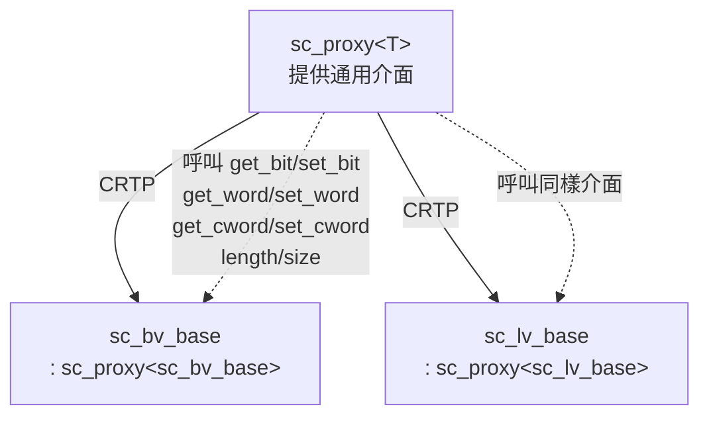
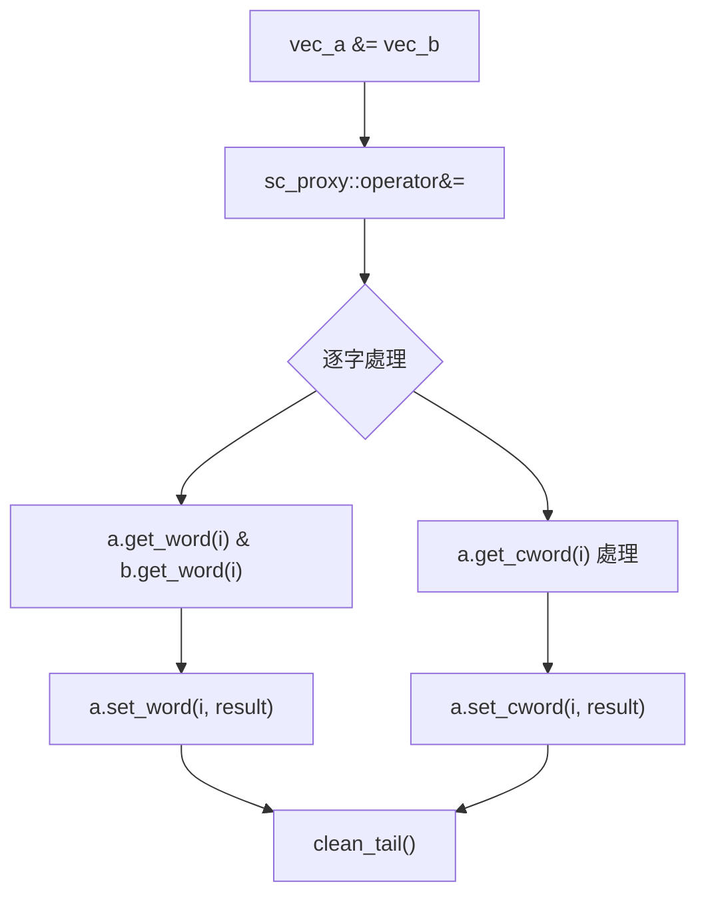

# sc_proxy<T> - 向量型別的 CRTP 基底類別

## 概述

`sc_proxy<T>` 是所有位元/邏輯向量型別的共用基底類別，使用 CRTP（Curiously Recurring Template Pattern）模式來為 `sc_bv_base` 和 `sc_lv_base` 提供統一的介面和共用操作。它定義了位元運算、比較、轉換、位元選取、子範圍選取和串接等所有向量通用的功能。

**原始檔案：** `sc_proxy.h`（約 1549 行）

## 日常比喻

`sc_proxy<T>` 就像是一份「通用操作手冊」。不管你手上拿的是簡單開關面板（`sc_bv`）還是進階開關面板（`sc_lv`），基本操作方式都一樣：

- 翻轉所有開關（位元反轉）
- 檢查兩個面板是否相同（比較）
- 選取其中一個開關（位元選取）
- 選取連續一段開關（子範圍選取）
- 把兩個面板接在一起（串接）

手冊（`sc_proxy`）不需要知道面板的具體型別，它透過 CRTP 讓具體型別「插入」自己的實作。

## 關鍵概念

### CRTP 模式

```cpp
template <class X>
class sc_proxy { ... };

class sc_bv_base : public sc_proxy<sc_bv_base> { ... };
class sc_lv_base : public sc_proxy<sc_lv_base> { ... };
```

`sc_proxy` 透過模板參數 `X` 知道子類別是誰，可以透過 `back_cast()` 把自己轉回子類別，然後呼叫子類別的方法（如 `get_bit()`、`set_bit()`）。這避免了虛擬函式的開銷。



### 子類別必須提供的介面

每個繼承 `sc_proxy` 的類別必須實作以下方法：

```cpp
int length() const;                     // total bit count
int size() const;                       // number of sc_digit words

value_type get_bit(int i) const;        // get single bit
void set_bit(int i, value_type v);      // set single bit

sc_digit get_word(int i) const;         // get data word
void set_word(int i, sc_digit w);       // set data word
sc_digit get_cword(int i) const;        // get control word
void set_cword(int i, sc_digit w);      // set control word
```

### Traits 系統

`sc_proxy` 使用 traits 來區分二值和四值型別的行為：

```cpp
// for sc_bv_base
struct sc_proxy_traits<sc_bv_base> {
    typedef sc_logic_value_t value_type;
    typedef sc_logic         bit_type;
    // ... bit-vector specific traits
};

// for sc_lv_base
struct sc_proxy_traits<sc_lv_base> {
    typedef sc_logic_value_t value_type;
    typedef sc_logic         bit_type;
    // ... logic-vector specific traits
};
```

## sc_proxy 提供的功能

### 全域常數

```cpp
const int SC_DIGIT_SIZE = BITS_PER_BYTE * sizeof(sc_digit); // usually 32
const sc_digit SC_DIGIT_ZERO = 0;
const sc_digit SC_DIGIT_ONE  = 1;
const sc_digit SC_DIGIT_TWO  = 2;
```

### 位元運算子

```cpp
// bitwise operators (between two proxies)
template<class X, class Y>
sc_lv_base operator & (const sc_proxy<X>&, const sc_proxy<Y>&);
sc_lv_base operator | (const sc_proxy<X>&, const sc_proxy<Y>&);
sc_lv_base operator ^ (const sc_proxy<X>&, const sc_proxy<Y>&);

// compound assignment
sc_proxy<X>& operator &= (const sc_proxy<Y>&);
sc_proxy<X>& operator |= (const sc_proxy<Y>&);
sc_proxy<X>& operator ^= (const sc_proxy<Y>&);
```

### 位元選取與子範圍

```cpp
// bit select
sc_bitref<X> operator [] (int i);           // read-write
sc_bitref_r<X> operator [] (int i) const;   // read-only

// sub-range (part select)
sc_subref<X> operator () (int hi, int lo);
sc_subref_r<X> operator () (int hi, int lo) const;
sc_subref<X> range(int hi, int lo);
sc_subref_r<X> range(int hi, int lo) const;
```

### 比較運算子

```cpp
bool operator == (const sc_proxy<Y>&) const;
bool operator != (const sc_proxy<Y>&) const;
```

### 賦值方法

```cpp
// assign from various types
void assign_(const sc_proxy<Y>& a);     // from another proxy
void assign_(const bool* a);            // from bool array
void assign_(const sc_logic* a);        // from logic array
void assign_(unsigned long a);          // from integer
void assign_(const sc_unsigned& a);     // from sc_unsigned
void assign_(const sc_signed& a);       // from sc_signed
```

### 轉換方法

```cpp
int to_int() const;
unsigned int to_uint() const;
long to_long() const;
unsigned long to_ulong() const;
int64 to_int64() const;
uint64 to_uint64() const;

std::string to_string() const;
std::string to_string(sc_numrep) const;  // with number base
```

### 歸約運算（Reduction）

```cpp
sc_logic_value_t and_reduce() const;    // AND all bits
sc_logic_value_t or_reduce() const;     // OR all bits
sc_logic_value_t xor_reduce() const;    // XOR all bits
sc_logic_value_t nand_reduce() const;   // NAND all bits
sc_logic_value_t nor_reduce() const;    // NOR all bits
sc_logic_value_t xnor_reduce() const;   // XNOR all bits
```

## 運算流程



### assign_p_ 函式

`assign_p_` 是一個重要的輔助函式，處理兩個向量之間的賦值。它需要處理長度不匹配的情況：

- 如果來源較短：多餘的高位元用 0 填充
- 如果來源較長：截斷並可能發出警告

## 設計理由 / RTL 背景

### 為什麼用 CRTP 而非虛擬函式？

1. **效能**：硬體模擬中，位元操作可能被執行數十億次。虛擬函式的間接呼叫開銷在這種場景下不可接受。CRTP 在編譯期就解析了呼叫，沒有執行期開銷。

2. **內聯最佳化**：CRTP 允許編譯器內聯所有函式呼叫，這對位元操作的效能至關重要。

3. **型別安全**：不同型別的向量是不同的 CRTP 實例，編譯器可以進行更嚴格的型別檢查。

### 歸約運算的硬體對應

歸約運算在 Verilog 中是一個前綴運算子：

```verilog
wire [7:0] data;
wire all_ones = &data;    // AND reduce
wire any_one  = |data;    // OR reduce
wire parity   = ^data;    // XOR reduce (parity check)
```

這在硬體中對應的是一棵邏輯閘樹，將 N 個位元歸約為 1 個位元。

## 相關檔案

- [sc_bit_proxies.md](sc_bit_proxies.md) - 代理類別的具體實作
- [sc_bv_base.md](sc_bv_base.md) - 二值向量，繼承 `sc_proxy<sc_bv_base>`
- [sc_lv_base.md](sc_lv_base.md) - 四值向量，繼承 `sc_proxy<sc_lv_base>`
- [sc_logic.md](sc_logic.md) - 四值邏輯型別
- 原始碼：`ref/systemc/src/sysc/datatypes/bit/sc_proxy.h`
