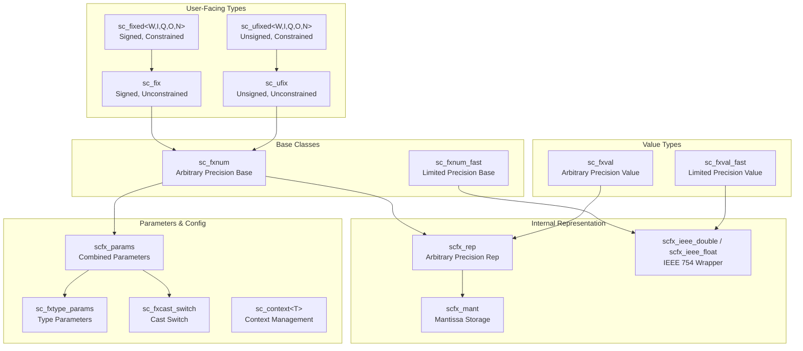

# SystemC 定點數型別 (Fixed-Point Types) -- 總覽

本目錄包含 SystemC 的**定點數 (fixed-point)** 資料型別實作，提供可自訂位寬、量化與溢位行為的數值型別，主要用於硬體模擬中的 DSP (數位訊號處理) 與通訊系統建模。

## 什麼是定點數？

### 日常生活類比

想像你有一個計算機，但螢幕只能顯示固定的位數。例如你的計算機最多顯示 8 位數，其中小數點固定在第 3 位：

```
XXXXX.XXX
```

- 整數部分最多 5 位 -> 最大值 99999
- 小數部分最多 3 位 -> 最小精度 0.001

如果計算結果是 `3.14159265`，你只能存 `3.141`，多出來的部分怎麼辦？可以「直接截斷」或「四捨五入」-- 這就是**量化 (quantization)**。

如果結果是 `123456.789`，超出整數範圍怎麼辦？可以「飽和到最大值」或「繞回」-- 這就是**溢位處理 (overflow)**。

定點數就是用這樣的方式，以有限的位元數來表示實數。

### 為什麼不用浮點數？

在真正的硬體電路中，浮點運算單元 (FPU) 非常昂貴（面積大、功耗高）。DSP 晶片、手機基頻處理器、音訊 codec 等，幾乎都使用定點數來節省成本。SystemC 的定點數型別讓你在軟體模擬階段就能精確模擬硬體的定點行為。

## 核心概念

### 定點數的參數

```
sc_fixed<W, I, Q, O, N>
```

| 參數 | 含義 | 類比 |
|------|------|------|
| `W` (wl) | 總位寬 (Word Length) | 計算機螢幕總位數 |
| `I` (iwl) | 整數位寬 (Integer Word Length) | 小數點左邊的位數 |
| `Q` (q_mode) | 量化模式 (Quantization Mode) | 多餘小數位怎麼處理 |
| `O` (o_mode) | 溢位模式 (Overflow Mode) | 超出範圍怎麼處理 |
| `N` (n_bits) | 飽和位數 | 搭配 wrap-around 模式使用 |

小數位寬 `F = W - I`（自動計算）。

## 類別階層



## Constrained vs. Unconstrained

| 特性 | Constrained (`sc_fixed/sc_ufixed`) | Unconstrained (`sc_fix/sc_ufix`) |
|------|-------------------------------------|----------------------------------|
| 參數設定 | 模板參數，編譯時決定 | 建構函式參數，執行時決定 |
| 使用場景 | 最終硬體規格已確定 | 探索階段，尚在調整參數 |
| 效能 | 略好（編譯器最佳化） | 較靈活 |

## Arbitrary Precision vs. Limited Precision

每種型別都有兩個版本：

- **一般版 (arbitrary precision)**：使用 `scfx_rep` 內部表示，可支援任意位寬
- **快速版 (`_fast`)**：使用 C++ `double` 內部表示，限制在 53 位精度內，但運算更快

## 檔案清單

| 檔案 | 說明 | 文件 |
|------|------|------|
| `fx.h` | 主要 include 檔 | [fx.md](fx.md) |
| `sc_context.h` | 上下文管理模板 | [sc_context.md](sc_context.md) |
| `sc_fxdefs.h/cpp` | 列舉定義與預設值 | [sc_fxdefs.md](sc_fxdefs.md) |
| `sc_fx_ids.h` | 錯誤訊息 ID | [sc_fx_ids.md](sc_fx_ids.md) |
| `sc_fxcast_switch.h/cpp` | 型別轉換開關 | [sc_fxcast_switch.md](sc_fxcast_switch.md) |
| `sc_fxtype_params.h/cpp` | 定點數型別參數 | [sc_fxtype_params.md](sc_fxtype_params.md) |
| `sc_fxnum.h/cpp` | 定點數基底類別 | [sc_fxnum.md](sc_fxnum.md) |
| `sc_fxnum_observer.h/cpp` | 定點數觀察者 | [sc_fxnum_observer.md](sc_fxnum_observer.md) |
| `sc_fxval.h/cpp` | 定點數值型別 | [sc_fxval.md](sc_fxval.md) |
| `sc_fxval_observer.h/cpp` | 定點數值觀察者 | [sc_fxval_observer.md](sc_fxval_observer.md) |
| `sc_fixed.h` | 有號約束定點數 | [sc_fixed.md](sc_fixed.md) |
| `sc_ufixed.h` | 無號約束定點數 | [sc_ufixed.md](sc_ufixed.md) |
| `sc_fix.h` | 有號非約束定點數 | [sc_fix.md](sc_fix.md) |
| `sc_ufix.h` | 無號非約束定點數 | [sc_ufix.md](sc_ufix.md) |
| `scfx_rep.h/cpp` | 任意精度內部表示 | [scfx_rep.md](scfx_rep.md) |
| `scfx_mant.h/cpp` | 尾數儲存 | [scfx_mant.md](scfx_mant.md) |
| `scfx_ieee.h` | IEEE 754 包裝 | [scfx_ieee.md](scfx_ieee.md) |
| `scfx_pow10.h/cpp` | 10 的次方計算 | [scfx_pow10.md](scfx_pow10.md) |
| `scfx_utils.h/cpp` | 工具函式 | [scfx_utils.md](scfx_utils.md) |
| `scfx_params.h` | 組合參數 | [scfx_params.md](scfx_params.md) |
| `scfx_string.h` | 內部字串類別 | [scfx_string.md](scfx_string.md) |
| `scfx_other_defs.h` | 與其他型別的互操作 | [scfx_other_defs.md](scfx_other_defs.md) |

## 相關檔案

- `sysc/datatypes/int/` -- 整數資料型別（`sc_int`, `sc_uint`, `sc_signed`, `sc_unsigned`）
- `sysc/datatypes/bit/` -- 位元向量型別（`sc_bv_base`）
- `sysc/utils/sc_report.h` -- 錯誤報告機制
