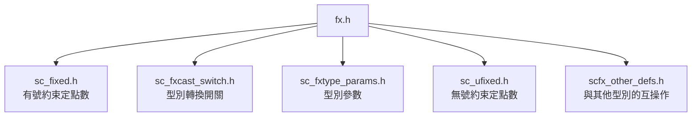

# fx.h -- 定點數型別的主要 include 檔

## 概述

`fx.h` 是 SystemC 定點數子系統的**統一入口標頭檔 (master include)**。只要 `#include "fx.h"`，就能使用所有的定點數型別。這個檔案本身不包含任何邏輯，純粹是一個匯集其他標頭檔的便利入口。

### 日常類比

就像百貨公司的大門 -- 你不需要知道每個品牌在幾樓，走進大門就能到達所有地方。`fx.h` 就是定點數世界的大門。

## 包含的標頭檔



### 包含順序說明

1. `sc_fixed.h` -- 引入有號定點數（間接引入 `sc_fix.h` -> `sc_fxnum.h` -> 整個依賴鏈）
2. `sc_fxcast_switch.h` -- 型別轉換控制
3. `sc_fxtype_params.h` -- 定點數參數定義
4. `sc_ufixed.h` -- 引入無號定點數（間接引入 `sc_ufix.h`）
5. `scfx_other_defs.h` -- 定義定點數與 `sc_signed`、`sc_unsigned` 等型別之間的轉換運算子

## 使用方式

```cpp
#include "sysc/datatypes/fx/fx.h"

// Now all fixed-point types are available:
sc_dt::sc_fixed<8, 4> a;      // 8-bit signed, 4 integer bits
sc_dt::sc_ufixed<16, 8> b;    // 16-bit unsigned, 8 integer bits
sc_dt::sc_fix c(8, 4);        // unconstrained signed
sc_dt::sc_ufix d(16, 8);      // unconstrained unsigned
```

## 設計理由

將所有 include 集中到一個檔案有兩個好處：

1. **使用者方便** -- 不需要記住十幾個標頭檔名
2. **依賴管理** -- 保證正確的 include 順序，避免前向宣告問題

## 相關檔案

- `sc_fixed.h` / `sc_ufixed.h` -- 約束型定點數模板
- `sc_fix.h` / `sc_ufix.h` -- 非約束型定點數
- `scfx_other_defs.h` -- 與整數型別的互操作定義
