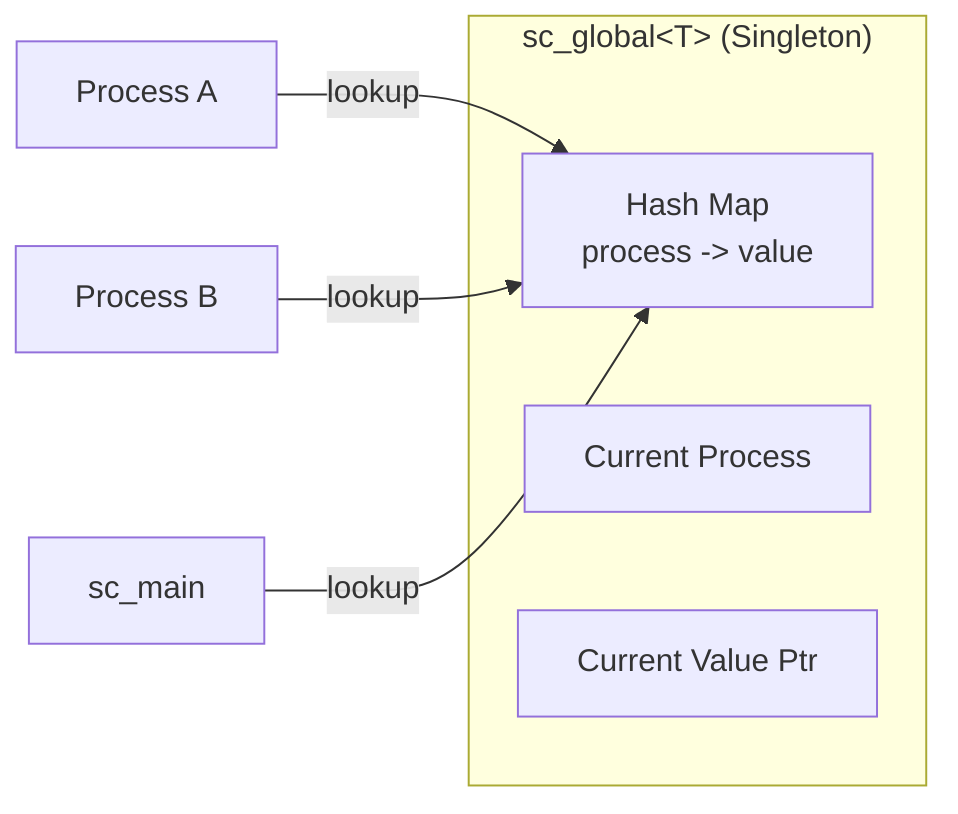
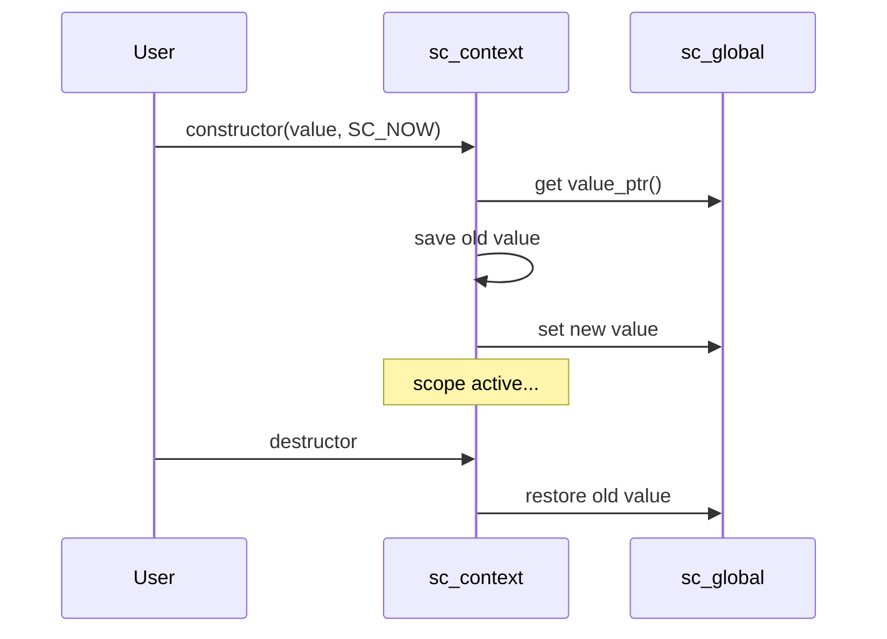

# sc_context.h -- 定點數上下文管理

## 概述

`sc_context.h` 提供了一個**模板化的上下文管理機制**，讓定點數的預設參數可以在不同的程式範圍內動態切換。這是 SystemC 定點數系統中最精巧的設計之一。

## 日常類比

想像你在一家國際公司工作。公司有一個預設語言（英文），但當你進入日本分部的會議室時，預設語言自動切換為日文。離開會議室後，又回到英文。

`sc_context` 就是這個「會議室」-- 進入它的範圍時，定點數的預設參數自動改變；離開時自動恢復。

```cpp
// Default: wl=32, iwl=32
{
    sc_fxtype_context ctx(sc_fxtype_params(16, 8, SC_RND, SC_SAT));
    // Inside this scope: wl=16, iwl=8, rounding, saturation
    sc_fix a;  // uses 16-bit, 8-integer-bit format
}
// Back to default: wl=32, iwl=32
```

## 核心類別

### `sc_without_context`

一個空的標記類別，用來表示「不使用上下文，直接用硬編碼預設值」。

### `sc_global<T>` -- 全域變數管理（Singleton）



`sc_global<T>` 是一個 singleton 模板，為每個 SystemC 模擬行程 (co-routine) 維護獨立的預設值。這很重要，因為 SystemC 的多個模組可能同時在不同的 context 下執行。

**關鍵成員：**

| 成員 | 說明 |
|------|------|
| `m_instance` | 靜態 singleton 指標 |
| `m_map` | Hash map，將 process 指標映射到預設值 |
| `m_proc` | 目前的 process 指標 |
| `m_value_ptr` | 目前的預設值指標 |
| `update()` | 切換行程時更新預設值 |
| `instance()` | 取得 singleton 實例 |
| `value_ptr()` | 取得目前的預設值指標 |

### `sc_context_begin` -- 啟動時機列舉

```cpp
enum sc_context_begin {
    SC_NOW,   // constructor runs immediately
    SC_LATER  // must explicitly call begin()
};
```

### `sc_context<T>` -- 上下文類別

這是一個 RAII (Resource Acquisition Is Initialization) 風格的模板類別：



**關鍵成員：**

| 成員 | 說明 |
|------|------|
| `m_value` | 此 context 的值 |
| `m_def_value_ptr` | 指向全域預設值的參考 |
| `m_old_value_ptr` | 保存的舊值，用於恢復 |
| `begin()` | 手動啟動 context |
| `end()` | 手動結束 context |
| `default_value()` | 靜態方法，取得目前的預設值 |
| `value()` | 取得此 context 的值 |

**重要限制：**

- 禁止複製建構
- 禁止 `new` 在 heap 上建立（必須在 stack 上使用，確保 RAII 正確）
- 巢狀使用時，後進先出

## 具體的 typedef

此模板被實例化為兩個具體型別：

```cpp
typedef sc_context<sc_fxtype_params> sc_fxtype_context;   // in sc_fxtype_params.h
typedef sc_context<sc_fxcast_switch> sc_fxcast_context;   // in sc_fxcast_switch.h
```

## Co-routine 安全性

`sc_global` 使用 hash map 為每個 SystemC process 維護獨立的預設值，確保在多個 `SC_THREAD` 之間不會互相干擾。當 SystemC 排程器切換執行緒時，`update()` 方法會自動查找當前 process 對應的值。

## 相關檔案

- `sc_fxtype_params.h` -- `sc_fxtype_context` 的定義
- `sc_fxcast_switch.h` -- `sc_fxcast_context` 的定義
- `sc_fxdefs.h` -- 預設參數值
- `sysc/kernel/sc_simcontext.h` -- 取得當前 process
