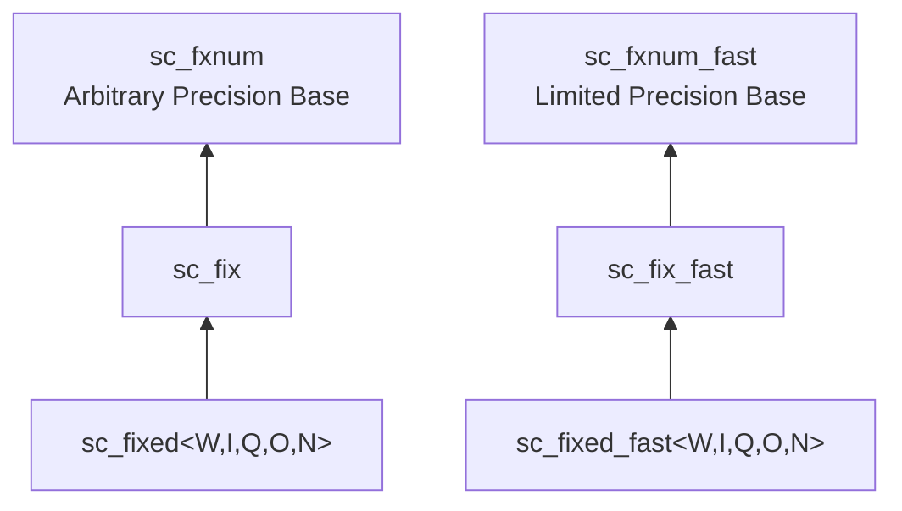

# sc_fix.h -- 有號非約束定點數

## 概述

`sc_fix` 和 `sc_fix_fast` 是**有號的、執行時參數化的**定點數類別。與 `sc_fixed` 不同，`sc_fix` 的位寬和行為參數在建構時透過函式引數指定，而非模板參數，因此可以在執行時動態決定。

## 日常類比

如果 `sc_fixed<8,4>` 是一個「8cm x 4cm 的固定相框」，那 `sc_fix` 就是一個「可調節大小的相框」。你在購買時（建構時）告訴店員想要多大，但之後不能再改。

## 繼承關係



## 建構函式

`sc_fix` 提供了大量的建構函式多載，主要分為以下模式：

```cpp
// No initial value, specify parameters
sc_fix( int wl, int iwl, sc_fxnum_observer* = 0 );
sc_fix( int wl, int iwl, sc_q_mode, sc_o_mode, sc_fxnum_observer* = 0 );
sc_fix( int wl, int iwl, sc_q_mode, sc_o_mode, int n_bits, sc_fxnum_observer* = 0 );

// With initial value
sc_fix( double, int wl, int iwl, sc_fxnum_observer* = 0 );
sc_fix( double, int wl, int iwl, sc_q_mode, sc_o_mode, sc_fxnum_observer* = 0 );

// With cast switch
sc_fix( int wl, int iwl, const sc_fxcast_switch&, sc_fxnum_observer* = 0 );
sc_fix( double, int wl, int iwl, const sc_fxcast_switch&, sc_fxnum_observer* = 0 );

// Using type params
sc_fix( const sc_fxtype_params&, sc_fxnum_observer* = 0 );
sc_fix( double, const sc_fxtype_params&, sc_fxnum_observer* = 0 );
```

所有建構函式最終都呼叫 `sc_fxnum` 的建構函式，傳入 `SC_TC_`（二補數編碼）。

## 運算子

### 算術運算（返回 `sc_fxval`）

```cpp
friend sc_fxval operator + ( const sc_fix&, const sc_fix& );
friend sc_fxval operator - ( const sc_fix&, const sc_fix& );
friend sc_fxval operator * ( const sc_fix&, const sc_fix& );
friend sc_fxval operator / ( const sc_fix&, const sc_fix& );
```

### 賦值運算

```cpp
sc_fix& operator = ( double );
sc_fix& operator += ( double );
sc_fix& operator -= ( double );
sc_fix& operator *= ( double );
sc_fix& operator /= ( double );
sc_fix& operator <<= ( int );
sc_fix& operator >>= ( int );
```

### 位元運算

```cpp
friend sc_fix operator & ( const sc_fix&, const sc_fix& );
friend sc_fix operator | ( const sc_fix&, const sc_fix& );
friend sc_fix operator ^ ( const sc_fix&, const sc_fix& );
sc_fix& operator &= ( const sc_fix& );
sc_fix& operator |= ( const sc_fix& );
sc_fix& operator ^= ( const sc_fix& );
```

位元運算在定點數上有特殊意義 -- 它們操作的是二補數表示的個別位元，常用於 DSP 演算法中的位元操控。

## 使用範例

```cpp
// Runtime-parameterized
int bits = compute_required_bits();
sc_fix signal(bits, bits/2, SC_RND, SC_SAT);

// Arithmetic
sc_fxval result = signal * 0.5;
signal = result + 1.0;
```

## sc_fix vs sc_fixed

| 特性 | `sc_fix` | `sc_fixed<W,I,Q,O,N>` |
|------|---------|----------------------|
| 參數設定 | 建構時（執行時） | 模板（編譯時） |
| 靈活度 | 高 | 低 |
| 型別安全 | 較低 | 較高（不同參數 = 不同型別） |
| 使用階段 | 探索/原型設計 | 最終設計 |

## 相關檔案

- `sc_fxnum.h` -- 父類別 `sc_fxnum`
- `sc_fixed.h` -- 約束版本 `sc_fixed`，繼承自 `sc_fix`
- `sc_ufix.h` -- 無號版本
- `sc_fxval.h` -- 算術運算的返回型別
