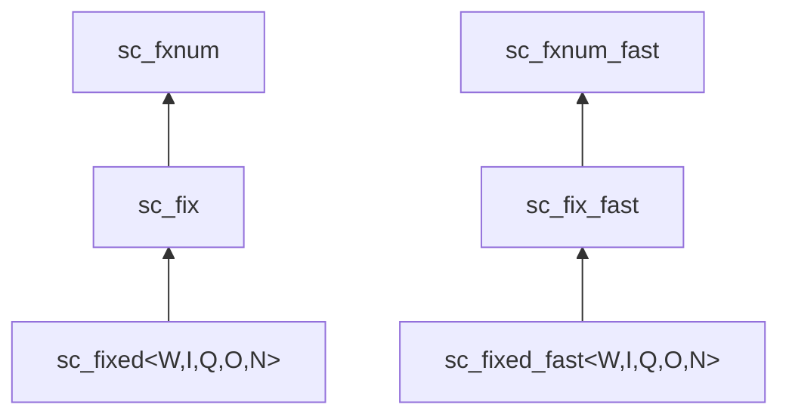

# sc_fixed.h -- 有號約束定點數

## 概述

`sc_fixed<W, I, Q, O, N>` 和 `sc_fixed_fast<W, I, Q, O, N>` 是**有號的、編譯時約束的**定點數模板類別。所有參數在編譯時透過模板參數決定，不能在執行時更改。

## 日常類比

`sc_fixed` 就像一個「定規格的量杯」。你在設計時就決定了它能裝多少（位寬）和刻度精度（小數位寬），之後就不能改了。如果你倒太多水（溢位），它會根據預設的規則處理（溢出、飽和等）。

相比之下，`sc_fix` 就像一個「可調節大小的量杯」。

## 模板參數

```cpp
template <int W, int I,
          sc_q_mode Q = SC_DEFAULT_Q_MODE_,
          sc_o_mode O = SC_DEFAULT_O_MODE_,
          int N = SC_DEFAULT_N_BITS_>
class sc_fixed : public sc_fix { ... };
```

| 參數 | 預設值 | 說明 |
|------|--------|------|
| `W` | (必填) | 總位寬 |
| `I` | (必填) | 整數位寬 |
| `Q` | `SC_TRN` | 量化模式 |
| `O` | `SC_WRAP` | 溢位模式 |
| `N` | `0` | 飽和位數 |

## 繼承關係



`sc_fixed` 繼承自 `sc_fix`，在建構時將模板參數 `W, I, Q, O, N` 傳遞給父類別的建構函式。

## 建構函式

所有建構函式都會將模板參數傳給 `sc_fix` 的建構函式：

```cpp
// Default constructor
sc_fixed( sc_fxnum_observer* = 0 );
// -> sc_fix( W, I, Q, O, N, observer_ )

// Value constructor
sc_fixed( double a, sc_fxnum_observer* = 0 );
// -> sc_fix( a, W, I, Q, O, N, observer_ )
```

支援的初始值型別：`int`, `unsigned int`, `long`, `unsigned long`, `float`, `double`, `const char*`, `sc_fxval`, `sc_fxnum`, `int64`, `uint64`, `sc_int_base`, `sc_uint_base`, `sc_signed`, `sc_unsigned`。

## 賦值運算子

支援所有標準算術賦值：`=`, `*=`, `/=`, `+=`, `-=`, `<<=`, `>>=`, `&=`, `|=`, `^=`

所有運算子都委託給 `sc_fix` 的對應方法：

```cpp
sc_fixed& operator = ( double a ) {
    sc_fix::operator = ( a );
    return *this;
}
```

## 遞增/遞減

```cpp
sc_fxval operator ++ ( int );  // post-increment, returns old value
sc_fxval operator -- ( int );  // post-decrement, returns old value
sc_fixed& operator ++ ();     // pre-increment
sc_fixed& operator -- ();     // pre-decrement
```

## 使用範例

```cpp
// 8-bit signed, 4 integer bits, 4 fractional bits
// Range: -8.0 to +7.9375, step: 0.0625
sc_fixed<8, 4> a = 3.7;

// 16-bit, 10 integer bits, rounding, saturation
sc_fixed<16, 10, SC_RND, SC_SAT> b = 123.456;

// Arithmetic produces sc_fxval (full precision)
sc_fxval c = a * b;

// Assigning back to sc_fixed triggers quantization
a = c;
```

## sc_fixed vs sc_fixed_fast

| 特性 | `sc_fixed` | `sc_fixed_fast` |
|------|-----------|-----------------|
| 精度 | 任意位寬 | 最多 53 位 |
| 速度 | 較慢 | 較快 |
| 基底類別 | `sc_fix` -> `sc_fxnum` | `sc_fix_fast` -> `sc_fxnum_fast` |
| 內部表示 | `scfx_rep` | `double` |

## 相關檔案

- `sc_fix.h` -- 父類別 `sc_fix` / `sc_fix_fast`
- `sc_ufixed.h` -- 無號版本 `sc_ufixed`
- `sc_fxnum.h` -- 最終基底類別
- `fx.h` -- 統一 include 入口
