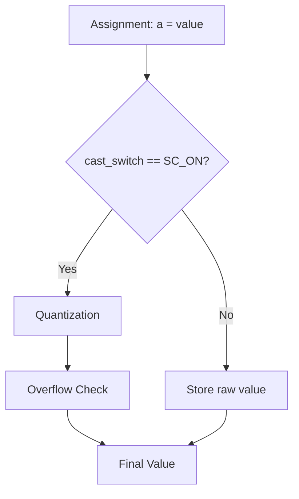

# sc_fxcast_switch.h / .cpp -- 定點數型別轉換開關

## 概述

`sc_fxcast_switch` 控制定點數在賦值或運算後是否要執行**量化 (quantization)** 和**溢位 (overflow)** 處理。簡單說，它是一個「要不要套用定點數限制」的開關。

## 日常類比

想像你在練習畫畫。平時老師要求你只能用 8 色蠟筆（有限制），但有時候老師說「今天自由發揮，用什麼顏色都行」。`sc_fxcast_switch` 就是老師的這個指令：

- `SC_ON`：套用定點數的位寬限制（正常模式）
- `SC_OFF`：不套用限制（適合除錯或初始化階段）

## 類別詳情

### `sc_fxcast_switch`

```cpp
class sc_fxcast_switch {
public:
    sc_fxcast_switch();                          // use context default
    sc_fxcast_switch( sc_switch );               // explicit ON/OFF
    sc_fxcast_switch( const sc_fxcast_switch& ); // copy
    explicit sc_fxcast_switch( sc_without_context ); // use compile-time default

    sc_fxcast_switch& operator = ( const sc_fxcast_switch& );

    friend bool operator == ( const sc_fxcast_switch&, const sc_fxcast_switch& );
    friend bool operator != ( const sc_fxcast_switch&, const sc_fxcast_switch& );

    std::string to_string() const;
    void print( std::ostream& ) const;
    void dump( std::ostream& ) const;

private:
    sc_switch m_sw;  // SC_ON or SC_OFF
};
```

**建構函式行為：**

| 建構方式 | 行為 |
|----------|------|
| 預設建構 | 從 `sc_fxcast_context` 取得目前的預設值 |
| `sc_switch` 建構 | 直接設定 ON 或 OFF |
| `sc_without_context` 建構 | 使用編譯時常數 `SC_DEFAULT_CAST_SWITCH_`（= `SC_ON`） |

### `sc_fxcast_context`

```cpp
typedef sc_context<sc_fxcast_switch> sc_fxcast_context;
```

這個 typedef 將 `sc_context` 模板實例化為 cast switch 專用的上下文。用法：

```cpp
{
    sc_fxcast_context ctx(sc_fxcast_switch(SC_OFF));
    // Inside this scope, casting is OFF
    sc_fix a(16, 8);
    a = 999.999;  // no quantization/overflow applied
}
// Outside: casting is back to ON
```

## cast switch 的作用流程



## .cpp 檔案

`sc_fxcast_switch.cpp` 包含：

1. `sc_global<sc_fxcast_switch>` 和 `sc_context<sc_fxcast_switch>` 的明確模板實例化
2. `to_string()`、`print()`、`dump()` 的實作

## 相關檔案

- `sc_fxdefs.h` -- `sc_switch` 列舉定義和 `SC_DEFAULT_CAST_SWITCH_` 常數
- `sc_context.h` -- `sc_context<T>` 模板
- `scfx_params.h` -- 在 `scfx_params` 中組合使用 cast switch
- `sc_fxnum.h` -- 在 `cast()` 方法中檢查 cast switch
