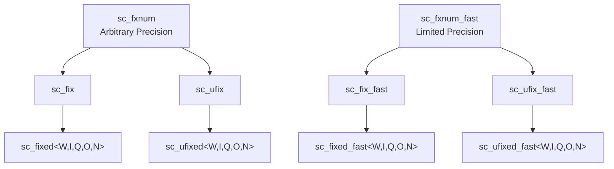
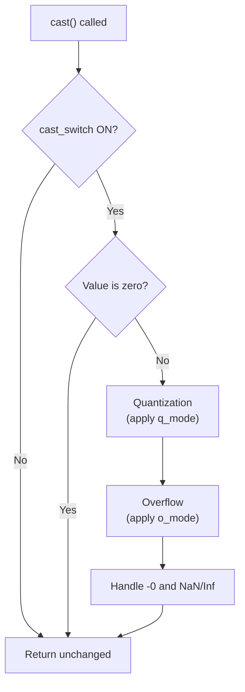

# sc_fxnum.h / .cpp -- 定點數基底類別

## 概述

`sc_fxnum` 和 `sc_fxnum_fast` 是所有定點數型別的**基底類別**。`sc_fxnum` 使用任意精度內部表示（`scfx_rep`），而 `sc_fxnum_fast` 使用 C++ `double`（限制在 53 位精度內）。這兩個類別提供了完整的算術運算、型別轉換、位元操作和觀察者支援。

## 日常類比

如果 `sc_fixed<8,4>` 是你從超市買回來的「8 吋蛋糕」，那 `sc_fxnum` 就是蛋糕工廠的「標準蛋糕生產線」。所有規格的蛋糕都從同一條生產線出來，差別只在模具（參數）不同。

`sc_fxnum_fast` 則是「簡化版生產線」 -- 速度快但只能做小蛋糕（精度有限）。

## 類別階層

## sc_fxnum -- 任意精度

### 核心成員

| 成員 | 型別 | 說明 |
|------|------|------|
| `m_rep` | `scfx_rep*` | 任意精度內部表示 |
| `m_params` | `scfx_params` | 型別參數（wl, iwl, enc, q_mode, o_mode 等） |
| `m_q_flag` | `bool` | 是否發生過量化 |
| `m_o_flag` | `bool` | 是否發生過溢位 |
| `m_observer` | `sc_fxnum_observer*` | 觀察者指標 |

### 主要操作

**算術運算子：** `+`, `-`, `*`, `/` 等，返回 `sc_fxval`（不受位寬限制的中間值）。

**賦值運算子：** `=`, `+=`, `-=`, `*=`, `/=`，賦值後自動呼叫 `cast()` 套用量化和溢位。

**比較運算子：** `==`, `!=`, `<`, `<=`, `>`, `>=`

**位元操作：**
- `operator[]` -- 位元選取（bit-select），返回 `sc_fxnum_bitref`
- `operator()` 或 `range()` -- 範圍選取（part-select），返回 `sc_fxnum_subref`

**型別轉換：**
- `to_int()`, `to_uint()`, `to_long()`, `to_double()` 等
- `to_string()`, `to_bin()`, `to_oct()`, `to_hex()`, `to_dec()`

### cast() 方法

`cast()` 是定點數系統的核心 -- 它依據參數對值進行量化和溢位處理：

## sc_fxnum_fast -- 有限精度

### 核心成員

| 成員 | 型別 | 說明 |
|------|------|------|
| `m_val` | `double` | 使用原生 double 儲存 |
| `m_params` | `scfx_params` | 型別參數 |
| `m_q_flag` | `bool` | 量化旗標 |
| `m_o_flag` | `bool` | 溢位旗標 |
| `m_observer` | `sc_fxnum_fast_observer*` | 觀察者 |

### 量化實作（快速版）

`.cpp` 中的 `quantization()` 函式展示了量化的完整邏輯：

1. 計算小數位寬 `fwl = wl - iwl`
2. 將值乘以 `2^fwl` 放大
3. 用 `modf()` 分離整數和小數部分
4. 根據 `q_mode` 決定是否進位
5. 除回 `2^fwl`

### 溢位實作（快速版）

`overflow()` 函式的邏輯：

1. 計算可表示範圍 `[low, high]`
2. 判斷是否超出範圍
3. 根據 `o_mode` 處理：飽和、歸零、繞回等

## Proxy 類別

### `sc_fxnum_bitref` / `sc_fxnum_bitref_r`

位元選取的代理類別，讓 `a[3]` 可以讀寫個別位元。`_r` 版本是唯讀的。

### `sc_fxnum_subref` / `sc_fxnum_subref_r`

範圍選取的代理類別，讓 `a(7, 0)` 可以讀寫位元範圍。行為類似 `sc_bv_base`。

## 觀察者模式

透過 `lock_observer()` / `unlock_observer()` 實作互斥存取觀察者，防止在通知回呼中發生重入問題。

## 相關檔案

- `scfx_rep.h` -- 任意精度內部表示
- `scfx_params.h` -- 組合參數類別
- `sc_fxnum_observer.h` -- 觀察者基底類別
- `sc_fxval.h` -- 算術運算的返回型別
- `sc_fix.h` / `sc_ufix.h` -- 繼承自 `sc_fxnum`
