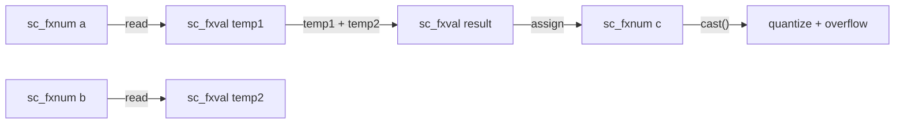

# sc_fxval.h / .cpp -- 定點數值型別

## 概述

`sc_fxval` 和 `sc_fxval_fast` 是**不受位寬限制的定點數值型別**。它們用於儲存算術運算的中間結果，保留完整精度，直到被賦值給一個有位寬限制的 `sc_fxnum` 時才進行量化和溢位處理。

## 日常類比

想像你在做一道數學題：

1. 中間計算：`3.14 * 2.71828 = 8.5394...`（保留所有小數位）
2. 寫到答案卷：四捨五入到小數點後兩位 = `8.54`

`sc_fxval` 就是「計算草稿紙」，可以暫存無限精度的中間結果。`sc_fxnum` 則是「答案卷」，有格式限制。

## 類別對比

| 特性 | `sc_fxval` | `sc_fxnum` |
|------|-----------|-----------|
| 位寬限制 | 無 | 有 |
| 量化/溢位 | 不執行 | 賦值時執行 |
| 用途 | 中間計算結果 | 最終儲存值 |
| 內部表示 | `scfx_rep*` | `scfx_rep*` + `scfx_params` |

## sc_fxval -- 任意精度值

### 核心成員

| 成員 | 型別 | 說明 |
|------|------|------|
| `m_rep` | `scfx_rep*` | 任意精度內部表示 |
| `m_observer` | `sc_fxval_observer*` | 觀察者指標 |

### 主要操作

**算術運算子（返回 `sc_fxval`）：**

```cpp
sc_fxval operator + ( const sc_fxval& ) const;
sc_fxval operator - ( const sc_fxval& ) const;
sc_fxval operator * ( const sc_fxval& ) const;
sc_fxval operator / ( const sc_fxval& ) const;
sc_fxval operator - () const;  // unary minus
```

**移位運算子：**

```cpp
sc_fxval operator << ( int ) const;
sc_fxval operator >> ( int ) const;
```

**型別轉換：**

```cpp
short to_short() const;
int to_int() const;
long to_long() const;
float to_float() const;
double to_double() const;
std::string to_string() const;
// ... and more
```

**查詢函式：**

```cpp
bool is_neg() const;
bool is_zero() const;
bool is_nan() const;
bool is_inf() const;
bool is_normal() const;
bool get_bit( int ) const;
```

## sc_fxval_fast -- 有限精度值

### 核心成員

| 成員 | 型別 | 說明 |
|------|------|------|
| `m_val` | `double` | C++ 原生 double |
| `m_observer` | `sc_fxval_fast_observer*` | 觀察者 |

`sc_fxval_fast` 使用 `double` 儲存值，精度限制在 IEEE 754 雙精度的 52 位尾數。運算速度比 `sc_fxval` 快得多。

### 算術運算

快速版的算術直接使用 C++ 的 `double` 運算，不需要軟體模擬的任意精度算術。

## 運算流程



## .cpp 檔案

`sc_fxval.cpp` 包含：

1. `to_string()` 系列方法的實作
2. `to_dec()`, `to_bin()`, `to_oct()`, `to_hex()` 轉換
3. `print()`, `scan()`, `dump()` 方法
4. 觀察者的 lock/unlock 機制
5. `to_string()` 工具函式（將 `scfx_ieee_double` 轉為字串）

## 相關檔案

- `scfx_rep.h` -- `sc_fxval` 的內部表示
- `sc_fxnum.h` -- 使用 `sc_fxval` 作為運算結果型別
- `sc_fxval_observer.h` -- 值的觀察者
- `scfx_ieee.h` -- `sc_fxval_fast` 使用的 IEEE 包裝
