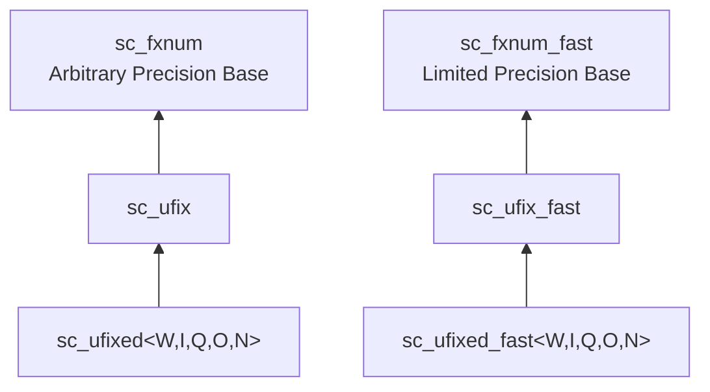

# sc_ufix.h -- 無號非約束定點數

## 概述

`sc_ufix` 和 `sc_ufix_fast` 是**無號的、執行時參數化的**定點數類別。與 `sc_fix` 的差異在於使用無號編碼（`SC_US_`），只能表示非負值。

## 日常類比

`sc_ufix` 就像一個「可調大小但只能顯示正數的電子秤」。在建構時你決定它的量程和精度，但它永遠不會顯示負數。

## 繼承關係



## 與 sc_fix 的差異

1. **編碼**：`sc_ufix` 在建構 `sc_fxnum` 時傳入 `SC_US_`（無號），`sc_fix` 傳入 `SC_TC_`（二補數）
2. **範圍**：同樣的位寬下，無號可以表示更大的正數
3. **限制**：不能使用 `SC_WRAP_SM` 溢位模式（sign magnitude wrap 對無號數無意義）

## 建構函式

與 `sc_fix` 結構完全一致，差別只在內部傳遞 `SC_US_` 給 `sc_fxnum`。

## 運算子

與 `sc_fix` 相同的算術、賦值和位元運算子。位元運算子 `&=`, `|=`, `^=` 接受 `sc_ufix` 和 `sc_ufix_fast`。

## 使用範例

```cpp
// Unsigned 12-bit with 8 integer bits
// Range: 0 to 255.9375
sc_ufix amplitude(12, 8);
amplitude = 128.5;

// Unsigned with saturation
sc_ufix level(10, 5, SC_TRN, SC_SAT);
level = 50.0;  // ok
level = -1.0;  // saturates to 0
```

## 相關檔案

- `sc_fxnum.h` -- 父類別 `sc_fxnum`
- `sc_ufixed.h` -- 約束版本 `sc_ufixed`，繼承自 `sc_ufix`
- `sc_fix.h` -- 有號版本
- `sc_fxval.h` -- 算術運算的返回型別
