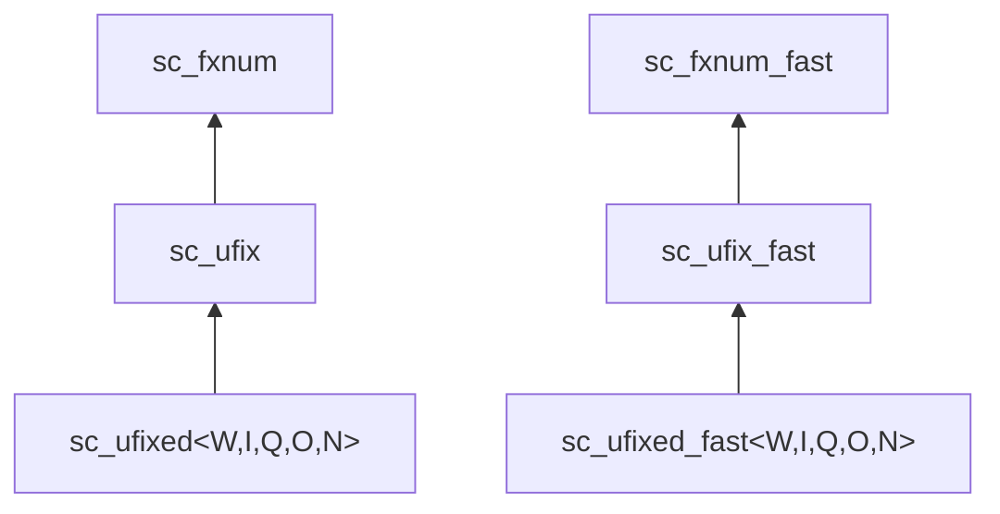

# sc_ufixed.h -- 無號約束定點數

## 概述

`sc_ufixed<W, I, Q, O, N>` 和 `sc_ufixed_fast<W, I, Q, O, N>` 是**無號的、編譯時約束的**定點數模板類別。與 `sc_fixed` 的差異在於使用無號編碼（`SC_US_`），因此只能表示非負值。

## 日常類比

如果 `sc_fixed` 是一個可以顯示正負溫度的溫度計，`sc_ufixed` 就是一個只能顯示 0 度以上的溫度計 -- 沒有負號，但相同位數可以表示更大的正數。

## 模板參數

```cpp
template <int W, int I,
          sc_q_mode Q = SC_DEFAULT_Q_MODE_,
          sc_o_mode O = SC_DEFAULT_O_MODE_,
          int N = SC_DEFAULT_N_BITS_>
class sc_ufixed : public sc_ufix { ... };
```

參數含義與 `sc_fixed` 完全相同。

## 繼承關係



## 與 sc_fixed 的差異

| 特性 | `sc_fixed` | `sc_ufixed` |
|------|-----------|------------|
| 編碼 | `SC_TC_`（二補數） | `SC_US_`（無號） |
| 範圍（8位, 4整數位） | -8.0 ~ +7.9375 | 0 ~ 15.9375 |
| 父類別 | `sc_fix` | `sc_ufix` |
| `SC_WRAP_SM` | 可用 | 不可用（會報錯） |

## 使用範例

```cpp
// 8-bit unsigned, 4 integer bits
// Range: 0 to 15.9375, step: 0.0625
sc_ufixed<8, 4> pixel_value = 12.5;

// 10-bit unsigned, 1 integer bit (9 fractional bits)
// Range: 0 to ~1.998, step: ~0.002
sc_ufixed<10, 1> probability = 0.75;
```

## 位元運算

位元運算子 `&=`, `|=`, `^=` 接受 `sc_ufix` 和 `sc_ufix_fast` 型別（而非 `sc_fix`），確保型別安全。

## 相關檔案

- `sc_ufix.h` -- 父類別 `sc_ufix` / `sc_ufix_fast`
- `sc_fixed.h` -- 有號版本 `sc_fixed`
- `sc_fxnum.h` -- 最終基底類別
- `fx.h` -- 統一 include 入口
