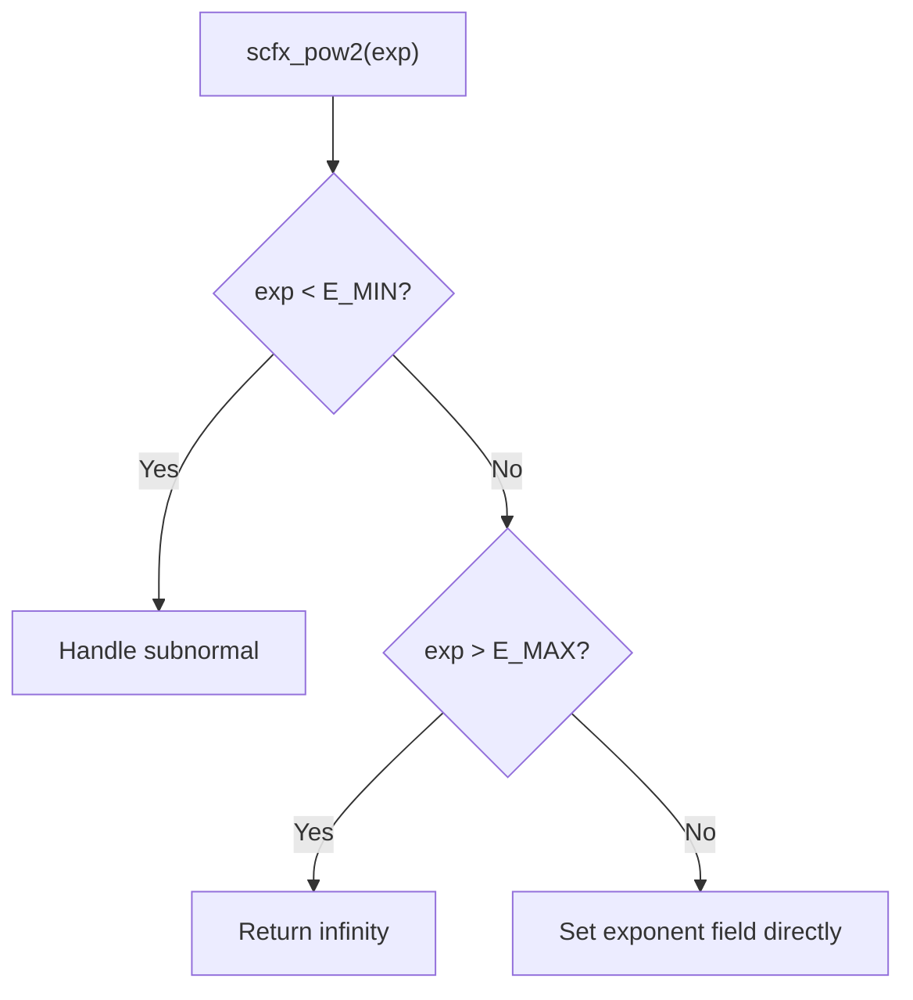

# scfx_ieee.h -- IEEE 754 浮點數包裝

## 概述

`scfx_ieee.h` 提供了 IEEE 754 單精度和雙精度浮點數的**底層位元欄位存取**介面。透過 union 和 bit-field，可以直接讀寫浮點數的符號位、指數和尾數，而不需要手動進行位元操作。

## 日常類比

一個 `double` 浮點數就像一個密封的黑盒子 -- 你知道它的值是 `3.14`，但不知道裡面的位元是怎麼排列的。`scfx_ieee_double` 就像一個透明的盒子，讓你直接看到並修改裡面的三個部分：符號、指數、尾數。

## IEEE 754 雙精度格式

```
 63  62    52 51                                    0
[S] [EEEEEEEEEEE] [MMMMMMMMMMMMMMMMMMMMMMMMMMMMMM...]
 ↑      ↑ (11位)              ↑ (52位)
符號   指數                  尾數
```

### `ieee_double` Union

```cpp
union ieee_double {
    double d;
    struct {
        unsigned mantissa1:32;  // lower 32 bits of mantissa
        unsigned mantissa0:20;  // upper 20 bits of mantissa
        unsigned exponent:11;   // biased exponent
        unsigned negative:1;    // sign bit
    } s;
};
```

**注意：** bit-field 的排列順序取決於平台的位元組序（大端/小端），源碼使用 `SC_BIG_ENDIAN` / `SC_LITTLE_ENDIAN` 條件編譯。

### 關鍵常數

| 常數 | 值 | 說明 |
|------|----|------|
| `SCFX_IEEE_DOUBLE_BIAS` | 1023 | 指數偏移量 |
| `SCFX_IEEE_DOUBLE_E_MAX` | 1023 | 最大指數 |
| `SCFX_IEEE_DOUBLE_E_MIN` | -1022 | 最小正常指數 |
| `SCFX_IEEE_DOUBLE_M_SIZE` | 52 | 尾數位元數 |

## `scfx_ieee_double` 類別

### 存取方法

| 方法 | 說明 |
|------|------|
| `negative()` / `negative(v)` | 讀取/設定符號位 |
| `exponent()` / `exponent(v)` | 讀取/設定指數（已減去偏移量） |
| `mantissa0()` / `mantissa0(v)` | 讀取/設定尾數高 20 位 |
| `mantissa1()` / `mantissa1(v)` | 讀取/設定尾數低 32 位 |

### 狀態判斷

| 方法 | 條件 | 說明 |
|------|------|------|
| `is_zero()` | 指數 = E_MIN-1, 尾數 = 0 | 正零或負零 |
| `is_subnormal()` | 指數 = E_MIN-1, 尾數 != 0 | 非正規數 |
| `is_normal()` | E_MIN <= 指數 <= E_MAX | 正規數 |
| `is_inf()` | 指數 = E_MAX+1, 尾數 = 0 | 正無窮或負無窮 |
| `is_nan()` | 指數 = E_MAX+1, 尾數 != 0 | 非數值 (NaN) |

### 位元搜尋

| 方法 | 說明 |
|------|------|
| `msb()` | 找到尾數中最高有效位的位置 |
| `lsb()` | 找到尾數中最低有效位的位置 |

這些方法使用二分搜尋技巧，效率為 O(log n)。

## `scfx_ieee_float` 類別

IEEE 754 單精度版本，結構類似但：

| 特性 | 雙精度 | 單精度 |
|------|--------|--------|
| 位元數 | 64 | 32 |
| 指數位 | 11 | 8 |
| 尾數位 | 52 | 23 |
| 偏移量 | 1023 | 127 |

## `scfx_pow2()` 函式

```cpp
inline double scfx_pow2(int exp);
```

高效地計算 `2.0^exp`。不使用 `pow()` 函式，而是直接操作 IEEE 754 的指數欄位：



這個函式是定點數量化和溢位計算中最常呼叫的基礎函式之一。

## 相關檔案

- `scfx_mant.h` -- 使用 `scfx_ieee.h` 進行浮點轉換
- `sc_fxnum.cpp` -- `sc_fxnum_fast` 使用 `scfx_ieee_double` 進行 cast
- `sc_fxval.h` -- `sc_fxval_fast` 的內部表示
- `sc_fxdefs.h` -- 被本檔案 include
