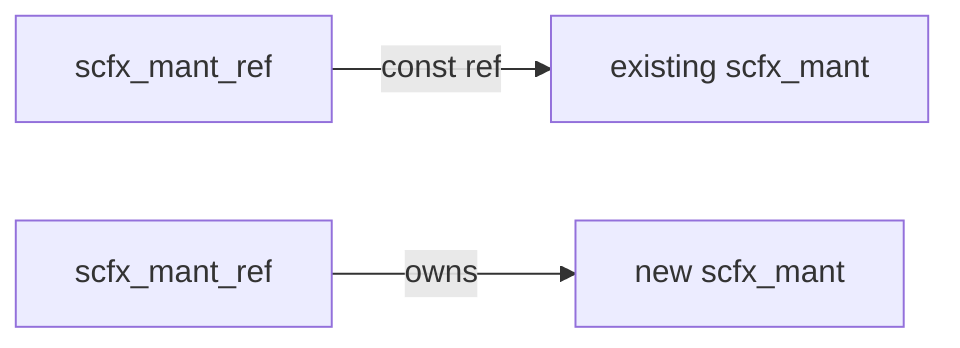

# scfx_mant.h / .cpp -- 尾數儲存類別

## 概述

`scfx_mant` 是一個**動態大小的 word 陣列**，用於儲存 `scfx_rep` 中定點數值的尾數（mantissa）。它處理了大端序/小端序的差異，並提供 word 級和 half-word 級的存取介面。

## 日常類比

`scfx_mant` 就像一個「可伸縮的收納盒」。每個格子（word）可以放 32 個彈珠（位元）。如果數字變大，就加更多格子；數字變小，就減少格子。而且它聰明到能適應不同的排列方式（大端序 vs 小端序）。

## 類別詳情

### 成員變數

| 成員 | 型別 | 說明 |
|------|------|------|
| `m_array` | `word*` | 動態分配的 word 陣列 |
| `m_size` | `int` | 陣列大小（word 數量） |

### 型別定義

```cpp
typedef unsigned int word;        // 32-bit unit
typedef unsigned short half_word; // 16-bit unit
```

### 主要方法

| 方法 | 說明 |
|------|------|
| `scfx_mant(size)` | 建構指定大小的尾數 |
| `operator[](i)` | 讀寫第 i 個 word |
| `half_at(i)` | 讀寫第 i 個 half-word |
| `half_addr(i)` | 取得第 i 個 word 的 half-word 指標 |
| `clear()` | 全部清零 |
| `resize_to(size, restore)` | 調整大小，可選擇保留內容 |
| `size()` | 取得目前大小 |

### 大端序/小端序處理

`scfx_mant` 在內部根據平台的位元組順序使用不同的索引方式：

```cpp
// Big Endian: index 0 is at the highest address
word operator[](int i) { return m_array[-i]; }

// Little Endian: index 0 is at the lowest address
word operator[](int i) { return m_array[i]; }
```

### resize_to 的兩種模式

```
restore == 1 (MSB aligned):
  Before: [A][B][C]
  After:  [A][B][C][0][0]  (new words at high end)

restore == -1 (LSB aligned):
  Before:     [A][B][C]
  After:  [0][0][A][B][C]  (new words at low end)
```

## 輔助函式

### `complement()` -- 一補數

```cpp
void complement(scfx_mant& target, const scfx_mant& source, int size);
```

對尾數做按位反轉。

### `inc()` -- 遞增

```cpp
void inc(scfx_mant& mant);
```

將尾數加 1，處理進位。與 `complement()` 配合使用可實現二補數轉換。

## `scfx_mant_ref` -- 尾數參考類別



`scfx_mant_ref` 是一個智慧參考，可以指向：
- 一個**已存在的** `scfx_mant`（唯讀，不擁有）
- 一個**新建的** `scfx_mant`（擁有，解構時釋放）

這用於 `align()` 等函式中，避免不必要的複製。

| 成員 | 說明 |
|------|------|
| `m_mant` | 指向 `scfx_mant` 的指標 |
| `m_not_const` | 是否擁有（true = 擁有，解構時 delete） |

## 記憶體管理

`alloc()` 和 `free()` 是靜態方法，封裝了 word 陣列的分配和釋放。它們在大端序平台上會調整指標位置，讓 `operator[]` 能正確工作。

## 相關檔案

- `scfx_rep.h` -- 使用 `scfx_mant` 儲存尾數
- `scfx_ieee.h` -- 依賴的 IEEE 浮點工具
- `scfx_utils.h` -- 依賴的工具函式
