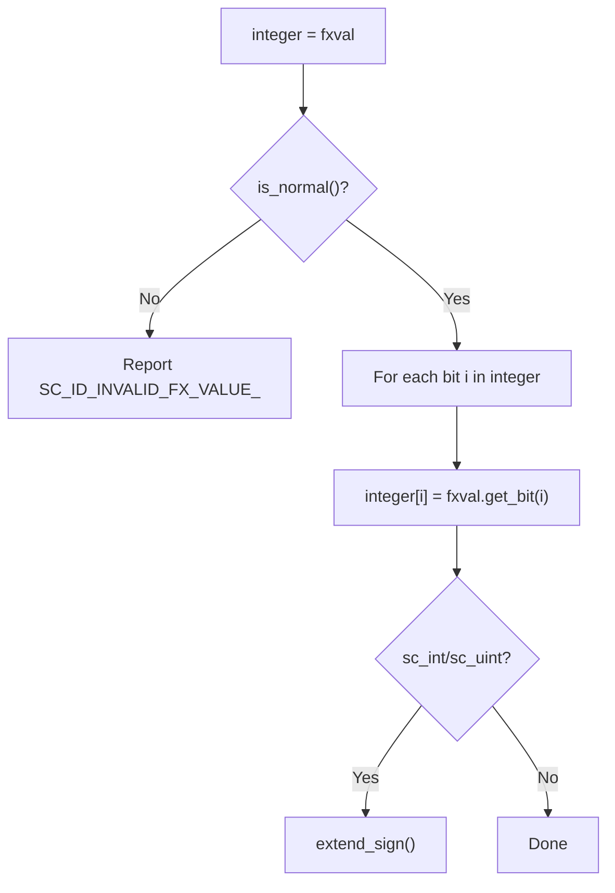
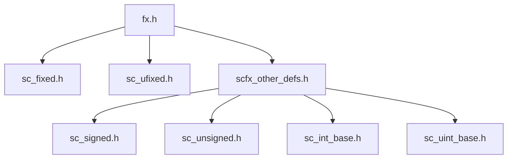

# scfx_other_defs.h -- 定點數與其他型別的互操作

## 概述

`scfx_other_defs.h` 定義了定點數型別與 SystemC 整數型別之間的**賦值運算子**。它讓 `sc_signed`、`sc_unsigned`、`sc_int_base`、`sc_uint_base` 能夠直接接收定點數值。

## 日常類比

就像不同國家的電源插頭需要轉接頭一樣，這個檔案提供了定點數和整數型別之間的「轉接頭」。沒有它，你就不能直接把一個 `sc_fixed<8,4>` 的值賦給一個 `sc_int<8>`。

## 支援的轉換

### 來源型別（定點數）

| 型別 | 說明 |
|------|------|
| `sc_fxval` | 任意精度定點值 |
| `sc_fxval_fast` | 有限精度定點值 |
| `sc_fxnum` | 任意精度定點數 |
| `sc_fxnum_fast` | 有限精度定點數 |

### 目標型別（整數）

| 型別 | 說明 |
|------|------|
| `sc_signed` | 任意精度有號整數 |
| `sc_unsigned` | 任意精度無號整數 |
| `sc_int_base` | 固定精度有號整數 (最多 64 位) |
| `sc_uint_base` | 固定精度無號整數 (最多 64 位) |

## 轉換邏輯

所有轉換都遵循相同的模式：



1. 先檢查定點值是否為 normal（不是 NaN 或 Inf）
2. 逐位複製：從定點數的位元 0 到整數的最高位
3. 對於 `sc_int_base` 和 `sc_uint_base`，最後做符號擴展

## 條件編譯

整個檔案包裹在 `#ifdef SC_INCLUDE_FX` 中。這表示定點數功能是選擇性的 -- 只有定義了 `SC_INCLUDE_FX` 巨集時，這些互操作才會被編譯。

```cpp
#ifdef SC_INCLUDE_FX
// ... all conversion operators ...
#endif
```

## 為什麼放在獨立檔案中？

這些轉換運算子必須同時看到定點數型別和整數型別的完整定義。為了避免循環 include 依賴，它們被放在一個獨立的檔案中，並在 `fx.h`（master include）的最後被 include。



## 相關檔案

- `fx.h` -- include 本檔案
- `sc_fxval.h` -- `sc_fxval` 的 `get_bit()` 方法
- `sc_fxnum.h` -- `sc_fxnum` 的 `get_bit()` 方法
- `sysc/datatypes/int/sc_signed.h` -- `sc_signed` 的定義
- `sysc/datatypes/int/sc_unsigned.h` -- `sc_unsigned` 的定義
- `sysc/datatypes/int/sc_int_base.h` -- `sc_int_base` 的定義
- `sysc/datatypes/int/sc_uint_base.h` -- `sc_uint_base` 的定義
